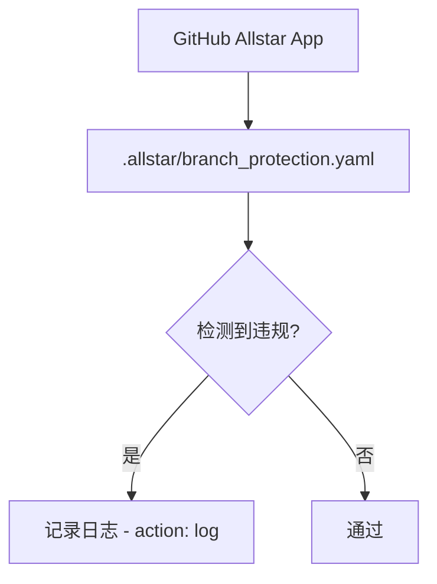

# .allstar/ 架构

> GitHub Allstar 安全治理配置，确保仓库遵循安全最佳实践。

## 概述

`.allstar/` 目录包含 [GitHub Allstar](https://github.com/ossf/allstar) 应用的配置文件。Allstar 是由 Open Source Security Foundation (OpenSSF) 维护的 GitHub 安全策略执行工具，用于持续监控和强制执行仓库级别的安全策略。

在 gemini-cli 项目中，Allstar 被配置为以日志模式（`action: 'log'`）运行，即仅记录违规行为而不自动修复，允许团队审查后手动处理。

## 架构图



## 目录结构

```
.allstar/
└── branch_protection.yaml   # 分支保护策略配置
```

## 关键文件

| 文件 | 功能 |
|------|------|
| `branch_protection.yaml` | 分支保护策略配置，设定 action 为 `log`（仅记录） |

## 配置详情

`branch_protection.yaml` 的完整内容：

```yaml
action: 'log'
```

此配置意味着：
- Allstar 会监控仓库的分支保护规则是否符合 OpenSSF 推荐的最佳实践
- 当检测到分支保护配置不符合要求时，仅在 Allstar 日志中记录，不会自动创建 issue 或修改设置
- 典型的监控项包括：是否要求 PR 审查、是否强制状态检查通过、是否限制强制推送等

## 内部依赖

无。该配置独立于项目代码，由 GitHub Allstar 应用读取。

## 外部依赖

- [GitHub Allstar](https://github.com/ossf/allstar) - OpenSSF 安全治理 GitHub App
