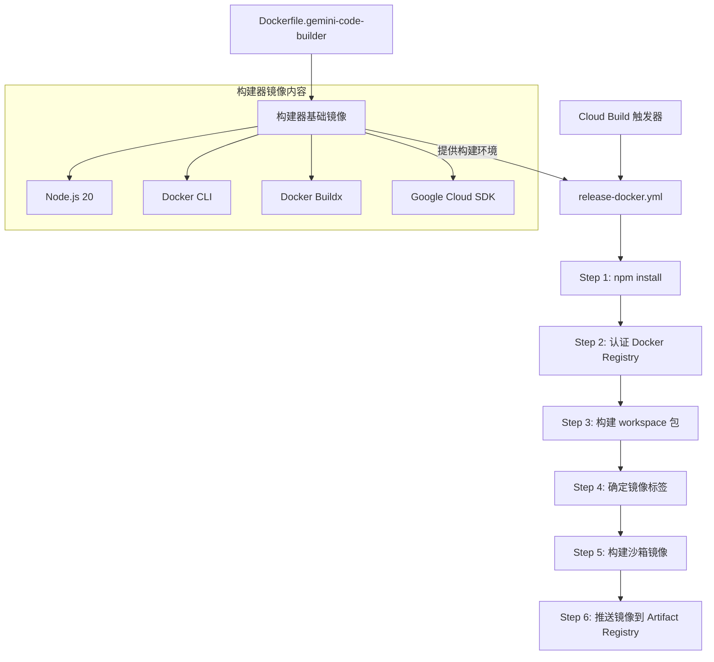

# .gcp/ 架构

> GCP Cloud Build 配置目录，定义沙箱容器镜像的构建和发布流水线。

## 概述

`.gcp/` 目录包含 Google Cloud Platform (GCP) 相关的构建和部署配置。主要用途是通过 Cloud Build 自动化构建 gemini-cli 的沙箱 (sandbox) Docker 容器镜像，并将其发布到 Google Artifact Registry。

沙箱容器是 gemini-cli 的核心安全特性之一，允许 AI Agent 在隔离的 Docker 容器中执行 shell 命令，防止对用户主机环境的意外修改。

## 架构图



## 目录结构

```
.gcp/
├── Dockerfile.gemini-code-builder   # 构建器基础镜像定义
└── release-docker.yml               # Cloud Build 发布流水线配置
```

## 关键文件

| 文件 | 功能 |
|------|------|
| `Dockerfile.gemini-code-builder` | 定义 Cloud Build 使用的构建器镜像，基于 `debian:bookworm-slim`，包含 Node.js 20、Docker CLI 26.1.3、Docker Buildx v0.14.0 和 Google Cloud SDK |
| `release-docker.yml` | Cloud Build 流水线定义，编排沙箱容器镜像的构建和发布步骤 |

## 构建流水线详情

`release-docker.yml` 定义了 6 个步骤的 Cloud Build 流水线：

1. **Install Dependencies** - 执行 `npm install` 安装所有 workspace 依赖
2. **Authenticate docker** - 运行 `npm run auth` 配置 Artifact Registry 认证
3. **Build packages** - 运行 `npm run build:packages` 构建所有 workspace 包
4. **Determine Docker Image Tag** - 根据 Git 标签决定镜像版本号（release 标签使用语义版本，其他使用 commit SHA）
5. **Build sandbox Docker image** - 运行 `npm run build:sandbox` 构建沙箱容器镜像
6. **Publish sandbox Docker image** - 将镜像推送到 Artifact Registry

构建器镜像存储在：`us-west1-docker.pkg.dev/gemini-code-dev/gemini-code-containers/gemini-code-builder`

## 内部依赖

- 根目录 `package.json` 中的 `build:sandbox`、`build:packages`、`auth` 脚本
- 根目录 `Dockerfile` 定义的沙箱容器镜像内容
- `scripts/build_sandbox.js` 实际的沙箱构建逻辑

## 外部依赖

- Google Cloud Build - CI/CD 服务
- Google Artifact Registry - 容器镜像仓库（`us-docker.pkg.dev/gemini-code-dev/gemini-cli/sandbox`）
- Docker / Docker Buildx - 容器构建工具
- Node.js 20 - 运行时环境
- Google Cloud SDK (`gcloud`) - GCP 命令行工具
