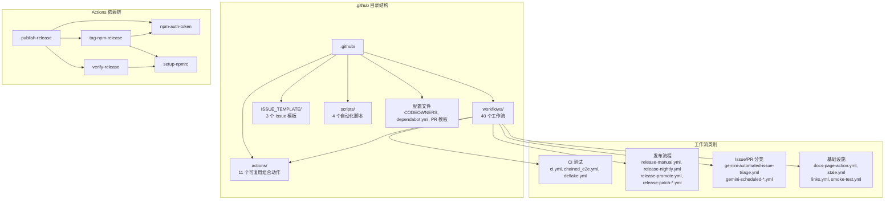

# .github 架构

> GitHub 项目基础设施配置中心，管理 CI/CD、Issue 模板、代码审查规则和自动化脚本

## 概述

`.github/` 目录是 gemini-cli 项目的 GitHub 平台基础设施层。它定义了项目的持续集成与部署流水线（40+ 个工作流）、11 个可复用的 Composite Action、Issue/PR 模板、代码所有权规则（CODEOWNERS）、依赖自动更新策略（Dependabot）以及用于标签管理和 PR 分类的自动化脚本。该目录是整个项目自动化运维和社区协作的核心枢纽。

## 架构图



## 目录结构

```
.github/
├── actions/                    # 11 个可复用的 GitHub Composite Actions
│   ├── calculate-vars/         # 发布流程变量计算
│   ├── create-pull-request/    # 自动创建 PR
│   ├── npm-auth-token/         # NPM 认证令牌生成
│   ├── post-coverage-comment/  # PR 代码覆盖率评论
│   ├── publish-release/        # 完整发布流程（核心）
│   ├── push-docker/            # Docker 镜像构建推送（GHCR）
│   ├── push-sandbox/           # Sandbox Docker 镜像推送（DockerHub）
│   ├── run-tests/              # 测试执行器
│   ├── setup-npmrc/            # .npmrc 配置
│   ├── tag-npm-release/        # NPM 发布标签管理
│   └── verify-release/         # 发布验证与冒烟测试
├── ISSUE_TEMPLATE/             # GitHub Issue 表单模板
│   ├── bug_report.yml          # Bug 报告模板
│   ├── feature_request.yml     # 功能请求模板
│   └── website_issue.yml       # 网站问题模板
├── scripts/                    # 自动化管理脚本
│   ├── backfill-need-triage.cjs      # 批量添加 need-triage 标签
│   ├── backfill-pr-notification.cjs  # PR 贡献流程通知
│   ├── pr-triage.sh                  # PR 分类与标签同步
│   └── sync-maintainer-labels.cjs    # 维护者标签递归同步
├── workflows/                  # 40 个 GitHub Actions 工作流
├── CODEOWNERS                  # 代码审查所有权规则
├── dependabot.yml              # 依赖自动更新配置
└── pull_request_template.md    # PR 模板
```

## 关键文件

| 文件 | 功能 |
|------|------|
| `CODEOWNERS` | 定义代码审查所有权：维护者团队审核所有文件，发布审批者审核关键文件（package.json、workflows），提示审批者审核 prompts/tools/evals |
| `dependabot.yml` | 配置 npm 和 github-actions 两个生态系统的每周一自动依赖更新，限制 10 个并发 PR，分组合并 minor/patch 更新 |
| `pull_request_template.md` | PR 模板，包含 Summary、Details、Related Issues、How to Validate、Pre-Merge Checklist（跨平台验证清单） |

## 内部依赖

- `actions/` 中的 Action 之间存在调用链：`publish-release` 调用 `npm-auth-token`、`verify-release`、`tag-npm-release`
- `workflows/` 中的工作流引用 `actions/` 中的可复用动作
- `scripts/` 中的脚本被 `workflows/` 中的工作流调用

## 外部依赖

| 依赖 | 用途 |
|------|------|
| `actions/checkout` | 代码检出 |
| `actions/setup-node` | Node.js 环境配置 |
| `actions/stale` | 过期 Issue/PR 自动管理 |
| `docker/setup-buildx-action` | Docker Buildx 多平台构建 |
| `docker/login-action` | Docker 注册表认证 |
| `docker/build-push-action` | Docker 镜像构建与推送 |
| `thollander/actions-comment-pull-request` | PR 评论发布 |
| `nick-fields/retry` | 命令重试（NPM 安装） |
| `lycheeverse/lychee-action` | 链接检查 |
| `cariad-tech/merge-queue-ci-skipper` | 合并队列 CI 跳过优化 |
| `@octokit/rest` | GitHub API 客户端（scripts 使用） |
| `gh` CLI | GitHub CLI 工具（scripts 使用） |
