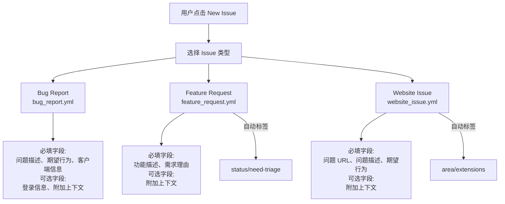

# ISSUE_TEMPLATE 架构

> 三个结构化 GitHub Issue 表单模板，规范 Bug 报告、功能请求和网站问题的提交格式

## 概述

`ISSUE_TEMPLATE/` 目录包含 gemini-cli 项目的 GitHub Issue 表单模板，使用 YAML 格式定义。这些模板在用户创建 Issue 时提供结构化表单界面（非纯 Markdown），确保报告包含必要的诊断信息。模板覆盖三种常见场景：Bug 报告、功能请求和网站问题。每个模板都引导用户先搜索已有 Issue 以避免重复，并使用表单验证确保关键字段不为空。

## 架构图



## 目录结构

```
ISSUE_TEMPLATE/
├── bug_report.yml       # Bug 报告表单模板
├── feature_request.yml  # 功能请求表单模板
└── website_issue.yml    # 网站问题表单模板
```

## 关键文件

| 文件 | 功能 |
|------|------|
| `bug_report.yml` | Bug 报告模板：包含问题描述、期望行为、客户端信息（引导运行 `/about` 命令获取）、登录方式和附加上下文五个字段。客户端信息字段预填了 `<details>` 折叠模板 |
| `feature_request.yml` | 功能请求模板：自动添加 `status/need-triage` 标签，使用 `type: Feature` 声明为 Feature 类型 Issue。包含功能描述、需求理由和附加上下文三个字段 |
| `website_issue.yml` | 网站问题模板：自动添加 `area/extensions` 标签。包含问题 URL（input 类型）、问题描述、期望行为和附加上下文四个字段。URL 字段使用 `type: input` 而非 `textarea` |

## 内部依赖

- 模板中引导用户使用的 `/about` 命令来自 CLI 核心包（`packages/cli/`）
- 自动添加的标签与 `workflows/` 中的自动分类工作流配合使用

## 外部依赖

无。YAML 表单模板是 GitHub 原生功能，无需额外依赖。
