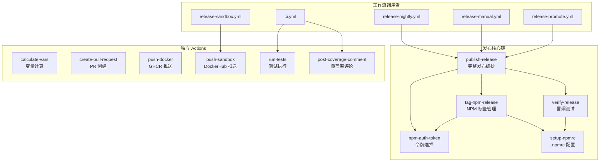

# .github/actions 架构

> 11 个可复用的 GitHub Composite Actions，封装发布、测试、Docker 和 NPM 管理的核心自动化逻辑

## 概述

`actions/` 目录包含 gemini-cli 项目自定义的 GitHub Composite Actions。这些 Action 将复杂的 CI/CD 操作封装为可复用的模块化单元，供 `workflows/` 中的 40 多个工作流调用。核心功能覆盖 NPM 包发布全生命周期（构建、发布、标签、验证）、Docker 镜像管理、测试执行和代码覆盖率报告。Action 之间存在清晰的依赖链，以 `publish-release` 为核心串联整个发布流程。

## 架构图



## 目录结构

```
actions/
├── calculate-vars/         # 发布流程 dry-run 变量计算
│   └── action.yml
├── create-pull-request/    # 自动创建并合并 PR
│   └── action.yml
├── npm-auth-token/         # 基于包名选择 NPM 认证令牌
│   └── action.yml
├── post-coverage-comment/  # 生成并发布代码覆盖率 PR 评论
│   └── action.yml
├── publish-release/        # 完整的 NPM 发布流程编排（核心）
│   └── action.yml
├── push-docker/            # 构建并推送 Docker 镜像到 GHCR
│   └── action.yml
├── push-sandbox/           # 构建并推送 Sandbox Docker 到 DockerHub
│   └── action.yml
├── run-tests/              # 执行单元测试和集成测试
│   └── action.yml
├── setup-npmrc/            # 配置 .npmrc 多注册表访问
│   └── action.yml
├── tag-npm-release/        # 为三个包设置 NPM dist-tag
│   └── action.yml
└── verify-release/         # NPM 安装验证和冒烟测试
    └── action.yml
```

## 关键文件

| 文件 | 功能 |
|------|------|
| `publish-release/action.yml` | 发布流程核心编排器：创建发布分支 -> 更新版本号 -> 构建打包 -> 按序发布 core/cli/a2a 三个包 -> 验证 -> 打标签 -> 创建 GitHub Release -> 清理分支 |
| `npm-auth-token/action.yml` | 根据包名（@google-gemini/* 私有包 / @google/gemini-cli / @google/gemini-cli-core / @google/gemini-cli-a2a-server）选择对应的认证令牌 |
| `tag-npm-release/action.yml` | 为 core、cli、a2a 三个包统一设置 NPM dist-tag（latest/preview/nightly/dev） |
| `verify-release/action.yml` | 发布后验证：全局 npm install -> 版本号冒烟测试 -> npx 运行测试 -> 集成测试 |
| `push-sandbox/action.yml` | 多架构 Sandbox Docker 构建：支持 amd64/arm64，自动检测 release tag 版本号 |

## 内部依赖

Action 之间的调用关系：

| 调用者 | 被调用者 |
|--------|---------|
| `publish-release` | `npm-auth-token`（3次，分别获取 core/cli/a2a 令牌） |
| `publish-release` | `verify-release`（发布后验证） |
| `publish-release` | `tag-npm-release`（设置 NPM 标签） |
| `tag-npm-release` | `npm-auth-token`（3次） |
| `tag-npm-release` | `setup-npmrc`（配置注册表） |
| `verify-release` | `setup-npmrc`（配置注册表） |

## 外部依赖

| 依赖 | 用途 | 使用者 |
|------|------|--------|
| `actions/checkout` | 代码检出 | push-docker, push-sandbox |
| `actions/setup-node` | Node.js 环境 | publish-release, tag-npm-release |
| `docker/setup-buildx-action` | Docker Buildx | push-docker, push-sandbox |
| `docker/setup-qemu-action` | QEMU 多架构支持 | push-sandbox |
| `docker/login-action` | Docker 注册表认证 | push-docker, push-sandbox |
| `docker/build-push-action` | Docker 镜像构建推送 | push-docker |
| `thollander/actions-comment-pull-request` | PR 评论 | post-coverage-comment |
| `nick-fields/retry` | 带重试的命令执行 | verify-release |
