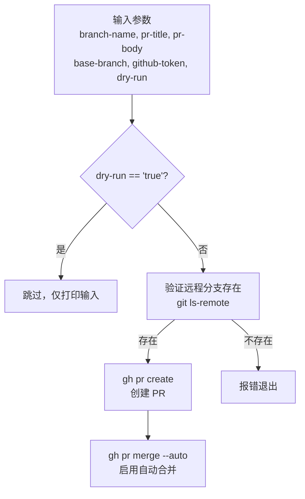

# create-pull-request 架构

> 自动创建 Pull Request 并启用自动合并的 Composite Action

## 概述

`create-pull-request` 是一个 GitHub Composite Action，用于在自动化工作流中创建 Pull Request。它先验证远程分支是否存在，然后通过 `gh` CLI 创建 PR 并自动启用 auto-merge。该 Action 主要被发布流程中的 Patch Release 工作流使用，用于自动将版本变更提交为 PR。支持 dry-run 模式以跳过实际创建。

## 架构图



## 目录结构

```
create-pull-request/
└── action.yml    # Action 定义文件
```

## 关键文件

| 文件 | 功能 |
|------|------|
| `action.yml` | 定义 Composite Action：接收分支名、PR 标题/内容、目标分支和 GitHub Token，验证远程分支后使用 `gh pr create` 创建 PR 并通过 `gh pr merge --auto` 启用自动合并 |

## 内部依赖

无。该 Action 是独立的工具 Action。

## 外部依赖

| 依赖 | 用途 |
|------|------|
| `gh` CLI | 创建 PR（`gh pr create`）和启用自动合并（`gh pr merge --auto`） |
| `git` | 远程分支存在性验证（`git ls-remote`） |
