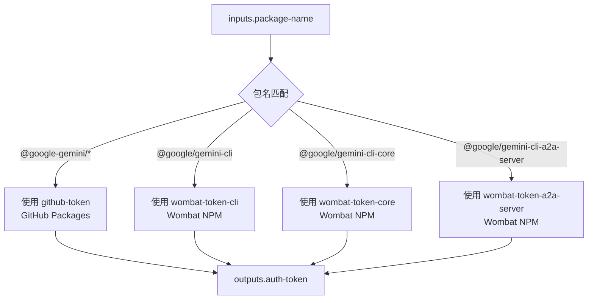

# npm-auth-token 架构

> 根据 NPM 包名动态选择对应认证令牌的 Composite Action

## 概述

`npm-auth-token` 是一个 GitHub Composite Action，负责根据待发布的 NPM 包名称选择正确的认证令牌。gemini-cli 项目有三种不同的 NPM 发布目标：GitHub Packages（私有 `@google-gemini/*` 包）和 Wombat Dressing Room（公共 `@google/gemini-cli`、`@google/gemini-cli-core`、`@google/gemini-cli-a2a-server`），每种目标需要不同的认证令牌。该 Action 在发布流程中被 `publish-release` 和 `tag-npm-release` 多次调用。

## 架构图



## 目录结构

```
npm-auth-token/
└── action.yml    # Action 定义文件
```

## 关键文件

| 文件 | 功能 |
|------|------|
| `action.yml` | 通过 Bash 条件分支匹配包名前缀，选择对应的认证令牌输出。支持四种包名模式：`@google-gemini/*`（GitHub Token）、`@google/gemini-cli`（CLI Wombat Token）、`@google/gemini-cli-core`（Core Wombat Token）、`@google/gemini-cli-a2a-server`（A2A Wombat Token） |

## 内部依赖

无。该 Action 是被多个其他 Action 调用的基础工具。

**被以下 Action 调用：**
- `publish-release`（3 次，分别为 core/cli/a2a 获取令牌）
- `tag-npm-release`（3 次，分别为 core/cli/a2a 获取令牌）

## 外部依赖

无。仅使用 Bash shell 进行字符串匹配。
