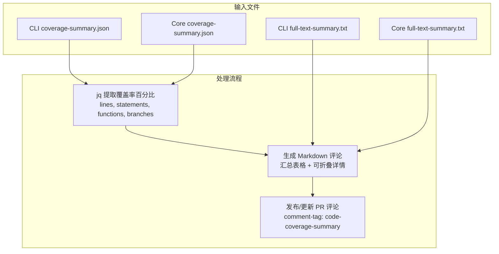

# post-coverage-comment 架构

> 解析 CLI 和 Core 包的代码覆盖率数据并发布 PR 评论的 Composite Action

## 概述

`post-coverage-comment` 是一个 GitHub Composite Action，用于在 CI 流水线中将代码覆盖率结果以结构化评论的形式发布到 Pull Request 上。它读取 CLI 和 Core 两个包的 `coverage-summary.json`（Vitest 生成）和 `full-text-summary.txt` 文件，使用 `jq` 提取覆盖率百分比，生成包含汇总表格和可折叠详细报告的 Markdown 评论。评论使用 `comment-tag` 机制实现幂等更新。

## 架构图



## 目录结构

```
post-coverage-comment/
└── action.yml    # Action 定义文件
```

## 关键文件

| 文件 | 功能 |
|------|------|
| `action.yml` | 两步骤 Action：(1) 使用 `jq` 从 JSON 文件提取 lines/statements/functions/branches 覆盖率百分比，结合全文报告生成 Markdown 文件（包含汇总表和两个 `<details>` 折叠区域）；(2) 使用 `thollander/actions-comment-pull-request` 发布评论，通过 `comment-tag` 实现评论幂等更新 |

## 内部依赖

无。该 Action 是独立的报告工具。

## 外部依赖

| 依赖 | 用途 |
|------|------|
| `thollander/actions-comment-pull-request@v3` | 在 PR 上发布/更新评论，支持基于 tag 的幂等操作 |
| `jq` | 从 JSON 覆盖率报告中提取百分比数据 |
