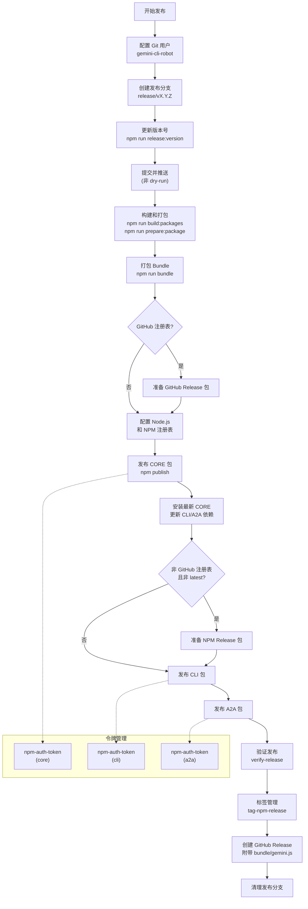

# publish-release 架构

> 完整的 NPM 包发布编排器，管理构建、发布、验证和 GitHub Release 创建的全流程

## 概述

`publish-release` 是 gemini-cli 发布系统的核心 Composite Action，编排了从版本更新到 GitHub Release 创建的完整发布流程。它依次处理三个包（core -> cli -> a2a）的发布，遵循严格的发布顺序以确保依赖关系正确。该 Action 被 `release-nightly.yml`、`release-manual.yml`、`release-promote.yml` 和 `release-patch-3-release.yml` 等多个发布工作流调用，支持 dry-run 模式、多种 NPM 频道（latest/preview/nightly/dev）以及 GitHub Packages 和公共 NPM 两种注册表。

## 架构图



## 目录结构

```
publish-release/
└── action.yml    # Action 定义文件（307 行）
```

## 关键文件

| 文件 | 功能 |
|------|------|
| `action.yml` | 发布全流程编排，包含 15+ 个步骤：Git 配置 -> 创建发布分支 -> 版本更新 -> 提交推送 -> 构建打包 -> 按序发布 core/cli/a2a -> 验证 -> 标签 -> GitHub Release -> 清理。支持 15 个输入参数和 dry-run 模式 |

## 内部依赖

| 被调用 Action | 调用次数 | 用途 |
|--------------|---------|------|
| `npm-auth-token` | 3 次 | 分别获取 core、cli、a2a 的发布令牌 |
| `verify-release` | 1 次 | 发布后冒烟测试和集成测试验证 |
| `tag-npm-release` | 1 次 | 为三个包设置 NPM dist-tag |

## 外部依赖

| 依赖 | 用途 |
|------|------|
| `actions/setup-node` | 配置 Node.js 环境和 NPM 注册表 |
| `gh` CLI | 创建 GitHub Release（`gh release create`），附带 `bundle/gemini.js` 资产 |
| `npm` CLI | 包发布（`npm publish`）、dist-tag 管理（`npm dist-tag rm`） |
| `git` | 分支管理、提交推送、标签操作 |
