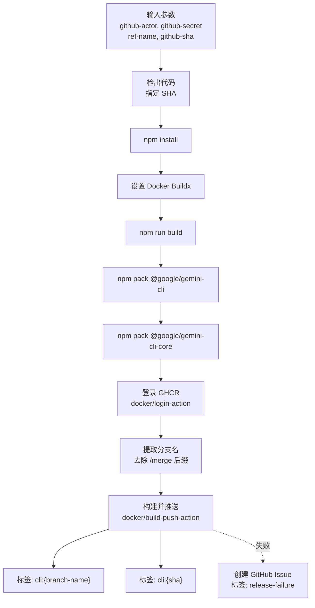

# push-docker 架构

> 构建 gemini-cli Docker 镜像并推送到 GitHub Container Registry (GHCR) 的 Composite Action

## 概述

`push-docker` 是一个 GitHub Composite Action，负责构建 gemini-cli 的 Docker 镜像并推送到 GitHub Container Registry（GHCR）。它执行完整的构建流程：代码检出 -> npm install -> npm build -> npm pack（cli 和 core 两个包）-> Docker 构建并推送。每次构建生成两个镜像标签：分支名标签和 commit SHA 标签。构建失败时会自动创建 GitHub Issue。

## 架构图



## 目录结构

```
push-docker/
└── action.yml    # Action 定义文件
```

## 关键文件

| 文件 | 功能 |
|------|------|
| `action.yml` | 完整的 Docker 构建推送流程：使用项目根目录的 `Dockerfile`，推送到 `ghcr.io/{repo}/cli` 仓库，生成分支名和 SHA 两个标签。构建失败时自动创建带 `release-failure` 标签的 GitHub Issue |

## 内部依赖

无。该 Action 是独立的 Docker 构建推送工具。

## 外部依赖

| 依赖 | 用途 |
|------|------|
| `actions/checkout@v4` | 按指定 SHA 检出代码（fetch-depth: 0） |
| `docker/setup-buildx-action@v3` | 设置 Docker Buildx 构建器 |
| `docker/login-action@v3` | 登录 GitHub Container Registry |
| `docker/build-push-action@v6` | 构建并推送 Docker 镜像，禁用 provenance 以避免多镜像问题 |
| `gh` CLI | 构建失败时创建 GitHub Issue |
