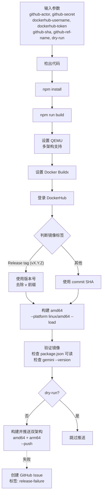

# push-sandbox 架构

> 构建多架构 Sandbox Docker 镜像并推送到 DockerHub 的 Composite Action

## 概述

`push-sandbox` 是一个 GitHub Composite Action，负责构建 gemini-cli 的 Sandbox（沙箱）Docker 镜像并推送到 DockerHub。与 `push-docker` 不同，Sandbox 镜像是为安全隔离执行环境设计的，支持 linux/amd64 和 linux/arm64 双架构，使用 QEMU 进行跨架构构建。镜像标签根据 Git 引用类型自动判断：release tag（如 `v1.2.3`）使用版本号，其他情况使用 commit SHA。构建流程包含验证步骤确保镜像内包含正确的包文件。

## 架构图



## 目录结构

```
push-sandbox/
└── action.yml    # Action 定义文件
```

## 关键文件

| 文件 | 功能 |
|------|------|
| `action.yml` | Sandbox Docker 构建推送流程：自动检测 release/开发构建 -> 先构建 amd64 验证 -> 验证包完整性 -> 推送双架构镜像到 `google/gemini-cli-sandbox:{tag}`。验证步骤检查容器内 `@google/gemini-cli` 和 `@google/gemini-cli-core` 的 `package.json` 可解析，且 `gemini --version` 可执行 |

## 内部依赖

无。该 Action 是独立的 Docker 构建推送工具。

## 外部依赖

| 依赖 | 用途 |
|------|------|
| `actions/checkout@v4` | 代码检出 |
| `docker/setup-qemu-action@v3` | QEMU 多架构仿真支持 |
| `docker/setup-buildx-action@v3` | Docker Buildx 多平台构建 |
| `docker/login-action@v3` | DockerHub 认证登录 |
| `npm run build:sandbox` | 项目内置的 Sandbox 构建脚本 |
| `gh` CLI | 构建失败时创建 Issue |
