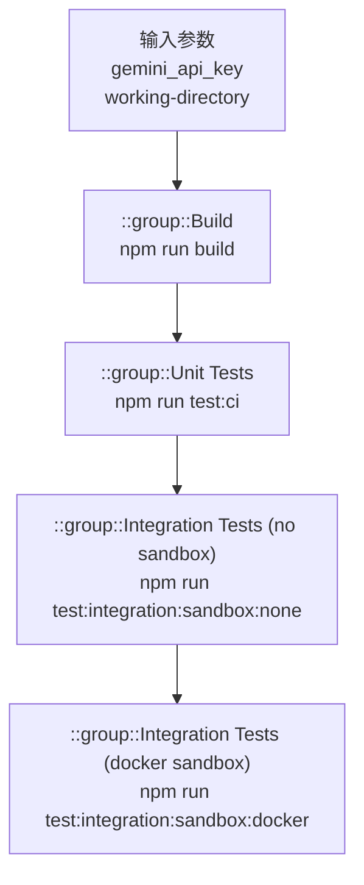

# run-tests 架构

> 执行完整测试套件（构建、单元测试、集成测试）的 Composite Action

## 概述

`run-tests` 是一个 GitHub Composite Action，封装了 gemini-cli 项目的完整测试执行流程。它按顺序运行构建、单元测试（CI 模式）、无沙箱集成测试和 Docker 沙箱集成测试四个阶段。每个阶段使用 GitHub Actions 的 `::group::` 语法进行日志分组，便于在 Actions UI 中快速定位问题。该 Action 被 CI 工作流和发布前验证调用。

## 架构图



## 目录结构

```
run-tests/
└── action.yml    # Action 定义文件
```

## 关键文件

| 文件 | 功能 |
|------|------|
| `action.yml` | 四阶段测试执行器：(1) `npm run build` 构建项目；(2) `npm run test:ci` 运行 CI 模式单元测试；(3) `npm run test:integration:sandbox:none` 运行无沙箱集成测试；(4) `npm run test:integration:sandbox:docker` 运行 Docker 沙箱集成测试。需要 `GEMINI_API_KEY` 环境变量 |

## 内部依赖

无。该 Action 直接调用项目的 npm scripts。

## 外部依赖

| 依赖 | 用途 |
|------|------|
| npm scripts (`build`, `test:ci`, `test:integration:sandbox:none`, `test:integration:sandbox:docker`) | 项目内置的构建和测试命令 |
