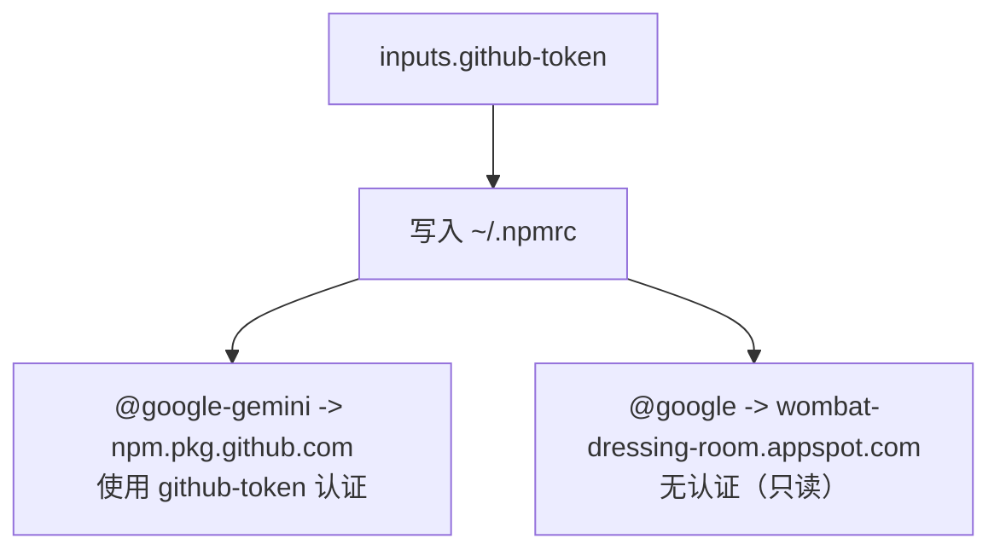

# setup-npmrc 架构

> 配置 .npmrc 文件以支持多注册表只读访问的 Composite Action

## 概述

`setup-npmrc` 是一个 GitHub Composite Action，负责在 CI 环境中配置 `~/.npmrc` 文件，使 npm 客户端能够同时访问 GitHub Packages（`@google-gemini` 作用域）和 Wombat Dressing Room（`@google` 作用域）两个 NPM 注册表。这是发布和验证流程的前置步骤，确保 npm 能正确解析和下载来自不同注册表的包依赖。

## 架构图



## 目录结构

```
setup-npmrc/
└── action.yml    # Action 定义文件
```

## 关键文件

| 文件 | 功能 |
|------|------|
| `action.yml` | 向 `~/.npmrc` 写入三行配置：(1) `@google-gemini:registry=https://npm.pkg.github.com` -- 私有包注册表；(2) `//npm.pkg.github.com/:_authToken={token}` -- GitHub Token 认证；(3) `@google:registry=https://wombat-dressing-room.appspot.com` -- 公共包注册表 |

## 内部依赖

**被以下 Action 调用：**
- `tag-npm-release` -- 标签管理前配置注册表
- `verify-release` -- 验证前配置注册表

## 外部依赖

无。仅使用 Bash 的 `echo` 命令写入文件。
