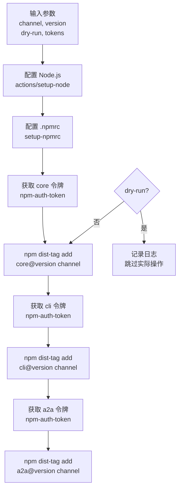

# tag-npm-release 架构

> 为 gemini-cli 三个 NPM 包统一设置 dist-tag 的 Composite Action

## 概述

`tag-npm-release` 是一个 GitHub Composite Action，用于在 NPM 发布后为 `@google/gemini-cli-core`、`@google/gemini-cli` 和 `@google/gemini-cli-a2a-server` 三个包统一设置 dist-tag（如 `latest`、`preview`、`nightly`、`dev`）。NPM dist-tag 控制用户运行 `npx @google/gemini-cli` 或 `npm install @google/gemini-cli@latest` 时获取的版本。该 Action 在 `publish-release` 流程的末尾被调用。

## 架构图



## 目录结构

```
tag-npm-release/
└── action.yml    # Action 定义文件
```

## 关键文件

| 文件 | 功能 |
|------|------|
| `action.yml` | 标签管理流程：配置环境 -> 分别获取三个包的认证令牌 -> 使用 `npm dist-tag add` 为每个包设置指定频道标签。支持 dry-run 模式 |

## 内部依赖

| 被调用 Action | 用途 |
|--------------|------|
| `setup-npmrc` | 配置 .npmrc 多注册表访问 |
| `npm-auth-token` | 3 次调用，分别获取 core、cli、a2a 的发布令牌 |

## 外部依赖

| 依赖 | 用途 |
|------|------|
| `actions/setup-node` | 配置 Node.js 环境（使用 .nvmrc 指定版本） |
| `npm` CLI | `npm dist-tag add` 命令设置 dist-tag |
