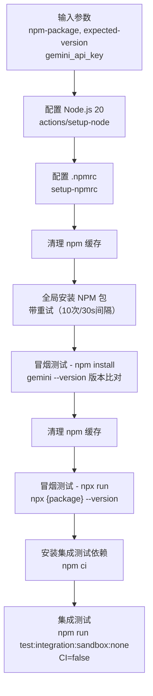

# verify-release 架构

> 从 NPM 安装已发布包并执行冒烟测试和集成测试的 Composite Action

## 概述

`verify-release` 是一个 GitHub Composite Action，用于在 NPM 发布完成后验证发布结果的正确性。它从 NPM 注册表全新安装已发布的包，执行版本号验证、npx 运行验证和完整的集成测试。该 Action 使用 `nick-fields/retry` 实现安装重试（最多 10 次，每次间隔 30 秒），以应对 NPM CDN 传播延迟。验证步骤刻意禁用 `CI=false` 以支持交互式测试。

## 架构图



## 目录结构

```
verify-release/
└── action.yml    # Action 定义文件
```

## 关键文件

| 文件 | 功能 |
|------|------|
| `action.yml` | 发布验证流程：(1) 配置环境和 .npmrc；(2) 清理缓存后全局安装（带 10 次重试应对 CDN 延迟）；(3) `gemini --version` 验证安装版本；(4) `npx` 验证运行版本；(5) 安装项目依赖后运行无沙箱集成测试（设置 `CI=false` 和 `INTEGRATION_TEST_USE_INSTALLED_GEMINI=true`） |

## 内部依赖

| 被调用 Action | 用途 |
|--------------|------|
| `setup-npmrc` | 配置多注册表 .npmrc |

## 外部依赖

| 依赖 | 用途 |
|------|------|
| `actions/setup-node@v4` | 配置 Node.js 20 环境 |
| `nick-fields/retry@v3` | NPM 安装重试机制（timeout 900s，最多 10 次，间隔 30s） |
| `npm` CLI | 全局安装、npx 运行、集成测试 |
