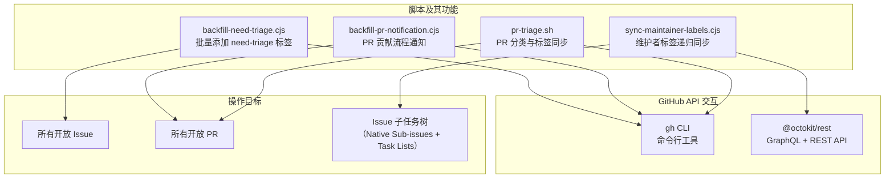

# .github/scripts 架构

> 四个自动化管理脚本，用于 Issue/PR 标签批量回填、PR 贡献流程通知、PR 分类标签同步和维护者标签递归传播

## 概述

`scripts/` 目录包含 gemini-cli 项目的 GitHub 自动化管理脚本，被 `workflows/` 中的工作流调用执行。这些脚本处理大规模的 Issue 和 PR 管理任务：批量为未分类 Issue 添加 `status/need-triage` 标签、向非维护者的 PR 发送贡献流程通知、将 Issue 标签同步到关联的 PR、以及递归地将 `maintainer only` 标签传播到子 Issue 树。所有脚本都支持 `--dry-run` 模式，使用 `gh` CLI 或 Octokit API 与 GitHub 交互。

## 架构图



## 目录结构

```
scripts/
├── backfill-need-triage.cjs      # 批量添加 need-triage 标签
├── backfill-pr-notification.cjs  # PR 贡献流程通知
├── pr-triage.sh                  # PR 分类与标签同步
└── sync-maintainer-labels.cjs    # 维护者标签递归同步
```

## 关键文件

| 文件 | 功能 |
|------|------|
| `backfill-need-triage.cjs` | 批量查询所有开放 Issue，过滤掉已有 `maintainer only`、`help wanted` 或 `status/need-triage` 标签的 Issue，为剩余 Issue 添加 `status/need-triage` 标签。使用 `gh api` 分页查询突破 1000 条限制，通过 `jq` 过滤 |
| `backfill-pr-notification.cjs` | 向非维护者团队成员提交的、未关联 Issue 的开放 PR 发送贡献流程变更通知评论。使用团队成员 API 检查 PR 作者是否为维护者（带缓存），检查是否已发送过通知（幂等性） |
| `pr-triage.sh` | PR 分类核心脚本：(1) 无关联 Issue 的非 draft PR 添加 `status/need-issue` 标签；(2) 有关联 Issue 的 PR 移除 `status/need-issue` 标签并同步 Issue 的 `area/*`、`priority/*`、`help wanted`、`maintainer only` 标签到 PR；(3) 输出需要评论通知的 PR 列表到 `$GITHUB_OUTPUT` |
| `sync-maintainer-labels.cjs` | 从指定的根 Issue（#15374、#15456、#15324）出发，通过 GraphQL 递归遍历 Native Sub-issues 和 Markdown Task Lists 中的子 Issue 引用，为所有后代 Issue 添加 `maintainer only` 标签并移除 `status/need-triage` 标签。支持跨仓库（公共 gemini-cli 和私有 maintainers-gemini-cli）遍历，仅标记公共仓库 Issue |

## 内部依赖

- 脚本被 `.github/workflows/` 中的工作流调用执行
- `pr-triage.sh` 通过 `$GITHUB_OUTPUT` 与调用工作流通信
- 脚本中使用的标签名（如 `status/need-triage`、`status/need-issue`、`maintainer only`）与项目标签系统一致

## 外部依赖

| 依赖 | 用途 | 使用者 |
|------|------|--------|
| `gh` CLI | GitHub API 交互（Issue/PR 查询、编辑、评论） | backfill-need-triage.cjs, backfill-pr-notification.cjs, pr-triage.sh |
| `@octokit/rest` | GitHub GraphQL/REST API 客户端 | sync-maintainer-labels.cjs |
| `jq` | JSON 数据处理 | pr-triage.sh |
| Node.js `child_process` | 安全执行 `gh` CLI 命令（`execFileSync` 避免命令注入） | backfill-need-triage.cjs, backfill-pr-notification.cjs |
