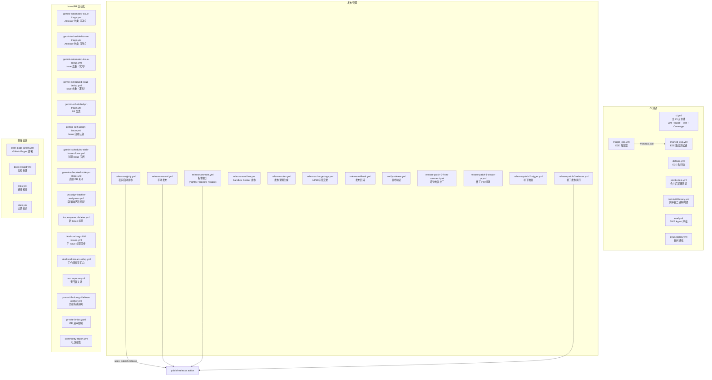

# .github/workflows 架构

> 40 个 GitHub Actions 工作流，覆盖 CI 测试、发布管理、Issue/PR 自动化分类和项目基础设施维护

## 概述

`workflows/` 目录包含 gemini-cli 项目的 40 个 GitHub Actions 工作流定义文件。这些工作流构成了项目的完整自动化运维体系，分为四大类别：CI 测试（持续集成、E2E 测试、冒烟测试）、发布管理（夜间构建、手动发布、版本提升、补丁发布、回滚）、Issue/PR 自动化（AI 分类、标签管理、过期清理、贡献者通知）和基础设施（文档部署、链接检查、依赖更新）。工作流之间存在复杂的触发链和调用关系。

## 架构图



## 目录结构

```
workflows/
├── # CI 测试 (8 个)
├── ci.yml                           # 主 CI: Lint + Build + Test + Coverage (PR/push/merge_group)
├── chained_e2e.yml                  # E2E 链式测试 (push main/merge_group/workflow_run)
├── trigger_e2e.yml                  # E2E 触发器 (pull_request)
├── deflake.yml                      # E2E 去抖动重复测试 (workflow_dispatch)
├── smoke-test.yml                   # 合并后冒烟测试 (push main)
├── test-build-binary.yml            # 跨平台二进制构建测试 (workflow_dispatch)
├── eval.yml                         # SWE Agent 评估 (workflow_dispatch)
├── evals-nightly.yml                # 夜间评估 (schedule/workflow_dispatch)
│
├── # 发布管理 (12 个)
├── release-nightly.yml              # 夜间自动发布 (schedule 每天 00:00 UTC)
├── release-manual.yml               # 手动发布 (workflow_dispatch)
├── release-promote.yml              # 版本提升: nightly->preview->stable (workflow_dispatch)
├── release-sandbox.yml              # Sandbox Docker 发布 (workflow_dispatch)
├── release-notes.yml                # 发布说明生成 (release published)
├── release-change-tags.yml          # NPM dist-tag 变更 (workflow_dispatch)
├── release-rollback.yml             # 发布回滚 (workflow_dispatch)
├── release-patch-0-from-comment.yml # 评论触发补丁流程 (issue_comment)
├── release-patch-1-create-pr.yml    # 补丁 PR 创建 (workflow_dispatch)
├── release-patch-2-trigger.yml      # 补丁触发 (pull_request closed)
├── release-patch-3-release.yml      # 补丁发布执行 (workflow_dispatch)
├── verify-release.yml               # 发布验证 (workflow_dispatch)
│
├── # Issue/PR 自动化 (16 个)
├── gemini-automated-issue-triage.yml      # AI Issue 分类 (issues opened/reopened)
├── gemini-scheduled-issue-triage.yml      # 定时 AI Issue 分类 (schedule)
├── gemini-automated-issue-dedup.yml       # AI Issue 去重 (issues opened)
├── gemini-scheduled-issue-dedup.yml       # 定时 AI Issue 去重 (schedule)
├── gemini-scheduled-pr-triage.yml         # 定时 PR 分类 (schedule)
├── gemini-self-assign-issue.yml           # Issue 自助认领 (issue_comment)
├── gemini-scheduled-stale-issue-closer.yml # 过期 Issue 关闭 (schedule)
├── gemini-scheduled-stale-pr-closer.yml   # 过期 PR 关闭 (schedule)
├── unassign-inactive-assignees.yml        # 取消非活跃分配 (schedule)
├── issue-opened-labeler.yml               # 新 Issue 自动标签 (issues opened)
├── label-backlog-child-issues.yml         # 子 Issue 标签同步 (schedule)
├── label-workstream-rollup.yml            # 工作流标签汇总 (schedule)
├── no-response.yml                        # 无回复自动关闭 (schedule/issue_comment)
├── pr-contribution-guidelines-notifier.yml # PR 贡献指南通知 (pull_request)
├── pr-rate-limiter.yaml                   # PR 提交速率限制 (pull_request)
├── community-report.yml                   # 社区贡献报告 (schedule)
│
├── # 基础设施 (4 个)
├── docs-page-action.yml             # GitHub Pages 文档部署 (push tags v*)
├── docs-rebuild.yml                 # 文档重建 (workflow_dispatch)
├── links.yml                        # Markdown 链接检查 (push/PR/schedule)
└── stale.yml                        # Issue/PR 过期标记 (schedule 每天 01:30)
```

## 关键文件

| 文件 | 功能 |
|------|------|
| `ci.yml` | 主 CI 流水线（17.6KB）：Merge Queue 跳过优化 -> Lint（ESLint + header check）-> 多平台构建测试（ubuntu/macos/windows x Node 20/22）-> 覆盖率收集与评论 -> 集成测试 |
| `release-nightly.yml` | 夜间自动发布：每天 00:00 UTC 触发，自动计算版本号，调用 `publish-release` action 发布到 nightly 频道 |
| `release-manual.yml` | 手动发布：支持指定版本号、分支、NPM 频道、环境和 dry-run 参数 |
| `release-promote.yml` | 版本提升：将 nightly -> preview -> stable 逐级提升，自动计算新版本号 |
| `release-patch-*` | 补丁发布四步流水线：(0) PR 评论触发 -> (1) 创建补丁 PR -> (2) PR 合并触发 -> (3) 执行补丁发布 |
| `release-rollback.yml` | 发布回滚：将 NPM latest 标签指向上一个稳定版本 |
| `gemini-automated-issue-triage.yml` | AI 驱动的实时 Issue 分类：使用 Gemini API 自动添加 area/* 和 priority/* 标签 |
| `gemini-automated-issue-dedup.yml` | AI 驱动的 Issue 去重：检测重复 Issue 并自动评论 |
| `chained_e2e.yml` | E2E 测试链：被 trigger_e2e 和 push main 触发，运行端到端集成测试 |
| `stale.yml` | 过期管理：60 天无活动标记 stale，14 天后自动关闭。豁免 pinned/security/maintainer-only/help-wanted 标签 |

## 内部依赖

### 工作流间触发链
- `trigger_e2e.yml` --(`workflow_run`)--> `chained_e2e.yml`
- `release-patch-0-from-comment.yml` --(`workflow_dispatch`)--> `release-patch-1-create-pr.yml`
- `release-patch-2-trigger.yml` --(`workflow_dispatch`)--> `release-patch-3-release.yml`

### 工作流引用的 Composite Actions
- `ci.yml` -> `post-coverage-comment`, `push-docker`
- `release-nightly.yml` -> `calculate-vars`, `publish-release`
- `release-manual.yml` -> `calculate-vars`, `publish-release`
- `release-promote.yml` -> `calculate-vars`, `publish-release`
- `release-patch-3-release.yml` -> `publish-release`
- `release-sandbox.yml` -> `push-sandbox`
- `verify-release.yml` -> `verify-release`
- `release-change-tags.yml` -> `tag-npm-release`
- `release-rollback.yml` -> `tag-npm-release`

### 工作流引用的脚本
- `gemini-scheduled-pr-triage.yml` -> `scripts/pr-triage.sh`
- `label-backlog-child-issues.yml` -> `scripts/sync-maintainer-labels.cjs`

## 外部依赖

| 依赖 | 用途 | 使用者 |
|------|------|--------|
| `actions/checkout` | 代码检出 | 几乎所有工作流 |
| `actions/setup-node` | Node.js 环境 | CI、发布工作流 |
| `actions/stale` | Issue/PR 过期管理 | stale.yml |
| `actions/configure-pages` / `actions/deploy-pages` | GitHub Pages 部署 | docs-page-action.yml |
| `lycheeverse/lychee-action` | Markdown 链接检查 | links.yml |
| `cariad-tech/merge-queue-ci-skipper` | 合并队列优化 | ci.yml, chained_e2e.yml |
| Gemini API | AI 驱动的 Issue 分类和去重 | gemini-automated-issue-triage.yml, gemini-automated-issue-dedup.yml |
