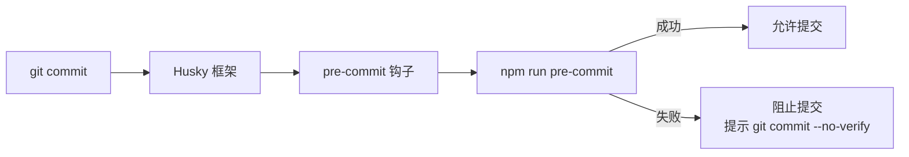

# .husky 架构

> Git pre-commit 钩子配置，在提交前自动执行代码质量检查

## 概述

`.husky/` 目录配置了 gemini-cli 项目的 Git 钩子，使用 [Husky](https://typicode.github.io/husky/) 框架管理。当前仅配置了一个 `pre-commit` 钩子，在每次 `git commit` 时自动运行 `npm run pre-commit` 脚本执行代码质量检查（通常包括 lint-staged 格式化和 lint 检查）。钩子失败时会阻止提交并提供使用 `--no-verify` 紧急跳过的提示。

## 架构图



## 目录结构

```
.husky/
└── pre-commit    # Git pre-commit 钩子脚本
```

## 关键文件

| 文件 | 功能 |
|------|------|
| `pre-commit` | 执行 `npm run pre-commit` 命令。失败时输出分隔线和紧急跳过命令（`git commit --no-verify`），返回退出码 1 阻止提交 |

## 内部依赖

| 依赖 | 说明 |
|------|------|
| `npm run pre-commit` | 项目根目录 `package.json` 中定义的 pre-commit 脚本，通常调用 lint-staged 执行针对暂存文件的格式化和 lint 检查 |

## 外部依赖

| 依赖 | 用途 |
|------|------|
| [Husky](https://typicode.github.io/husky/) | Git 钩子管理框架，在 `npm install` 时自动安装钩子 |
| lint-staged（推测） | 仅对 Git 暂存区文件运行 lint/format 检查，由 `npm run pre-commit` 间接调用 |
