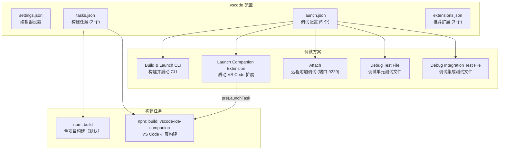

# .vscode 架构

> VS Code 工作区配置，提供统一的编辑器设置、调试配置、构建任务和推荐扩展

## 概述

`.vscode/` 目录包含 gemini-cli 项目的 VS Code 工作区级配置文件。这些配置确保团队成员使用一致的代码格式化规则（Prettier）、编辑器设置（2 空格缩进、80 字符标尺），并提供了 5 个预配置的调试方案（覆盖 CLI 启动、VS Code 扩展开发、远程附加、单元测试调试和集成测试调试）以及 2 个构建任务。推荐扩展列表包含 Vitest Explorer、Prettier 和 ESLint 三个开发必备工具。

## 架构图



## 目录结构

```
.vscode/
├── extensions.json  # 推荐扩展列表
├── launch.json      # 调试启动配置
├── settings.json    # 编辑器和工作区设置
└── tasks.json       # 构建任务定义
```

## 关键文件

| 文件 | 功能 |
|------|------|
| `settings.json` | 编辑器配置：启用 TypeScript 项目诊断、2 空格缩进、80 字符标尺、禁用自动缩进检测、Prettier 作为 TS/TSX/JS/JSON/MD 的默认格式化器、禁用 Vitest 工作区警告 |
| `launch.json` | 5 个调试配置：(1) **Build & Launch CLI** -- 运行 `npm run build-and-start` 启动 CLI（`GEMINI_SANDBOX=false`）；(2) **Launch Companion VS Code Extension** -- 启动 `vscode-ide-companion` 扩展主机调试（依赖 `npm: build: vscode-ide-companion` 任务）；(3) **Attach** -- 附加到端口 9229 的 Node 进程，支持沙箱全局安装的源码映射（`remoteRoot: /usr/local/share/npm-global/lib/node_modules/@gemini-cli`）；(4) **Debug Test File** -- 通过 `npm run test` 和 `--inspect-brk=9229` 调试指定测试文件；(5) **Debug Integration Test File** -- 使用 `npx vitest` 调试集成测试（`GEMINI_SANDBOX=false`） |
| `tasks.json` | 2 个构建任务：(1) `npm: build` -- 全项目构建（默认构建任务）；(2) `npm: build: vscode-ide-companion` -- 单独构建 VS Code IDE 伴侣扩展 |
| `extensions.json` | 推荐安装 3 个扩展：`vitest.explorer`（Vitest 测试浏览器）、`esbenp.prettier-vscode`（Prettier 格式化器）、`dbaeumer.vscode-eslint`（ESLint 检查器） |

## 内部依赖

| 依赖 | 说明 |
|------|------|
| `npm run build-and-start` | 项目 package.json 中的组合脚本，用于构建并启动 CLI |
| `npm run build` | 项目全量构建脚本（`scripts/build.sh`） |
| `npm run test` | 项目测试脚本 |
| `packages/vscode-ide-companion/` | VS Code IDE 伴侣扩展包，Launch 配置中引用了其构建输出和开发路径 |
| `integration-tests/` | 集成测试目录，Debug Integration Test File 配置中使用 |

## 外部依赖

| 依赖 | 用途 |
|------|------|
| [Vitest Explorer](https://marketplace.visualstudio.com/items?itemName=vitest.explorer) | VS Code 中的 Vitest 测试浏览器和运行器 |
| [Prettier](https://marketplace.visualstudio.com/items?itemName=esbenp.prettier-vscode) | 代码格式化器，用于 TS/TSX/JS/JSON/MD 文件 |
| [ESLint](https://marketplace.visualstudio.com/items?itemName=dbaeumer.vscode-eslint) | JavaScript/TypeScript 静态代码分析 |
