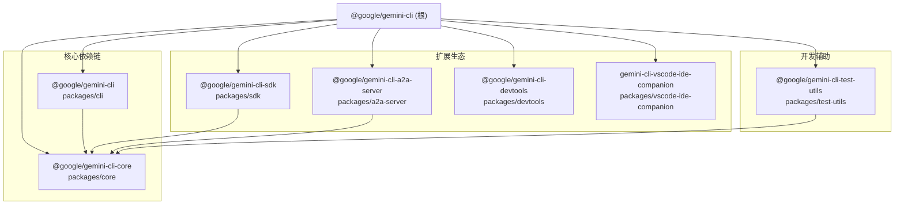

# gemini-cli 根目录架构

> Google Gemini CLI 的 monorepo 根目录，管理 7 个 npm workspace 包及其构建、测试、发布流程。

## 概述

`gemini-cli` 是 Google 官方的 Gemini AI 命令行工具，采用 npm workspaces 管理的 monorepo 架构。根目录作为整个项目的组织枢纽，负责统一构建编排、依赖管理、代码质量控制和发布流程。项目使用 TypeScript 编写，目标运行环境为 Node.js >= 20，模块系统为 ESM（`"type": "module"`）。

根目录的 `package.json` 定义了顶层脚本（构建、测试、lint、发布等），并通过 `workspaces` 字段将 `packages/*` 下的 7 个子包统一管理。最终产物通过 esbuild 打包到 `bundle/gemini.js`，作为 CLI 的入口。

## 架构图



## 目录结构

```
gemini-cli/
├── packages/                # 7 个 workspace 子包
│   ├── cli/                 # CLI 前端 (Ink/React TUI)
│   ├── core/                # 核心引擎 (Agent、工具、API 交互)
│   ├── sdk/                 # SDK 包 (基于 core 的公共 API)
│   ├── a2a-server/          # A2A (Agent-to-Agent) 服务器
│   ├── devtools/            # 开发者工具 (WebSocket 调试)
│   ├── test-utils/          # 测试工具和辅助函数
│   └── vscode-ide-companion/ # VS Code IDE 伴侣扩展
├── .gemini/                 # Gemini Code Assist 配置和自定义命令
├── .gcp/                    # GCP 构建和发布配置
├── .allstar/                # GitHub Allstar 安全治理
├── .github/                 # GitHub Actions 工作流和模板
├── scripts/                 # 构建、发布、代码生成脚本
├── evals/                   # 行为评测 (Behavioral Evaluations)
├── integration-tests/       # 集成测试
├── docs/                    # 项目文档
├── schemas/                 # JSON Schema 定义
├── sea/                     # Single Executable Application 支持
├── bundle/                  # esbuild 打包产物
├── package.json             # 根 package.json (monorepo 管理)
├── tsconfig.json            # TypeScript 基础配置
├── esbuild.config.js        # esbuild 打包配置
├── eslint.config.js         # ESLint 配置
├── Dockerfile               # 沙箱容器 Dockerfile
└── Makefile                 # 便捷 Make 命令
```

## 关键文件

| 文件 | 功能 |
|------|------|
| `package.json` | monorepo 根配置，定义 workspaces、脚本、顶层依赖和 npm overrides |
| `tsconfig.json` | TypeScript 基础配置，strict 模式，ESM + NodeNext 模块解析 |
| `esbuild.config.js` | esbuild 打包配置，将所有包合并为 `bundle/gemini.js` |
| `eslint.config.js` | ESLint flat config，统一代码风格和质量规则 |
| `Dockerfile` | 沙箱环境 Docker 镜像定义 |
| `Makefile` | 便捷构建命令入口 |
| `GEMINI.md` | Gemini Code Assist 的项目级提示词配置 |
| `CONTRIBUTING.md` | 贡献者指南 |

## 7 个 Workspace 包

| 包名 | 路径 | 功能 | 内部依赖 |
|------|------|------|----------|
| `@google/gemini-cli` | `packages/cli` | CLI 前端 TUI (Ink/React) | `@google/gemini-cli-core` |
| `@google/gemini-cli-core` | `packages/core` | 核心引擎：Agent 循环、工具系统、API 客户端 | 无 |
| `@google/gemini-cli-sdk` | `packages/sdk` | 公共 SDK API | `@google/gemini-cli-core` |
| `@google/gemini-cli-a2a-server` | `packages/a2a-server` | Agent-to-Agent 协议服务器 | `@google/gemini-cli-core` |
| `@google/gemini-cli-devtools` | `packages/devtools` | WebSocket 调试工具 | 无 |
| `@google/gemini-cli-test-utils` | `packages/test-utils` | 测试辅助工具 | `@google/gemini-cli-core` |
| `gemini-cli-vscode-ide-companion` | `packages/vscode-ide-companion` | VS Code IDE 伴侣 MCP 服务 | 无 |

## 内部依赖

根目录本身不包含业务逻辑代码，但通过以下方式协调各子包：

- `npm run build` 调用 `scripts/build.js` 按依赖顺序构建所有包
- `npm run bundle` 使用 esbuild 将构建产物打包为单一可执行文件
- `npm run test` 遍历所有 workspace 运行测试
- `npm run preflight` 执行完整的 CI 前置检查流程（clean、install、format、build、lint、typecheck、test）

## 外部依赖

**核心运行时依赖：**
- `ink` (fork: `@jrichman/ink`) - React 终端 UI 框架
- `simple-git` - Git 操作库
- `proper-lockfile` - 文件锁定
- `latest-version` - npm 最新版本检查

**关键开发依赖：**
- `esbuild` - 快速 JavaScript 打包工具
- `vitest` - 测试框架
- `typescript-eslint` / `eslint` - 代码质量
- `prettier` - 代码格式化
- `husky` / `lint-staged` - Git hooks
- `tsx` - TypeScript 执行器

**可选依赖（平台相关）：**
- `@lydell/node-pty` / `node-pty` - 伪终端支持（多平台）
- `keytar` - 系统密钥链访问
