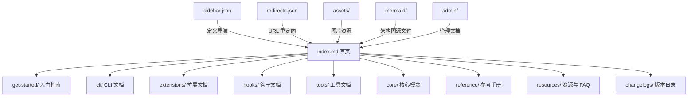

# docs 架构

> Gemini CLI 的官方用户文档站点，包含入门指南、功能说明、配置参考和开发者文档。

## 概述

`docs/` 目录是 Gemini CLI 项目的完整文档体系，采用 Markdown 格式编写，通过 `sidebar.json` 组织导航结构。文档涵盖从快速入门到高级配置、从用户教程到开发者贡献指南的完整内容。该目录同时作为线上文档站点的源文件，支持 Mermaid 架构图渲染和资源文件引用。

## 架构图



## 目录结构

```
docs/
├── index.md                    # 文档首页与总览
├── sidebar.json                # 导航栏结构定义（4 个 tab）
├── redirects.json              # URL 重定向映射
├── CONTRIBUTING.md             # -> ../CONTRIBUTING.md 的符号链接
├── admin/                      # 管理相关文档
├── assets/                     # 图片资源（截图、主题预览等）
├── changelogs/                 # 版本发布日志
├── cli/                        # CLI 使用文档（教程、功能、配置）
│   ├── tutorials/              # 用户教程（文件管理、Shell 命令等）
│   ├── cli-reference.md        # CLI 命令速查表
│   ├── settings.md             # 设置说明
│   └── ...                     # 其他功能文档
├── core/                       # 核心架构概念（子代理、远程代理）
├── examples/                   # 使用示例
├── extensions/                 # 扩展系统文档
├── get-started/                # 入门（安装、认证、快速开始）
├── hooks/                      # 钩子系统文档
├── ide-integration/            # IDE 集成文档
├── mermaid/                    # Mermaid 架构图源文件
├── reference/                  # 参考手册（命令、配置、快捷键、工具）
├── resources/                  # FAQ、定价、故障排除、隐私条款
├── tools/                      # 工具文档（MCP 服务器）
├── integration-tests.md        # 集成测试说明
├── issue-and-pr-automation.md  # Issue 和 PR 自动化说明
├── local-development.md        # 本地开发指南
├── npm.md                      # NPM 包结构说明
├── release-confidence.md       # 发布信心度指标
└── releases.md                 # 发布流程说明
```

## 关键文件

| 文件 | 功能 |
|------|------|
| `index.md` | 文档首页，包含所有文档分类的入口链接 |
| `sidebar.json` | 定义导航栏结构，包含 docs_tab、reference_tab、resources_tab、releases_tab 四个标签页 |
| `redirects.json` | 旧 URL 到新 URL 的重定向映射，确保文档迁移后的链接兼容性 |
| `cli/tutorials/` | 用户教程目录，涵盖文件管理、Shell 命令、会话管理、MCP 设置等 |
| `reference/commands.md` | 完整的命令参考手册 |
| `reference/configuration.md` | 配置项和环境变量参考 |
| `extensions/writing-extensions.md` | 扩展开发指南 |
| `hooks/reference.md` | 钩子系统 API 参考 |
| `mermaid/context.mmd` | 上下文系统 Mermaid 架构图 |
| `mermaid/render-path.mmd` | 渲染路径 Mermaid 架构图 |

## 内部依赖

- 符号链接至根目录的 `CONTRIBUTING.md`
- 文档内容引用 `schemas/settings.schema.json` 作为设置的 JSON Schema

## 外部依赖

- Markdown 渲染引擎（文档站点构建工具）
- Mermaid 图表渲染支持
- 图片资源（`assets/` 目录下的 PNG 截图）
