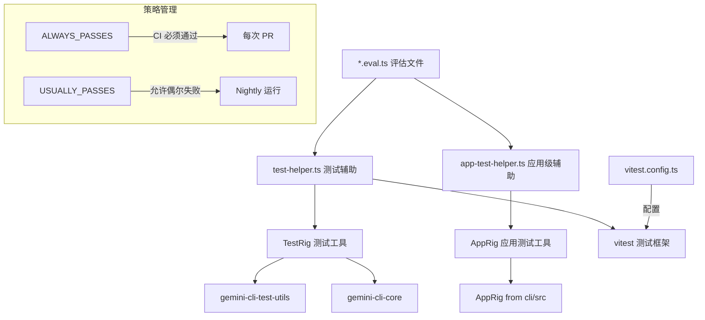

# evals 架构

> 行为评估（Behavioral Evals）测试套件，用于验证 AI 代理在特定提示下的决策行为是否正确。

## 概述

`evals/` 目录包含 Gemini CLI 的行为评估测试系统。与传统集成测试验证系统功能不同，行为评估验证的是模型是否"选择"了正确的动作。例如，当用户要求"检查 bug"时，代理不应自动修改文件；而当用户说"修复 bug"时，代理应该执行编辑操作。该系统通过两级策略（`ALWAYS_PASSES` 和 `USUALLY_PASSES`）管理测试的确定性预期，是系统提示词、工具定义等模型引导机制的核心反馈回路。

## 架构图



## 目录结构

```
evals/
├── vitest.config.ts           # Vitest 配置（5 分钟超时，JSON 报告）
├── test-helper.ts             # 核心测试辅助工具（evalTest, EvalCase）
├── app-test-helper.ts         # 进程内 AppRig 辅助工具
├── README.md                  # 评估系统完整文档
├── answer-vs-act.eval.ts      # 回答 vs 行动边界评估
├── ask_user.eval.ts           # 用户询问行为评估
├── automated-tool-use.eval.ts # 自动化工具使用评估
├── concurrency-safety.eval.ts # 并发安全评估
├── edit-locations-eval.eval.ts# 编辑位置评估
├── frugalReads.eval.ts        # 节约读取评估
├── frugalSearch.eval.ts       # 节约搜索评估
├── generalist_agent.eval.ts   # 通用代理评估
├── generalist_delegation.eval.ts # 通用代理委派评估
├── gitRepo.eval.ts            # Git 仓库操作评估
├── grep_search_functionality.eval.ts # Grep 搜索评估
├── hierarchical_memory.eval.ts # 层级记忆评估
├── interactive-hang.eval.ts   # 交互式挂起检测评估
├── model_steering.eval.ts     # 模型引导评估
├── plan_mode.eval.ts          # 计划模式评估
├── save_memory.eval.ts        # 记忆保存评估
├── shell-efficiency.eval.ts   # Shell 效率评估
├── subagents.eval.ts          # 子代理评估
├── tool_output_masking.eval.ts# 工具输出遮罩评估
├── tracker.eval.ts            # 任务跟踪器评估
├── validation_fidelity.eval.ts# 验证保真度评估
└── validation_fidelity_pre_existing_errors.eval.ts # 预存错误验证评估
```

## 关键文件

| 文件 | 功能 |
|------|------|
| `test-helper.ts` | 核心辅助模块，定义 `evalTest()` 函数、`EvalCase` 接口和 `EvalPolicy` 类型，管理测试设置、Git 初始化、日志记录和清理 |
| `app-test-helper.ts` | 基于进程内 `AppRig` 的评估辅助，支持渲染层面的评估测试 |
| `vitest.config.ts` | 测试配置：5 分钟超时、JSON 报告输出到 `evals/logs/report.json`、匹配 `*.eval.ts` 文件 |
| `answer-vs-act.eval.ts` | 验证代理在"检查"与"修复"指令间的正确行为边界（6 个测试用例） |
| `automated-tool-use.eval.ts` | 验证代理使用 eslint --fix 和 prettier --write 等自动化工具 |
| `tracker.eval.ts` | 验证任务跟踪器的创建和状态更新行为 |
| `generalist_agent.eval.ts` | 验证通用子代理的调用和文件创建能力 |

## 内部依赖

| 模块 | 用途 |
|------|------|
| `@google/gemini-cli-test-utils` | 提供 `TestRig` 测试工具类 |
| `@google/gemini-cli-core` | 提供 `EDIT_TOOL_NAMES`、`TRACKER_CREATE_TASK_TOOL_NAME`、`createUnauthorizedToolError`、`parseAgentMarkdown`、`DEFAULT_GEMINI_MODEL` 等常量和工具 |
| `packages/cli/src/test-utils/AppRig.js` | 提供进程内应用测试工具 |
| `packages/cli/test-setup.ts` | Vitest setupFiles 配置 |

## 外部依赖

| 包名 | 用途 |
|------|------|
| `vitest` | 测试框架，提供 `describe`、`it`、`expect` 等 |
| `node:fs` | 文件系统操作 |
| `node:path` | 路径处理 |
| `node:child_process` | 执行 Git 命令 |
| `node:crypto` | 代理文件哈希计算 |
