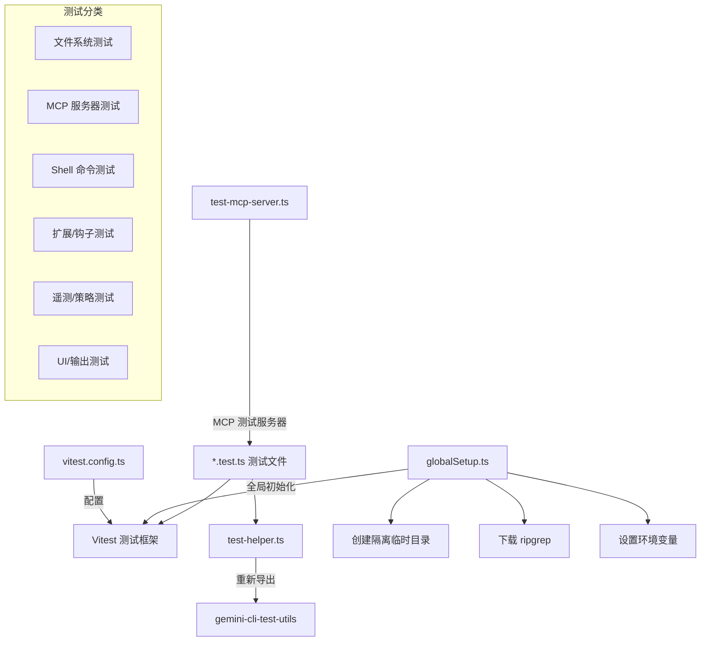

# integration-tests 架构

> 端到端集成测试套件，验证 Gemini CLI 各核心功能在真实环境中的正确运行。

## 概述

`integration-tests/` 目录包含 40+ 个集成测试文件，验证 Gemini CLI 的端到端功能。与行为评估（evals）不同，集成测试关注的是系统的功能正确性，例如"文件写入工具是否真正写入了文件"、"MCP 服务器是否能正确连接"。测试通过 `TestRig` 工具类驱动 CLI 的实际二进制执行，使用全局设置（`globalSetup.ts`）创建隔离的临时目录和环境变量，支持多线程并行执行，并内置 2 次重试机制以应对间歇性失败。

## 架构图



## 目录结构

```
integration-tests/
├── vitest.config.ts                    # Vitest 配置（5 分钟超时，8-16 线程并行，2 次重试）
├── globalSetup.ts                      # 全局设置（临时目录、环境隔离、ripgrep 下载）
├── test-helper.ts                      # 测试辅助（重新导出 test-utils）
├── test-mcp-server.ts                  # MCP 测试服务器实现
├── tsconfig.json                       # TypeScript 配置
│
├── file-system.test.ts                 # 文件读取功能测试
├── file-system-interactive.test.ts     # 交互式文件系统测试
├── write_file.test.ts                  # 文件写入测试
├── read_many_files.test.ts             # 批量文件读取测试
├── replace.test.ts                     # 文件替换测试
├── list_directory.test.ts              # 目录列表测试
│
├── run_shell_command.test.ts           # Shell 命令执行测试
├── stdin-context.test.ts              # 标准输入上下文测试
├── stdout-stderr-output.test.ts        # 标准输出/错误输出测试
│
├── simple-mcp-server.test.ts           # 简单 MCP 服务器测试
├── mcp_server_cyclic_schema.test.ts    # MCP 循环 Schema 测试
│
├── extensions-install.test.ts          # 扩展安装测试
├── extensions-reload.test.ts           # 扩展重载测试
├── hooks-agent-flow.test.ts            # 钩子代理流程测试
├── hooks-system.test.ts                # 钩子系统测试
│
├── telemetry.test.ts                   # 遥测测试
├── acp-telemetry.test.ts              # ACP 遥测测试
├── acp-env-auth.test.ts               # ACP 环境认证测试
├── policy-headless.test.ts             # 策略无头模式测试
├── user-policy.test.ts                 # 用户策略测试
│
├── api-resilience.test.ts              # API 弹性测试
├── checkpointing.test.ts              # 检查点测试
├── concurrency-limit.test.ts           # 并发限制测试
├── context-compress-interactive.test.ts # 上下文压缩测试
├── ctrl-c-exit.test.ts                # Ctrl+C 退出测试
├── json-output.test.ts                # JSON 输出模式测试
├── plan-mode.test.ts                   # 计划模式测试
├── parallel-tools.test.ts             # 并行工具测试
├── resume_repro.test.ts               # 会话恢复测试
├── ripgrep-real.test.ts               # ripgrep 真实使用测试
├── google_web_search.test.ts          # Google 搜索测试
├── browser-agent.test.ts             # 浏览器代理测试
├── flicker.test.ts                    # UI 闪烁测试
├── deprecation-warnings.test.ts       # 弃用警告测试
├── mixed-input-crash.test.ts          # 混合输入崩溃测试
├── symlink-install.test.ts            # 符号链接安装测试
├── clipboard-linux.test.ts            # Linux 剪贴板测试
├── utf-bom-encoding.test.ts           # UTF BOM 编码测试
├── skill-creator-scripts.test.ts      # 技能创建脚本测试
└── skill-creator-vulnerabilities.test.ts # 技能创建漏洞测试
```

## 关键文件

| 文件 | 功能 |
|------|------|
| `vitest.config.ts` | 测试配置：5 分钟超时、8-16 线程并行、2 次重试、`GEMINI_TEST_TYPE=integration` 环境变量 |
| `globalSetup.ts` | 全局设置/清理：创建隔离临时目录 `.integration-tests/<timestamp>/`，设置 HOME/CONFIG_DIR 环境变量，预下载 ripgrep，自动清理旧运行记录（保留最近 5 个） |
| `test-helper.ts` | 重新导出 `@google/gemini-cli-test-utils` 中的 `TestRig`、`normalizePath` 等工具 |
| `test-mcp-server.ts` | 基于 `@modelcontextprotocol/sdk` 和 Express 的测试用 MCP HTTP 服务器，支持动态注册工具 |
| `tsconfig.json` | TypeScript 配置，继承根 tsconfig，引用 `packages/core` |

## 内部依赖

| 模块 | 用途 |
|------|------|
| `@google/gemini-cli-test-utils` | 提供 `TestRig`、`poll`、`printDebugInfo`、`assertModelHasOutput` 等 |
| `@google/gemini-cli-core` | 提供 `disableMouseTracking`、`canUseRipgrep` 等核心功能 |
| `packages/core/src/tools/ripGrep.js` | ripgrep 可用性检查 |

## 外部依赖

| 包名 | 用途 |
|------|------|
| `vitest` | 测试框架 |
| `@modelcontextprotocol/sdk` | MCP 协议 SDK（McpServer、StreamableHTTPServerTransport） |
| `express` | HTTP 服务器（MCP 测试服务器） |
| `zod` | Schema 类型定义 |
