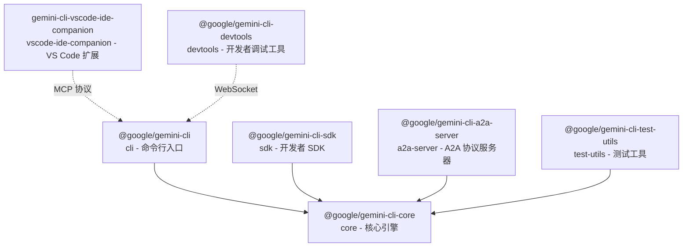

# packages 架构

> Gemini CLI 的多包 monorepo 工作区，包含 7 个相互协作的子包

## 概述

`packages/` 目录是 Gemini CLI 项目的 monorepo 工作区根目录。项目采用 npm workspace 组织方式，将功能划分为多个独立但相互关联的包。核心逻辑位于 `core` 包中，其他包（CLI、SDK、A2A 服务器等）均依赖 `core` 包提供的能力。所有包共享统一的版本号（当前为 `0.35.0-nightly`），通过 `file:` 协议引用 workspace 内的依赖。

## 架构图

## 目录结构

| 子包 | 包名 | 功能描述 |
|------|------|---------|
| `core/` | `@google/gemini-cli-core` | 核心引擎：LLM 客户端、工具系统、配置、策略、Agent 框架 |
| `cli/` | `@google/gemini-cli` | 命令行界面：终端 UI、命令解析、用户交互 |
| `sdk/` | `@google/gemini-cli-sdk` | 开发者 SDK：提供编程接口，基于 Zod 的类型安全 |
| `a2a-server/` | `@google/gemini-cli-a2a-server` | A2A（Agent-to-Agent）协议服务器，支持远程 Agent 通信 |
| `devtools/` | `@google/gemini-cli-devtools` | 开发者调试工具：基于 React 的 Web UI + WebSocket 服务器 |
| `test-utils/` | `@google/gemini-cli-test-utils` | 测试工具集：模拟终端（node-pty）、测试辅助函数 |
| `vscode-ide-companion/` | `gemini-cli-vscode-ide-companion` | VS Code IDE 伴侣扩展：通过 MCP 协议与 CLI 集成 |

## 关键文件

| 文件 | 功能 |
|------|------|
| `core/package.json` | 核心包定义，包含约 60+ 个依赖 |
| `cli/package.json` | CLI 入口包，`bin` 字段定义 `gemini` 命令 |
| `sdk/package.json` | SDK 包，依赖 core + zod |
| `a2a-server/package.json` | A2A 服务器，依赖 core + @a2a-js/sdk |

## 内部依赖

包间依赖关系形成清晰的层级：
- **core** 是基础层，不依赖其他 workspace 包
- **cli、sdk、a2a-server、test-utils** 都直接依赖 core
- **devtools** 独立运行，通过 WebSocket 与 CLI 通信
- **vscode-ide-companion** 独立运行，通过 MCP 协议与 CLI 通信

## 外部依赖

关键外部依赖包括：
- `@google/genai` - Google Generative AI SDK
- `@modelcontextprotocol/sdk` - MCP 协议 SDK
- `@a2a-js/sdk` - Agent-to-Agent 协议 SDK
- `@opentelemetry/*` - 可观测性（遥测）框架
- `zod` - 运行时类型验证
- `vitest` - 测试框架
