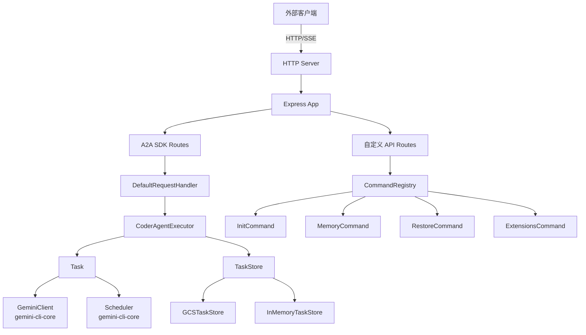

# a2a-server 架构

> 基于 A2A (Agent-to-Agent) 协议的 Gemini CLI 服务端，将 Gemini CLI 的代码生成能力封装为可通过 HTTP 调用的 Agent 服务。

## 概述

`a2a-server` 包将 Gemini CLI 的核心代码生成功能暴露为一个符合 A2A 协议的 HTTP 服务器。它允许外部客户端（如 IDE 前端）通过 JSON-RPC 流式消息与 Gemini Agent 交互，支持任务创建、消息流处理、工具调用确认、任务取消等完整的 Agent 生命周期管理。该包在系统中充当 CLI 核心能力的服务化适配层，使得 Gemini CLI 可以脱离终端界面独立运行。

## 架构图



## 目录结构

```
packages/a2a-server/
├── index.ts                 # 包入口，重新导出 src/index.ts
├── package.json             # 包配置，依赖 @a2a-js/sdk、express、gemini-cli-core
├── src/
│   ├── index.ts             # 源码入口，导出核心模块
│   ├── types.ts             # 核心类型定义（CoderAgentEvent、消息类型等）
│   ├── agent/               # Agent 执行逻辑
│   ├── commands/            # 命令处理系统
│   ├── config/              # 配置加载与管理
│   ├── http/                # HTTP 服务层
│   ├── persistence/         # 持久化存储
│   └── utils/               # 工具函数
├── tsconfig.json
└── vitest.config.ts
```

## 关键文件

| 文件 | 功能 |
|------|------|
| `index.ts` | 包入口，重新导出所有公开 API |
| `src/types.ts` | 定义 CoderAgentEvent 枚举、消息类型、任务元数据和持久化状态接口 |
| `src/index.ts` | 源码入口，导出 executor、app 和 types |
| `package.json` | 包配置，定义 bin 入口 `gemini-cli-a2a-server` |

## 内部依赖

- `src/agent/` - Agent 执行核心逻辑
- `src/commands/` - 命令注册与执行系统
- `src/config/` - 配置、设置和扩展加载
- `src/http/` - HTTP 服务和 Express 应用
- `src/persistence/` - GCS 持久化存储
- `src/utils/` - 日志和工具函数

## 外部依赖

| 包名 | 用途 |
|------|------|
| `@a2a-js/sdk` | A2A 协议 SDK，提供 Task、Message 等类型 |
| `@a2a-js/sdk/server` | A2A 服务端组件，提供 TaskStore、AgentExecutor 接口 |
| `@google/gemini-cli-core` | Gemini CLI 核心，提供 GeminiClient、Scheduler 等 |
| `express` | HTTP 服务框架 |
| `@google-cloud/storage` | GCS 存储客户端 |
| `winston` | 日志框架 |
| `uuid` | UUID 生成 |
| `fs-extra` | 文件系统扩展 |
| `tar` | 归档压缩 |
| `strip-json-comments` | JSON 注释处理 |
