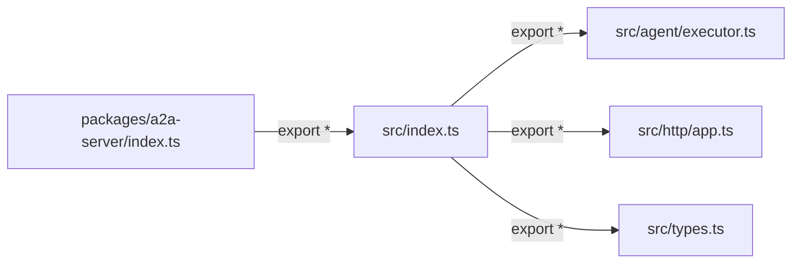

# index.ts

> 包的顶层入口文件，将内部模块的全部导出重新导出给外部消费者。

## 概述

`index.ts` 是 `@a2a-server` 包的根入口点。它本身不包含任何业务逻辑，唯一职责是通过 `export *` 语法将 `./src/index.js` 中的所有导出进行桶导出（barrel export），使外部消费者可以直接从包的根路径引入所有公共 API。

这种设计模式将包的公共接口定义与内部实现结构解耦，使得内部目录可以自由重组而不影响外部导入路径。

## 架构图

## 主要导出

| 导出方式 | 来源 | 说明 |
|---------|------|------|
| `export * from './src/index.js'` | `src/index.ts` | 转发 src 目录下所有已命名导出，包括 `CoderAgentExecutor`、HTTP 应用以及全部类型定义 |

## 核心逻辑

该文件仅包含一行重导出语句，无核心逻辑。它是标准的 TypeScript 桶文件（barrel file）模式。

## 内部依赖

| 模块 | 说明 |
|------|------|
| `./src/index.js` | 包的次级入口，聚合了 agent executor、HTTP app 和类型定义 |

## 外部依赖

无。
