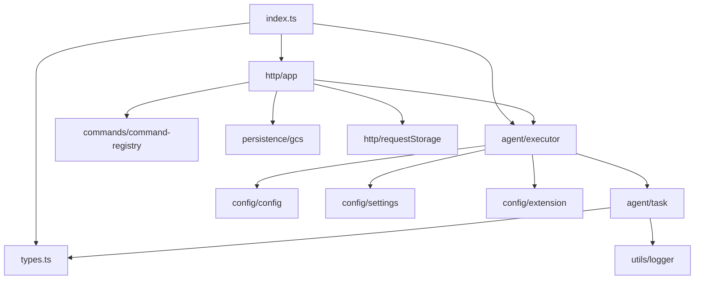

# a2a-server/src 架构

> A2A 服务端源码目录，包含 Agent 执行、命令处理、配置管理、HTTP 服务和持久化等子模块。

## 概述

`src` 目录是 a2a-server 的核心源码目录，组织为多个子模块：`agent` 负责 Gemini Agent 的执行循环和任务管理；`commands` 提供可扩展的命令系统；`config` 处理配置加载和环境设置；`http` 提供 Express HTTP 服务；`persistence` 管理任务状态的 GCS 持久化；`utils` 提供日志等公共工具。入口文件 `index.ts` 导出 `executor`、`app` 和 `types` 三个核心模块供外部使用。

## 架构图



## 目录结构

```
src/
├── index.ts          # 源码入口，导出 executor、app、types
├── types.ts          # CoderAgentEvent 枚举、消息/状态/元数据类型
├── agent/            # Agent 执行核心
├── commands/         # 命令注册与执行
├── config/           # 配置加载
├── http/             # HTTP 服务
├── persistence/      # 持久化存储
└── utils/            # 工具函数
```

## 关键文件

| 文件 | 功能 |
|------|------|
| `index.ts` | 统一导出 executor、app 和 types |
| `types.ts` | 定义 CoderAgentEvent（7种事件类型）、AgentSettings、TaskMetadata、PersistedStateMetadata 等核心类型，以及状态序列化/反序列化工具函数 |

## 内部依赖

- `agent/` 依赖 `types.ts`、`config/`、`utils/`
- `http/` 依赖 `agent/`、`commands/`、`config/`、`persistence/`
- `commands/` 依赖 `types.ts`、`config/`

## 外部依赖

| 包名 | 用途 |
|------|------|
| `@a2a-js/sdk` | TaskState 类型 |
| `@google/gemini-cli-core` | MCPServerStatus、ToolConfirmationOutcome |
