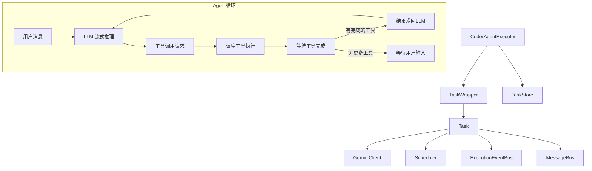

# a2a-server/src/agent 架构

> Agent 执行核心，实现 Gemini Agent 的任务创建、消息流处理、工具调用调度和生命周期管理。

## 概述

`agent` 目录包含 A2A 服务器最核心的两个类：`CoderAgentExecutor` 和 `Task`。`CoderAgentExecutor` 实现了 A2A SDK 的 `AgentExecutor` 接口，负责管理任务的创建、重建、执行和取消。`Task` 类封装了单个任务的完整运行时状态，包括与 Gemini LLM 的流式通信、工具调用的调度和确认、以及通过 A2A EventBus 发布状态更新。两者协同实现了一个完整的"用户消息 -> LLM 推理 -> 工具执行 -> 结果反馈"的 Agent 循环。

## 架构图

## 关键文件

| 文件 | 功能 |
|------|------|
| `executor.ts` | `CoderAgentExecutor` 类：实现 AgentExecutor 接口，管理任务生命周期。核心方法包括 `execute()`（主执行循环）、`createTask()`、`reconstruct()`（从持久化恢复）、`cancelTask()`。内部通过 `TaskWrapper` 桥接 Task 与 SDKTask |
| `task.ts` | `Task` 类：封装单个任务的完整运行时。管理 GeminiClient 通信、Scheduler 工具调度、工具确认流程、事件发布。核心方法包括 `acceptUserMessage()`（处理用户输入）、`acceptAgentMessage()`（处理 LLM 事件）、`scheduleToolCalls()`、`waitForPendingTools()`、`sendCompletedToolsToLlm()` |

## 内部依赖

- `../types.ts` - CoderAgentEvent、AgentSettings、状态类型
- `../config/config.ts` - loadConfig、loadEnvironment、setTargetDir
- `../config/settings.ts` - loadSettings
- `../config/extension.ts` - loadExtensions
- `../http/requestStorage.ts` - 请求上下文存储
- `../utils/logger.ts` - 日志
- `../utils/executor_utils.ts` - pushTaskStateFailed 工具函数

## 外部依赖

| 包名 | 用途 |
|------|------|
| `@a2a-js/sdk` | Message、Task、TaskState 等类型 |
| `@a2a-js/sdk/server` | AgentExecutor、TaskStore、ExecutionEventBus 接口 |
| `@google/gemini-cli-core` | GeminiClient、Scheduler、GeminiEventType、Config、工具相关类型 |
| `uuid` | 生成唯一 ID |
