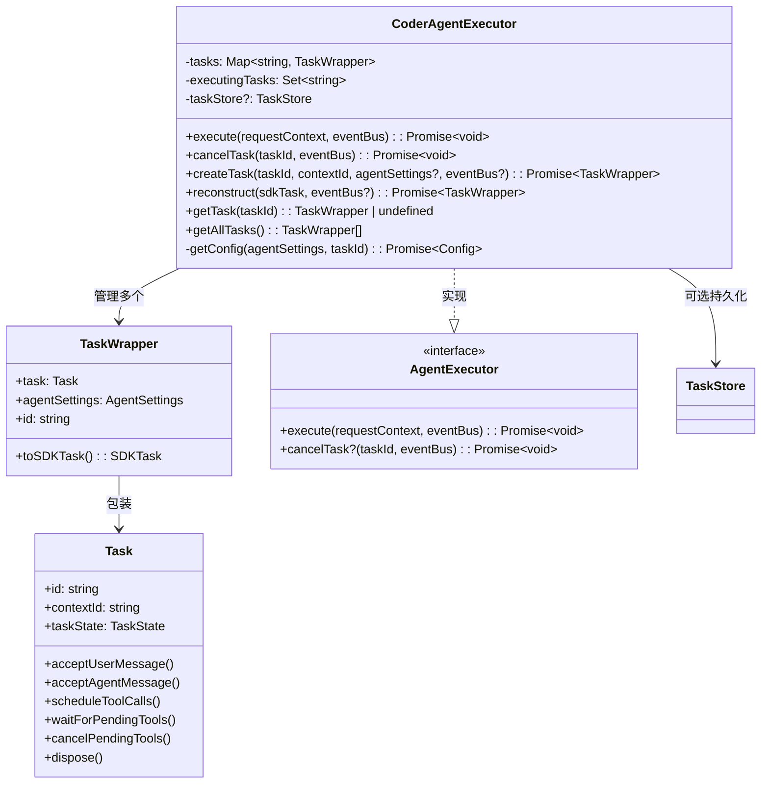
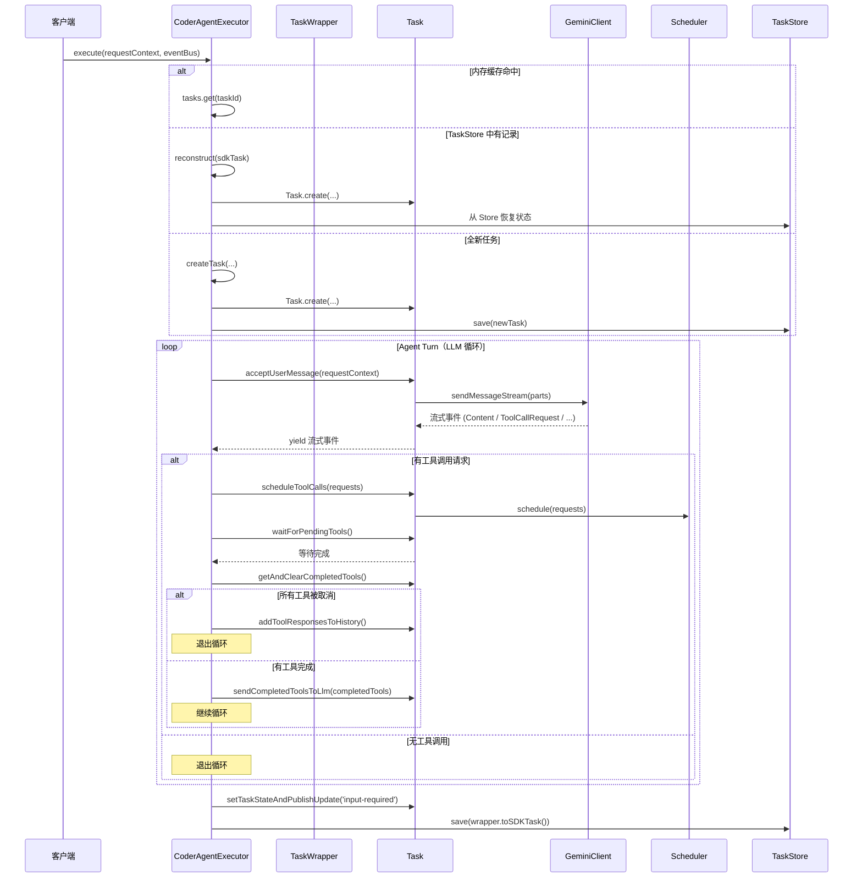

# src/agent/executor.ts

> 实现 A2A 协议的 AgentExecutor 接口，管理任务的完整生命周期：创建、恢复、执行、取消和持久化。

## 概述

`executor.ts` 是 `a2a-server` 包的核心执行器模块，包含两个类：

1. **`TaskWrapper`**（内部类）-- 将运行时的 `Task` 对象与 `AgentSettings` 绑定，并提供到 SDK 标准 `SDKTask` 格式的序列化方法，是持久化存储的桥梁。
2. **`CoderAgentExecutor`**（导出类）-- 实现 `@a2a-js/sdk/server` 的 `AgentExecutor` 接口，是整个代理执行引擎的入口。它负责：
   - 任务的创建（`createTask`）、内存缓存和持久化存储管理
   - 任务的从持久化存储恢复（`reconstruct`）
   - 主执行循环：接收用户消息 -> LLM 流式响应 -> 工具调用批处理 -> 结果反馈 -> 循环直到无更多工具调用
   - 任务取消（`cancelTask`）与异常处理
   - Socket 断开检测和中止信号传播

在模块分层中，`executor.ts` 处于业务逻辑的最上层，协调 `Task`（LLM 交互与工具调度）和 `TaskStore`（持久化）之间的交互。

## 架构图





## 主要导出

### `CoderAgentExecutor` 类

```typescript
export class CoderAgentExecutor implements AgentExecutor
```

实现 `@a2a-js/sdk/server` 的 `AgentExecutor` 接口的核心类。

#### 构造函数

```typescript
constructor(private taskStore?: TaskStore)
```
- `taskStore`（可选）：任务持久化存储，用于在请求之间保存和恢复任务状态。

#### `execute(requestContext: RequestContext, eventBus: ExecutionEventBus): Promise<void>`

主执行方法，是 `AgentExecutor` 接口的核心实现。接收请求上下文和事件总线，执行完整的代理交互循环。

**执行流程：**
1. 从 `requestContext` 中提取 `taskId` 和 `contextId`
2. 设置 Socket 断开检测（通过 `requestStorage` 获取原始请求）
3. 从内存缓存 / TaskStore / 全新创建中获取 `TaskWrapper`
4. 检查任务是否处于终态（canceled / failed / completed），若是则直接返回
5. 检查是否有并发执行（`executingTasks`），若有则将消息委托给次级执行循环
6. 进入主执行循环：
   - 调用 `acceptUserMessage` 获取 LLM 流式响应
   - 收集工具调用请求（`ToolCallRequest` 事件）
   - 批量调度工具调用（`scheduleToolCalls`）
   - 等待所有待处理工具完成（`waitForPendingTools`）
   - 收集已完成工具调用结果
   - 若有非取消的工具结果，通过 `sendCompletedToolsToLlm` 反馈给 LLM 并继续循环
   - 若所有工具均被取消或无工具调用，退出循环
7. 设置最终状态为 `input-required`（等待用户输入）
8. 在 `finally` 块中保存任务状态，若处于终态则清理资源

#### `cancelTask(taskId: string, eventBus: ExecutionEventBus): Promise<void>`

取消指定任务。

**处理逻辑：**
- 若任务不存在，发布 `failed` 状态事件
- 若任务已处于终态（`canceled` / `failed`），发布当前状态事件
- 否则调用 `task.cancelPendingTools()` 取消所有待处理工具，设置状态为 `canceled`，保存到 TaskStore，清理内存引用并调用 `dispose()`

#### `createTask(taskId, contextId, agentSettingsInput?, eventBus?): Promise<TaskWrapper>`

创建新任务。加载配置、创建 `Task` 实例、初始化 `GeminiClient`，包装为 `TaskWrapper` 并存入内存缓存。

#### `reconstruct(sdkTask: SDKTask, eventBus?): Promise<TaskWrapper>`

从 `SDKTask`（持久化数据）恢复任务。从元数据中提取 `PersistedStateMetadata`，重建 `Task` 实例并恢复状态。

#### `getTask(taskId: string): TaskWrapper | undefined`

从内存缓存中获取指定任务。

#### `getAllTasks(): TaskWrapper[]`

获取内存中所有活跃的任务列表。

## 核心逻辑

### 1. 任务获取的三级策略

`execute` 方法中获取任务采用三级降级策略：

```
内存缓存 (this.tasks) -> TaskStore (reconstruct) -> 全新创建 (createTask)
```

- **内存缓存**：最快路径，任务已存在于 `Map` 中
- **TaskStore 恢复**：任务曾被持久化但不在内存中（如服务器重启后），通过 `reconstruct` 从元数据恢复
- **全新创建**：首次请求，需加载配置、初始化客户端

### 2. 并发执行保护

通过 `executingTasks: Set<string>` 追踪正在执行的任务。当同一任务收到新消息时：

- 若主执行循环已在运行，新请求进入次级循环（只执行 `acceptUserMessage`），处理完后返回
- 主执行循环继续消费工具调用结果

这确保了同一任务不会同时启动多个完整的 Agent Turn 循环。

### 3. Socket 断开检测

通过 `requestStorage`（AsyncLocalStorage）获取当前 HTTP 请求的原始 Socket，监听 `end` 事件：

```
Socket 'end' -> AbortController.abort() -> 循环中检测 abortSignal -> 抛出 'Execution aborted'
```

这保证了客户端断开连接时，服务器端的长时间执行能被及时中止。

### 4. 主执行循环（Agent Turn）

这是整个代理交互的核心算法：

```
while (agentTurnActive) {
    1. 从 LLM 流式读取事件
    2. 收集 ToolCallRequest 到 toolCallRequests 数组
    3. 其他事件通过 acceptAgentMessage 处理
    4. 若有工具调用 -> scheduleToolCalls -> waitForPendingTools
    5. 检查完成的工具:
       - 全部取消 -> 退出循环
       - 有结果 -> sendCompletedToolsToLlm -> 继续循环
       - 无工具调用 -> 退出循环
}
```

### 5. TaskWrapper 与 SDKTask 的序列化桥接

`TaskWrapper.toSDKTask()` 将运行时状态转换为 SDK 标准格式：

- 将 `AgentSettings` 和 `TaskState` 打包进 `PersistedStateMetadata`
- 通过 `setPersistedState` 写入 `metadata` 字典
- 额外存储 `_contextId` 以支持跨请求的上下文关联

### 6. 异常处理与资源清理

`finally` 块确保：
1. 从 `executingTasks` 中移除当前任务
2. 保存任务最终状态到 TaskStore
3. 若任务到达终态（`canceled` / `failed` / `completed`），调用 `dispose()` 清理事件监听器并从内存缓存中删除

## 内部依赖

| 模块 | 导入内容 | 说明 |
|------|---------|------|
| `../types.js` | `CoderAgentEvent`, `getPersistedState`, `setPersistedState`, `StateChange`, `AgentSettings`, `PersistedStateMetadata`, `getContextIdFromMetadata`, `getAgentSettingsFromMetadata` | 协议类型定义和持久化工具函数 |
| `./task.js` | `Task` | 核心任务运行时，负责 LLM 交互和工具调度 |
| `../config/config.js` | `loadConfig`, `loadEnvironment`, `setTargetDir` | 配置加载工具 |
| `../config/settings.js` | `loadSettings` | 设置加载工具 |
| `../config/extension.js` | `loadExtensions` | 扩展加载工具 |
| `../http/requestStorage.js` | `requestStorage` | 基于 AsyncLocalStorage 的请求存储，用于获取原始 Socket |
| `../utils/logger.js` | `logger` | 日志工具 |
| `../utils/executor_utils.js` | `pushTaskStateFailed` | 发布任务失败状态的辅助函数 |

## 外部依赖

| 包名 | 导入内容 | 说明 |
|------|---------|------|
| `@a2a-js/sdk` | `Message`, `Task as SDKTask` | A2A SDK 的消息和任务类型 |
| `@a2a-js/sdk/server` | `TaskStore`, `AgentExecutor`, `AgentExecutionEvent`, `RequestContext`, `ExecutionEventBus` | A2A SDK 服务端接口，`AgentExecutor` 是本类实现的核心接口 |
| `@google/gemini-cli-core` | `GeminiEventType`, `SimpleExtensionLoader`, `ToolCallRequestInfo`, `Config` | Gemini CLI 核心库，提供事件类型、扩展加载器、工具调用信息类型和配置类型 |
| `uuid` | `v4 as uuidv4` | 用于生成 UUID（任务 ID、消息 ID 等） |
