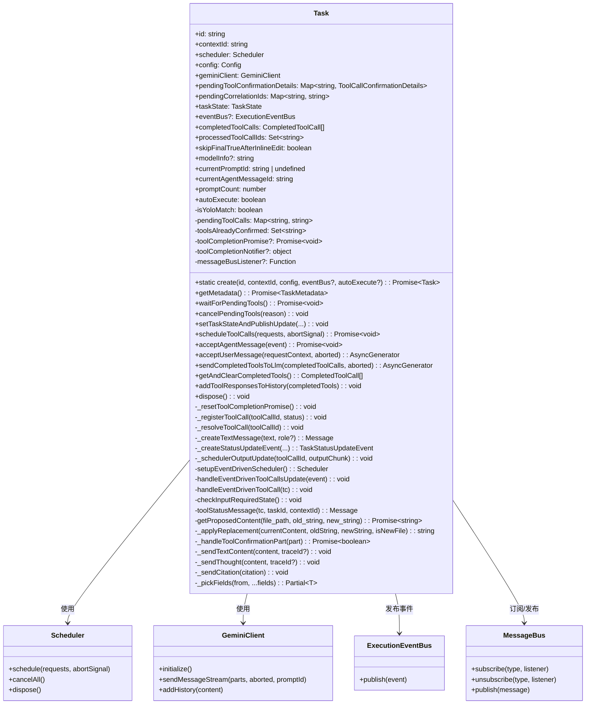
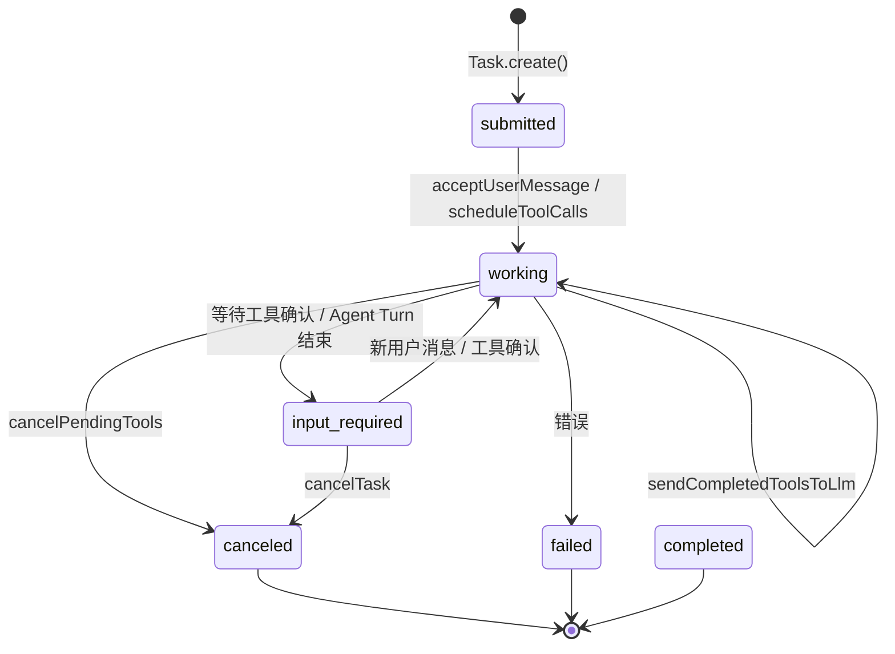
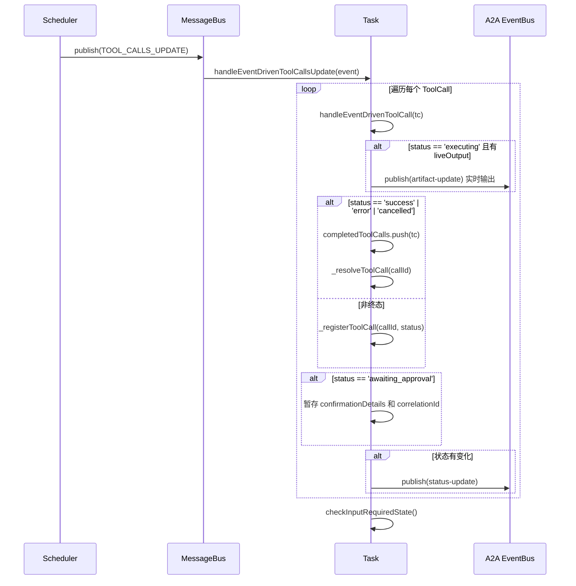
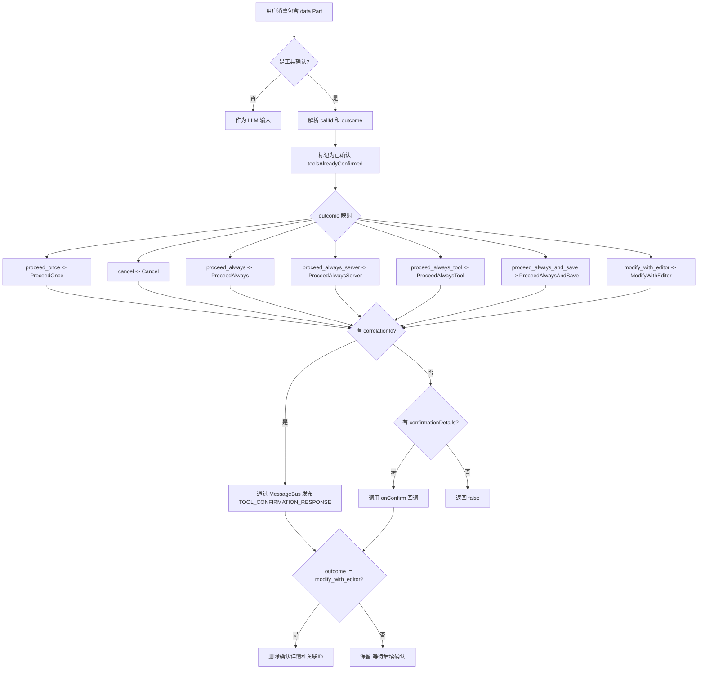
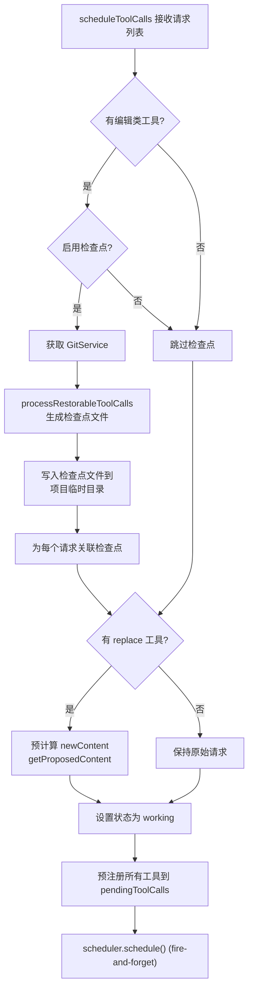

# src/agent/task.ts

> 封装单个代理任务的完整运行时，管理 LLM 通信、工具调用调度与确认、事件发布以及任务状态转换。

## 概述

`task.ts` 是 `a2a-server` 包中最核心也最复杂的模块（约 1240 行），封装了一个代理任务（Task）从创建到完成的全部运行时逻辑。它是 `CoderAgentExecutor` 的底层引擎，负责：

1. **LLM 交互**：通过 `GeminiClient` 发送用户消息和工具结果，接收流式响应。
2. **工具调度**：通过 `Scheduler` 批量调度工具调用，管理工具的生命周期（scheduled -> awaiting_approval -> executing -> success/error/cancelled）。
3. **工具确认**：处理需要用户确认的工具调用（如文件编辑），支持多种确认结果（ProceedOnce、Cancel、ProceedAlways 等）。
4. **事件驱动状态同步**：通过 `MessageBus` 订阅工具调用状态更新，通过 `ExecutionEventBus` 向 A2A 客户端发布任务状态变更。
5. **状态管理**：维护任务状态（`TaskState`）转换和工具待处理计数，支持并发工具调用的正确同步。
6. **文件操作预处理**：对 `replace` 工具调用预计算文件内容替换结果，支持检查点（checkpoint）机制。

在架构中，`Task` 处于执行器（`CoderAgentExecutor`）和基础设施（`GeminiClient`、`Scheduler`、`MessageBus`）之间，是业务逻辑的枢纽。

## 架构图





## 主要导出

### `Task` 类

```typescript
export class Task
```

代理任务的完整运行时封装。

#### 静态工厂方法

```typescript
static async create(
  id: string,
  contextId: string,
  config: Config,
  eventBus?: ExecutionEventBus,
  autoExecute?: boolean,
): Promise<Task>
```
创建 Task 实例。使用工厂模式（私有构造函数 + 静态方法），便于未来扩展异步初始化逻辑。

#### 公共属性

| 属性 | 类型 | 说明 |
|------|------|------|
| `id` | `string` | 任务唯一标识 |
| `contextId` | `string` | 对话上下文 ID，用于关联多轮交互 |
| `scheduler` | `Scheduler` | 工具调用调度器 |
| `config` | `Config` | 配置对象，提供模型设置、路径验证、工具注册表等 |
| `geminiClient` | `GeminiClient` | Gemini API 客户端，用于 LLM 流式通信 |
| `pendingToolConfirmationDetails` | `Map<string, ToolCallConfirmationDetails>` | 等待用户确认的工具调用详情映射 |
| `pendingCorrelationIds` | `Map<string, string>` | 工具调用 ID 到关联 ID 的映射，用于事件驱动的确认响应 |
| `taskState` | `TaskState` | 当前任务状态 |
| `eventBus` | `ExecutionEventBus \| undefined` | A2A 事件总线，用于向客户端发布状态更新 |
| `completedToolCalls` | `CompletedToolCall[]` | 已完成的工具调用结果缓冲区 |
| `processedToolCallIds` | `Set<string>` | 已处理过的工具调用 ID 集合，防止重复处理 |
| `skipFinalTrueAfterInlineEdit` | `boolean` | 标记是否跳过内联编辑后的 final:true 发布 |
| `modelInfo` | `string \| undefined` | LLM 返回的实际模型信息 |
| `currentPromptId` | `string \| undefined` | 当前提示的唯一标识（sessionId + promptCount 拼接） |
| `currentAgentMessageId` | `string` | 当前代理消息的 UUID |
| `promptCount` | `number` | 提示计数器 |
| `autoExecute` | `boolean` | 是否自动执行工具调用（跳过确认） |

#### 公共方法

##### `getMetadata(): Promise<TaskMetadata>`

获取任务的完整元数据，包括 MCP 服务器状态、可用工具列表、当前模型等。注意：MCP 服务器状态是进程级全局状态，非任务级。

##### `waitForPendingTools(): Promise<void>`

等待所有待处理的工具调用完成。基于 `toolCompletionPromise`，当最后一个待处理工具被 `_resolveToolCall` 时 resolve。

##### `cancelPendingTools(reason: string): void`

取消所有待处理的工具调用。调用 `scheduler.cancelAll()`，reject `toolCompletionPromise`，清空所有待处理状态。

##### `setTaskStateAndPublishUpdate(newState, coderAgentMessage, messageText?, messageParts?, final?, metadataError?, traceId?): void`

更新任务状态并通过 eventBus 发布状态更新事件。支持文本消息或复合消息部件（Parts），可选附带错误信息和 traceId。

##### `scheduleToolCalls(requests: ToolCallRequestInfo[], abortSignal: AbortSignal): Promise<void>`

批量调度工具调用。关键步骤：
1. 对编辑类工具（`EDIT_TOOL_NAMES`）执行检查点处理
2. 对 `replace` 工具预计算 `newContent`（文件内容替换预览）
3. 预注册所有工具调用到 `pendingToolCalls`（确保 `waitForPendingTools` 能正确等待）
4. 异步调用 `scheduler.schedule()`（fire-and-forget，不阻塞执行器循环）

##### `acceptAgentMessage(event: ServerGeminiStreamEvent): Promise<void>`

处理来自 LLM 的流式事件。根据事件类型分发处理：
- `Content` -> 发布文本内容
- `ToolCallRequest` -> 忽略（由执行器批量收集处理）
- `ToolCallConfirmation` -> 暂存确认详情
- `UserCancelled` -> 取消工具并设置 input-required
- `Thought` -> 发布思维过程
- `Citation` -> 发布引用
- `Error` -> 解析错误并更新状态
- `ModelInfo` -> 记录模型信息
- `Finished`, `Retry`, `InvalidStream`, `ChatCompressed` -> 无需处理或仅记录日志

##### `acceptUserMessage(requestContext: RequestContext, aborted: AbortSignal): AsyncGenerator<ServerGeminiStreamEvent>`

处理用户消息的异步生成器。遍历消息中的所有 Part：
- `data` 类型的 Part -> 尝试作为工具确认处理
- `text` 类型的 Part -> 作为 LLM 输入
- 若有 LLM 内容 -> `sendMessageStream` 并 yield 流式事件
- 若仅有确认 -> yield nothing（调度器会处理后续）

##### `sendCompletedToolsToLlm(completedToolCalls, aborted): AsyncGenerator<ServerGeminiStreamEvent>`

将已完成的工具调用结果发送给 LLM 并返回流式响应的异步生成器。设置状态为 `working`，生成新的 `agentMessageId`。

##### `getAndClearCompletedTools(): CompletedToolCall[]`

获取并清空已完成工具调用缓冲区。将已处理的工具调用 ID 添加到 `processedToolCallIds` 以防重复处理。

##### `addToolResponsesToHistory(completedTools: CompletedToolCall[]): void`

将已完成工具调用的响应直接添加到 LLM 对话历史中（不触发新的 LLM 响应）。用于所有工具都被取消时记录历史。

##### `dispose(): void`

清理资源。取消 `MessageBus` 上的事件监听，调用 `scheduler.dispose()`。

## 核心逻辑

### 1. 事件驱动的工具调用状态管理

Task 通过 `MessageBus` 订阅 `TOOL_CALLS_UPDATE` 消息来驱动工具调用的状态流转，而非轮询。



**`handleEventDrivenToolCall(tc: ToolCall)`** 的详细处理逻辑：

1. **去重检查**：若 `callId` 已在 `processedToolCallIds` 或 `completedToolCalls` 中，跳过
2. **变化检测**：比较当前状态与 `pendingToolCalls` 中记录的状态
3. **实时输出**：若 `executing` 且有 `liveOutput`，通过 `_schedulerOutputUpdate` 发布 artifact 更新
4. **终态处理**：`success` / `error` / `cancelled` 时移入 `completedToolCalls` 并 `_resolveToolCall`
5. **确认暂存**：`awaiting_approval` 时存储 `confirmationDetails` 和 `correlationId`
6. **事件发布**：状态有变化时通过 `eventBus` 发布更新

### 2. 工具待处理计数与 Promise 同步

这是并发工具调用正确同步的关键机制：

- **`pendingToolCalls: Map<string, string>`**：跟踪所有未完成工具调用及其当前状态
- **`toolCompletionPromise`**：一个手动管理的 Promise，当所有待处理工具完成时 resolve
- **`_resetToolCompletionPromise()`**：创建新的 Promise/resolve/reject 对。若当前无待处理工具，立即 resolve
- **`_registerToolCall(id, status)`**：添加工具到待处理集合。若集合从空变非空，重置 Promise
- **`_resolveToolCall(id)`**：从待处理集合移除。若集合变空，调用 `resolve()`

**`checkInputRequiredState()`** 的逻辑：

在非 YOLO 模式下，遍历所有 `pendingToolCalls`：
- 若存在 `awaiting_approval` 的工具（且未被预确认），标记 `isAwaitingApproval`
- 若存在 `executing` 或 `scheduled` 的工具，标记 `isExecuting`
- 当 `isAwaitingApproval && !isExecuting && !skipFinalTrueAfterInlineEdit` 时：
  - 设置状态为 `input-required`（final: true）
  - 若之前不是 `input-required` 状态，resolve `toolCompletionPromise` 以释放 HTTP 响应流

### 3. 工具确认处理流程



**GCP 环境变量隔离**：在执行工具确认时，临时移除 `GOOGLE_CLOUD_PROJECT` 和 `GOOGLE_APPLICATION_CREDENTIALS` 环境变量，防止泄漏到工具调用进程中。使用 `try/finally` 确保恢复。

**内联编辑特殊处理**：当确认类型为 `edit` 且包含 `newContent` 时，设置 `skipFinalTrueAfterInlineEdit = true`，避免在编辑确认过程中意外结束 HTTP 流。

### 4. LLM 流式事件处理（acceptAgentMessage）

`acceptAgentMessage` 方法是 LLM 响应的事件分发中心，处理 `ServerGeminiStreamEvent` 的所有可能类型：

| 事件类型 | 处理方式 |
|---------|---------|
| `Content` | 调用 `_sendTextContent` 发布文本更新 |
| `ToolCallRequest` | 忽略（由执行器批量处理） |
| `ToolCallResponse` | 记录日志（LLM 生成的工具响应部分） |
| `ToolCallConfirmation` | 暂存确认详情到 `pendingToolConfirmationDetails` |
| `UserCancelled` | 取消所有工具，设置 `input-required` |
| `Thought` | 调用 `_sendThought` 发布思维事件 |
| `Citation` | 调用 `_sendCitation` 发布引用事件 |
| `ChatCompressed` | 无操作 |
| `Finished` | 记录日志 |
| `ModelInfo` | 记录模型信息 |
| `Retry`, `InvalidStream` | 无操作（重试由底层处理） |
| `Error` / 默认 | 解析错误信息，取消工具，发布错误状态 |

### 5. 工具调用调度与检查点机制（scheduleToolCalls）



**`getProposedContent`** 的文件替换逻辑：
1. 解析文件路径并进行路径遍历验证（`validatePathAccess`）
2. 读取文件当前内容
3. 调用 `_applyReplacement` 执行替换：
   - 新文件（`old_string` 和文件内容均为空）：返回 `new_string`
   - 非空文件的空 `old_string`：返回原内容（不修改）
   - 正常情况：使用 `safeLiteralReplace` 进行安全的字面量替换（处理 `$` 等特殊字符）

### 6. 事件发布机制

所有对外事件通过 `_createStatusUpdateEvent` 统一构建：

```typescript
TaskStatusUpdateEvent {
  kind: 'status-update',
  taskId, contextId,
  status: { state, message?, timestamp },
  final: boolean,
  metadata: {
    coderAgent: CoderAgentMessage,  // 携带事件类型标识
    model: string,                   // 当前模型
    userTier?: UserTierId,          // 用户层级
    error?: string,                  // 可选错误信息
    traceId?: string,               // 可选追踪 ID
  }
}
```

工具实时输出通过 `_schedulerOutputUpdate` 发布为 `TaskArtifactUpdateEvent`：
- `artifactId`: `tool-{callId}-output`
- 支持多种输出格式：字符串、`SubagentProgress`（JSON 序列化）、`AnsiOutput`（逐行拼接 token）

### 7. 实时输出格式转换

`_schedulerOutputUpdate` 处理三种 `ToolLiveOutput` 格式：

| 输入类型 | 转换方式 |
|---------|---------|
| `string` | 直接使用 |
| `SubagentProgress` | `JSON.stringify()` |
| `AnsiOutput` (二维 AnsiToken 数组) | 逐行将 token 的 `text` 字段拼接，行间用 `\n` 连接 |

## 内部依赖

| 模块 | 导入内容 | 说明 |
|------|---------|------|
| `../types.js` | `CoderAgentEvent`, `CoderAgentMessage`, `StateChange`, `ToolCallUpdate`, `TextContent`, `TaskMetadata`, `Thought`, `ThoughtSummary`, `Citation` | 协议事件和消息类型 |
| `../utils/logger.js` | `logger` | 日志工具 |

## 外部依赖

| 包名 | 导入内容 | 说明 |
|------|---------|------|
| `@google/gemini-cli-core` | `AgentLoopContext`, `Scheduler`, `GeminiClient`, `GeminiEventType`, `ToolConfirmationOutcome`, `ApprovalMode`, `getAllMCPServerStatuses`, `MCPServerStatus`, `isNodeError`, `getErrorMessage`, `parseAndFormatApiError`, `safeLiteralReplace`, `DEFAULT_GUI_EDITOR`, `AnyDeclarativeTool`, `ToolCall`, `ToolConfirmationPayload`, `CompletedToolCall`, `ToolCallRequestInfo`, `ServerGeminiErrorEvent`, `ServerGeminiStreamEvent`, `ToolCallConfirmationDetails`, `Config`, `UserTierId`, `ToolLiveOutput`, `AnsiLine`, `AnsiOutput`, `AnsiToken`, `isSubagentProgress`, `EDIT_TOOL_NAMES`, `processRestorableToolCalls`, `MessageBusType`, `ToolCallsUpdateMessage` | Gemini CLI 核心库，提供调度器、客户端、事件类型、工具调用类型、错误处理工具等。这是该文件最主要的外部依赖，几乎所有的基础设施能力都来自此包 |
| `@a2a-js/sdk/server` | `ExecutionEventBus`, `RequestContext` | A2A SDK 服务端接口 |
| `@a2a-js/sdk` | `TaskStatusUpdateEvent`, `TaskArtifactUpdateEvent`, `TaskState`, `Message`, `Part`, `Artifact` | A2A SDK 核心类型 |
| `@google/genai` | `PartUnion`, `Part as genAiPart` | Google GenAI 类型，用于构建 LLM 消息部件 |
| `uuid` | `v4 as uuidv4` | UUID 生成 |
| `node:fs/promises` | `fs` | 文件系统操作（读取文件内容、创建目录、写入检查点文件） |
| `node:path` | `path` | 路径处理（resolve、join） |
