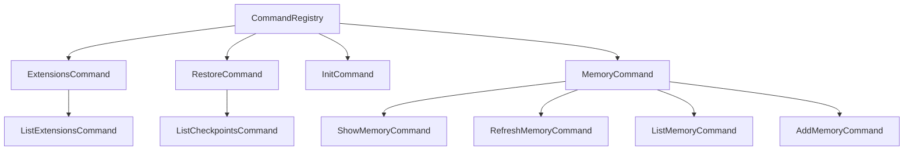

# a2a-server/src/commands 架构

> 可扩展的命令系统，提供 init、memory、restore、extensions 等服务端命令的注册和执行。

## 概述

`commands` 目录实现了 A2A 服务器的命令系统。`CommandRegistry` 采用注册模式管理所有可用命令，每个命令实现 `Command` 接口，支持子命令嵌套。命令通过 HTTP 端点 `/executeCommand` 和 `/listCommands` 暴露给客户端。当前注册了四组命令：`init`（项目初始化）、`memory`（记忆管理）、`restore`（检查点恢复）、`extensions`（扩展管理）。

## 架构图

## 关键文件

| 文件 | 功能 |
|------|------|
| `types.ts` | 定义 Command、CommandContext、CommandArgument、CommandExecutionResponse 接口 |
| `command-registry.ts` | CommandRegistry 类，维护命令 Map，支持注册、查找和列举所有命令。导出单例 `commandRegistry` |
| `init.ts` | InitCommand：分析项目并创建 GEMINI.md 文件，支持流式输出，内部调用 CoderAgentExecutor 执行 Agent 循环 |
| `memory.ts` | MemoryCommand 及子命令：show（显示记忆）、refresh（刷新）、list（列出文件）、add（添加记忆） |
| `restore.ts` | RestoreCommand 及 ListCheckpointsCommand：从检查点恢复文件状态，列出可用检查点 |
| `extensions.ts` | ExtensionsCommand 及 ListExtensionsCommand：列出已安装的扩展 |

## 内部依赖

- `../types.ts` - AgentSettings、CoderAgentEvent
- `../agent/executor.ts` - CoderAgentExecutor（init 命令使用）
- `../utils/logger.ts` - 日志

## 外部依赖

| 包名 | 用途 |
|------|------|
| `@google/gemini-cli-core` | performInit、listExtensions、addMemory、showMemory、performRestore 等核心功能 |
| `@a2a-js/sdk/server` | ExecutionEventBus、AgentExecutor 类型 |
| `uuid` | UUID 生成 |
