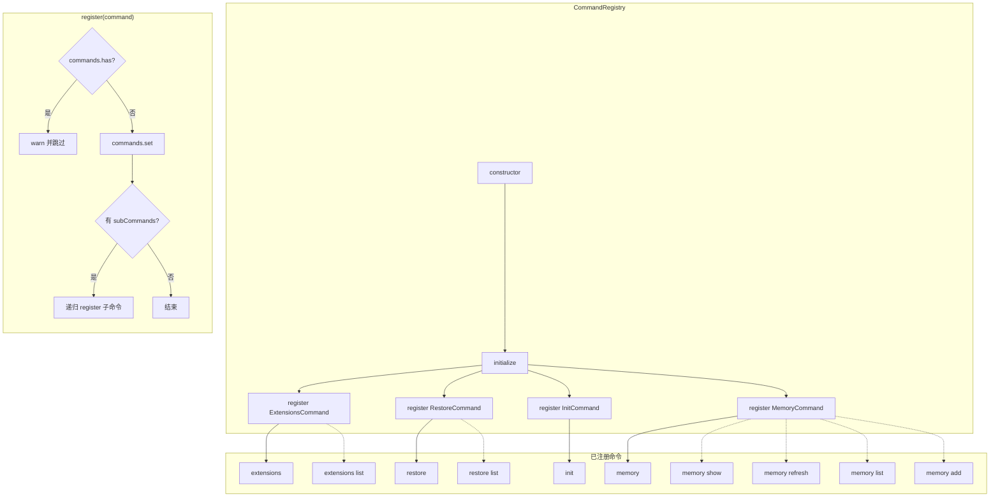

# command-registry.ts

> 命令注册中心，负责管理所有可用命令的注册、查找和获取。

## 概述

`command-registry.ts` 实现了命令注册表模式（Registry Pattern），是命令系统的中枢管理器。`CommandRegistry` 类使用 `Map` 数据结构存储命令实例，提供命令的注册（`register`）、查找（`get`）和遍历（`getAllCommands`）能力。

文件在模块末尾导出了一个预初始化的单例 `commandRegistry`，在构造时自动注册四个内置命令：`ExtensionsCommand`、`RestoreCommand`、`InitCommand` 和 `MemoryCommand`。该单例作为全局命令注册中心供 A2A 服务器的其他模块使用。

## 架构图

## 主要导出

### `class CommandRegistry`

命令注册表类，维护命令名称到命令实例的映射关系。

#### 属性

| 属性 | 类型 | 可见性 | 说明 |
|------|------|--------|------|
| `commands` | `Map<string, Command>` | `private readonly` | 命令存储映射表 |

#### 方法

##### `constructor()`

构造函数，调用 `initialize()` 完成内置命令的注册。

##### `initialize(): void`

清空已有命令并重新注册所有内置命令。按顺序注册：
1. `ExtensionsCommand` - 扩展管理命令
2. `RestoreCommand` - 检查点恢复命令
3. `InitCommand` - 项目初始化命令
4. `MemoryCommand` - 记忆管理命令

##### `register(command: Command): void`

注册一个命令及其所有子命令。

- 如果命令名称已存在，输出警告日志并跳过注册
- 注册成功后，递归注册该命令的所有 `subCommands`
- 子命令使用完整名称注册（如 `"memory show"`），与父命令平级存储在同一 Map 中

##### `get(commandName: string): Command | undefined`

根据命令名称查找并返回对应的命令实例。未找到时返回 `undefined`。

##### `getAllCommands(): Command[]`

返回所有已注册命令的数组副本。

### `const commandRegistry: CommandRegistry`

预实例化的全局命令注册表单例，供外部模块直接导入使用。

## 核心逻辑

### 命令注册流程

1. **扁平化注册**：虽然命令支持层级嵌套（通过 `subCommands`），但注册表内部采用扁平化存储。例如 `MemoryCommand`（名称 `"memory"`）及其子命令 `ShowMemoryCommand`（名称 `"memory show"`）都作为独立条目存储在同一个 Map 中。

2. **防重复注册**：通过 `commands.has()` 检查避免同名命令的重复注册，防止命令被意外覆盖。

3. **递归子命令注册**：`register` 方法遍历命令的 `subCommands` 数组，对每个子命令递归调用 `register`，确保多层嵌套的子命令也能被正确注册。

### 最终注册的命令清单

经过初始化和递归注册后，`commands` Map 中包含以下 10 个条目：

| 命令名称 | 来源 |
|----------|------|
| `extensions` | `ExtensionsCommand` |
| `extensions list` | `ListExtensionsCommand`（子命令） |
| `restore` | `RestoreCommand` |
| `restore list` | `ListCheckpointsCommand`（子命令） |
| `init` | `InitCommand` |
| `memory` | `MemoryCommand` |
| `memory show` | `ShowMemoryCommand`（子命令） |
| `memory refresh` | `RefreshMemoryCommand`（子命令） |
| `memory list` | `ListMemoryCommand`（子命令） |
| `memory add` | `AddMemoryCommand`（子命令） |

## 内部依赖

| 模块 | 导入内容 | 用途 |
|------|---------|------|
| `./memory.js` | `MemoryCommand` | 记忆管理命令 |
| `./extensions.js` | `ExtensionsCommand` | 扩展管理命令 |
| `./init.js` | `InitCommand` | 项目初始化命令 |
| `./restore.js` | `RestoreCommand` | 检查点恢复命令 |
| `./types.js` | `Command` | 命令接口类型 |

## 外部依赖

| 包 | 导入内容 | 用途 |
|----|---------|------|
| `@google/gemini-cli-core` | `debugLogger` | 输出重复注册的警告日志 |
