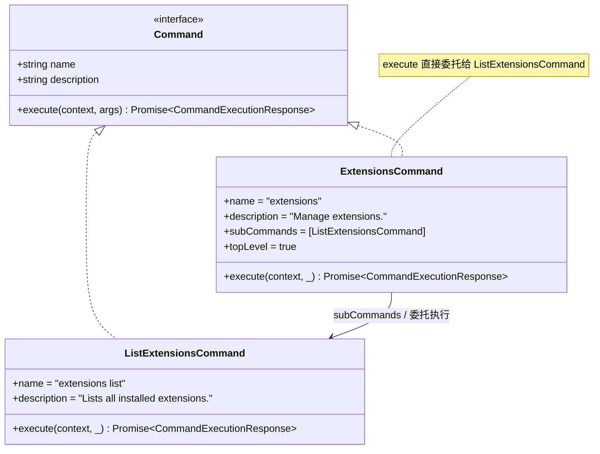
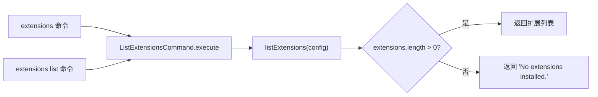

# extensions.ts

> 实现扩展管理命令，提供列出已安装扩展的功能。

## 概述

`extensions.ts` 实现了 `extensions` 命令及其子命令 `extensions list`，用于查询和展示当前安装的 Gemini CLI 扩展。文件包含两个命令类：`ExtensionsCommand` 作为顶层命令入口，`ListExtensionsCommand` 作为实际执行列出扩展逻辑的子命令。

`ExtensionsCommand` 的 `execute` 方法直接委托给 `ListExtensionsCommand`，即不带子命令调用时默认执行列出操作。扩展数据的实际查询由 `@google/gemini-cli-core` 的 `listExtensions` 函数完成，本模块仅负责命令层面的封装和响应格式化。

## 架构图

## 主要导出

### `class ExtensionsCommand implements Command`

扩展管理的顶层命令。

| 属性 | 值 | 说明 |
|------|-----|------|
| `name` | `"extensions"` | 命令名称 |
| `description` | `"Manage extensions."` | 命令描述 |
| `subCommands` | `[ListExtensionsCommand]` | 包含 `list` 子命令 |
| `topLevel` | `true` | 标记为顶层命令 |

#### `execute(context: CommandContext, _: string[]): Promise<CommandExecutionResponse>`

直接创建新的 `ListExtensionsCommand` 实例并委托执行。不使用传入的参数。

### `class ListExtensionsCommand implements Command`

列出已安装扩展的子命令。

| 属性 | 值 | 说明 |
|------|-----|------|
| `name` | `"extensions list"` | 命令名称 |
| `description` | `"Lists all installed extensions."` | 命令描述 |

#### `execute(context: CommandContext, _: string[]): Promise<CommandExecutionResponse>`

调用核心库的 `listExtensions` 函数获取扩展列表，返回格式化的响应。

**返回值**：
- 如果存在已安装的扩展，`data` 为扩展对象数组
- 如果没有安装任何扩展，`data` 为字符串 `"No extensions installed."`

## 核心逻辑

1. `ExtensionsCommand.execute` 委托模式：顶层命令不包含独立逻辑，直接转发给默认子命令 `ListExtensionsCommand`。这种设计使得 `/extensions` 和 `/extensions list` 效果相同。

2. `ListExtensionsCommand.execute` 的执行流程：
   - 调用 `listExtensions(context.config)` 从核心库获取扩展列表
   - 通过三元表达式判断列表是否为空
   - 非空时返回扩展数组，为空时返回提示字符串

## 内部依赖

| 模块 | 导入内容 | 用途 |
|------|---------|------|
| `./types.js` | `Command`, `CommandContext`, `CommandExecutionResponse` | 命令接口和类型定义 |

## 外部依赖

| 包 | 导入内容 | 用途 |
|----|---------|------|
| `@google/gemini-cli-core` | `listExtensions` | 查询已安装扩展列表的核心函数 |
