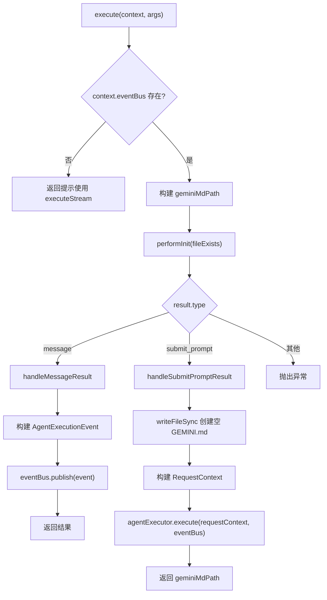
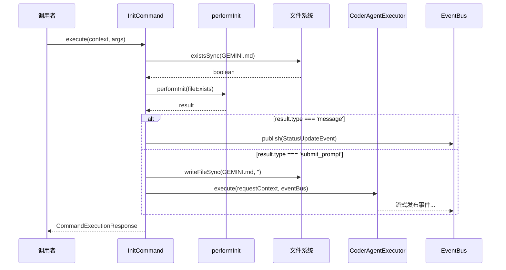

# init.ts

> 实现项目初始化命令，分析项目结构并通过 AI 代理生成定制化的 GEMINI.md 文件。

## 概述

`init.ts` 实现了 `init` 命令，用于分析当前项目并创建一个量身定制的 `GEMINI.md` 文件。该文件是 Gemini CLI 的项目级记忆/上下文配置文件，帮助 AI 更好地理解项目结构和约定。

`InitCommand` 是一个流式命令（`streaming = true`），其执行依赖 `EventBus` 来发布实时事件。命令的核心逻辑分为两个分支：
- 如果 `GEMINI.md` 已存在或其他条件满足，`performInit` 返回 `message` 类型结果，直接通过事件总线发布消息。
- 如果需要生成新文件，`performInit` 返回 `submit_prompt` 类型结果，命令会创建空的 `GEMINI.md` 文件，然后将提示词提交给 `CoderAgentExecutor` 进行 AI 代理执行，由代理完成整个文件生成过程。

## 架构图

## 主要导出

### `class InitCommand implements Command`

项目初始化命令。

| 属性 | 值 | 说明 |
|------|-----|------|
| `name` | `"init"` | 命令名称 |
| `description` | `"Analyzes the project and creates a tailored GEMINI.md file"` | 命令描述 |
| `requiresWorkspace` | `true` | 需要工作空间环境 |
| `streaming` | `true` | 流式命令，通过 EventBus 发布事件 |

#### 方法

##### `execute(context: CommandContext, _args?: string[]): Promise<CommandExecutionResponse>`

命令入口方法。

1. 检查 `context.eventBus` 是否存在，不存在则返回提示信息
2. 构建 `GEMINI.md` 文件路径（基于 `CODER_AGENT_WORKSPACE_PATH` 环境变量）
3. 调用 `performInit` 检测文件是否已存在
4. 根据返回结果类型分发到对应的处理方法

##### `private handleMessageResult(result, context, eventBus, taskId, contextId): CommandExecutionResponse`

处理 `message` 类型的 `performInit` 结果。

- 根据 `result.messageType` 确定状态（`"error"` 对应 `failed`，其他对应 `completed`）
- 构建 `AgentExecutionEvent` 并通过 `eventBus.publish` 发布
- 事件元数据包含 `coderAgent.kind` 和当前使用的模型信息

##### `private async handleSubmitPromptResult(result, context, geminiMdPath, eventBus, taskId, contextId): Promise<CommandExecutionResponse>`

处理 `submit_prompt` 类型的结果，触发 AI 代理执行。

1. 写入空的 `GEMINI.md` 文件
2. 校验 `context.agentExecutor` 存在
3. 构建 `AgentSettings`（包含工作空间路径和自动执行标志）
4. 将 `result.content` 作为用户消息构建 `RequestContext`
5. 调用 `agentExecutor.execute` 启动代理循环
6. 返回 `geminiMdPath` 作为响应数据

## 核心逻辑

### 工作空间路径

命令使用 `CODER_AGENT_WORKSPACE_PATH` 环境变量确定工作空间路径。`GEMINI.md` 文件将被创建在该路径的根目录下。

### 流式事件发布

`handleMessageResult` 构建的事件结构为 `AgentExecutionEvent`，包含以下关键字段：
- `kind: 'status-update'` - 状态更新事件
- `status.state` - `"completed"` 或 `"failed"`
- `status.message` - 包含角色（`"agent"`）和文本内容的消息
- `final: true` - 标记为最终事件
- `metadata.coderAgent.kind` - 区分 `TextContentEvent` 和 `StateChangeEvent`
- `metadata.model` - 当前使用的模型名称

### 代理执行循环

`handleSubmitPromptResult` 将初始化提示词包装为 A2A 协议的 `RequestContext`，其中：
- `userMessage.metadata.coderAgent` 包含 `AgentSettings`，设置 `autoExecute: true` 以允许代理自动执行工具调用
- 代理执行器（`CoderAgentExecutor`）负责整个代理循环，包括任务创建、流式响应和工具处理

## 内部依赖

| 模块 | 导入内容 | 用途 |
|------|---------|------|
| `../types.js` | `CoderAgentEvent`, `AgentSettings` | A2A 事件类型枚举和代理设置接口 |
| `./types.js` | `Command`, `CommandContext`, `CommandExecutionResponse` | 命令接口和类型定义 |
| `../agent/executor.js` | `CoderAgentExecutor` | 代理执行器类型（用于类型断言） |
| `../utils/logger.js` | `logger` | 日志工具 |

## 外部依赖

| 包 | 导入内容 | 用途 |
|----|---------|------|
| `node:fs` | `fs` | 文件系统操作（检测文件存在、写入空文件） |
| `node:path` | `path` | 路径拼接 |
| `@google/gemini-cli-core` | `performInit` | 执行初始化逻辑的核心函数 |
| `@a2a-js/sdk/server` | `ExecutionEventBus`, `RequestContext`, `AgentExecutionEvent` | A2A 协议的事件总线、请求上下文和事件类型 |
| `uuid` | `v4 as uuidv4` | 生成唯一标识符（taskId、contextId、messageId） |
