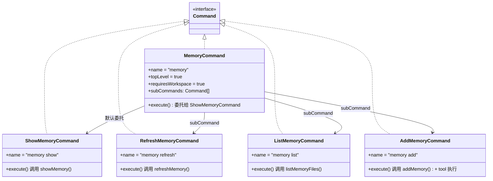
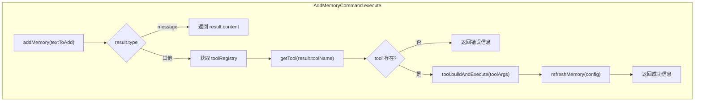

# memory.ts

> 实现记忆管理命令集，提供查看、刷新、列出和添加 GEMINI.md 记忆内容的功能。

## 概述

`memory.ts` 实现了 `memory` 命令及其四个子命令（`show`、`refresh`、`list`、`add`），用于管理 Gemini CLI 的记忆系统。记忆系统基于 `GEMINI.md` 文件，存储项目相关的上下文信息，帮助 AI 代理更好地理解项目。

`MemoryCommand` 作为顶层命令，默认委托给 `ShowMemoryCommand` 执行。四个子命令分别封装了 `@google/gemini-cli-core` 提供的记忆操作函数：`showMemory`、`refreshMemory`、`listMemoryFiles` 和 `addMemory`。其中 `AddMemoryCommand` 逻辑最为复杂，涉及通过工具注册表执行写入操作并自动刷新记忆。

## 架构图





## 主要导出

### `class MemoryCommand implements Command`

记忆管理的顶层命令。

| 属性 | 值 | 说明 |
|------|-----|------|
| `name` | `"memory"` | 命令名称 |
| `description` | `"Manage memory."` | 命令描述 |
| `topLevel` | `true` | 顶层命令 |
| `requiresWorkspace` | `true` | 需要工作空间 |
| `subCommands` | `[Show, Refresh, List, Add]` | 四个子命令 |

#### `execute(context, _): Promise<CommandExecutionResponse>`

默认委托给 `ShowMemoryCommand` 执行。

---

### `class ShowMemoryCommand implements Command`

显示当前记忆内容。

| 属性 | 值 |
|------|-----|
| `name` | `"memory show"` |
| `description` | `"Shows the current memory contents."` |

#### `execute(context, _): Promise<CommandExecutionResponse>`

调用 `showMemory(context.config)` 返回当前记忆的文本内容。

---

### `class RefreshMemoryCommand implements Command`

从源文件重新加载记忆。

| 属性 | 值 |
|------|-----|
| `name` | `"memory refresh"` |
| `description` | `"Refreshes the memory from the source."` |

#### `execute(context, _): Promise<CommandExecutionResponse>`

调用 `refreshMemory(context.config)`（异步）刷新记忆并返回结果内容。

---

### `class ListMemoryCommand implements Command`

列出正在使用的 GEMINI.md 文件路径。

| 属性 | 值 |
|------|-----|
| `name` | `"memory list"` |
| `description` | `"Lists the paths of the GEMINI.md files in use."` |

#### `execute(context, _): Promise<CommandExecutionResponse>`

调用 `listMemoryFiles(context.config)` 返回所有 GEMINI.md 文件的路径列表。

---

### `class AddMemoryCommand implements Command`

向记忆中添加新内容。

| 属性 | 值 |
|------|-----|
| `name` | `"memory add"` |
| `description` | `"Add content to the memory."` |

#### `execute(context, args): Promise<CommandExecutionResponse>`

将用户输入的文本添加到记忆中。这是最复杂的子命令，执行流程详见核心逻辑部分。

## 核心逻辑

### AddMemoryCommand 的执行流程

1. **参数处理**：将 `args` 数组用空格连接并 `trim()`，得到待添加的文本 `textToAdd`。

2. **调用 addMemory**：将文本传给核心库的 `addMemory` 函数，该函数返回两种可能的结果类型：
   - `type: 'message'`：直接返回消息内容（如参数为空时的错误提示）
   - 其他类型：返回需要执行的工具名称和参数

3. **工具执行**（非 message 类型时）：
   - 从 `context.config` 获取 `AgentLoopContext` 及其 `toolRegistry`
   - 通过 `toolRegistry.getTool(result.toolName)` 查找对应的写入工具
   - 使用 `tool.buildAndExecute` 执行工具，传入：
     - `result.toolArgs`：工具参数
     - `signal`：`AbortController` 的信号（用于取消控制）
     - `sanitizationConfig`：默认消毒配置（禁用环境变量编辑）
     - `sandboxManager`：沙箱管理器
   - 工具执行成功后，调用 `refreshMemory(context.config)` 刷新记忆缓存

4. **错误处理**：如果指定的工具不存在，返回错误信息 `"Error: Tool {toolName} not found."`

### 默认消毒配置

```typescript
const DEFAULT_SANITIZATION_CONFIG = {
  allowedEnvironmentVariables: [],
  blockedEnvironmentVariables: [],
  enableEnvironmentVariableRedaction: false,
};
```

此配置禁用了环境变量的编辑功能，确保记忆添加操作不会涉及敏感环境变量。

## 内部依赖

| 模块 | 导入内容 | 用途 |
|------|---------|------|
| `./types.js` | `Command`, `CommandContext`, `CommandExecutionResponse` | 命令接口和类型定义 |

## 外部依赖

| 包 | 导入内容 | 用途 |
|----|---------|------|
| `@google/gemini-cli-core` | `addMemory` | 添加记忆内容 |
| `@google/gemini-cli-core` | `listMemoryFiles` | 列出 GEMINI.md 文件路径 |
| `@google/gemini-cli-core` | `refreshMemory` | 从源刷新记忆 |
| `@google/gemini-cli-core` | `showMemory` | 显示当前记忆内容 |
| `@google/gemini-cli-core` | `AgentLoopContext`（类型） | 用于获取 toolRegistry 的上下文类型 |
