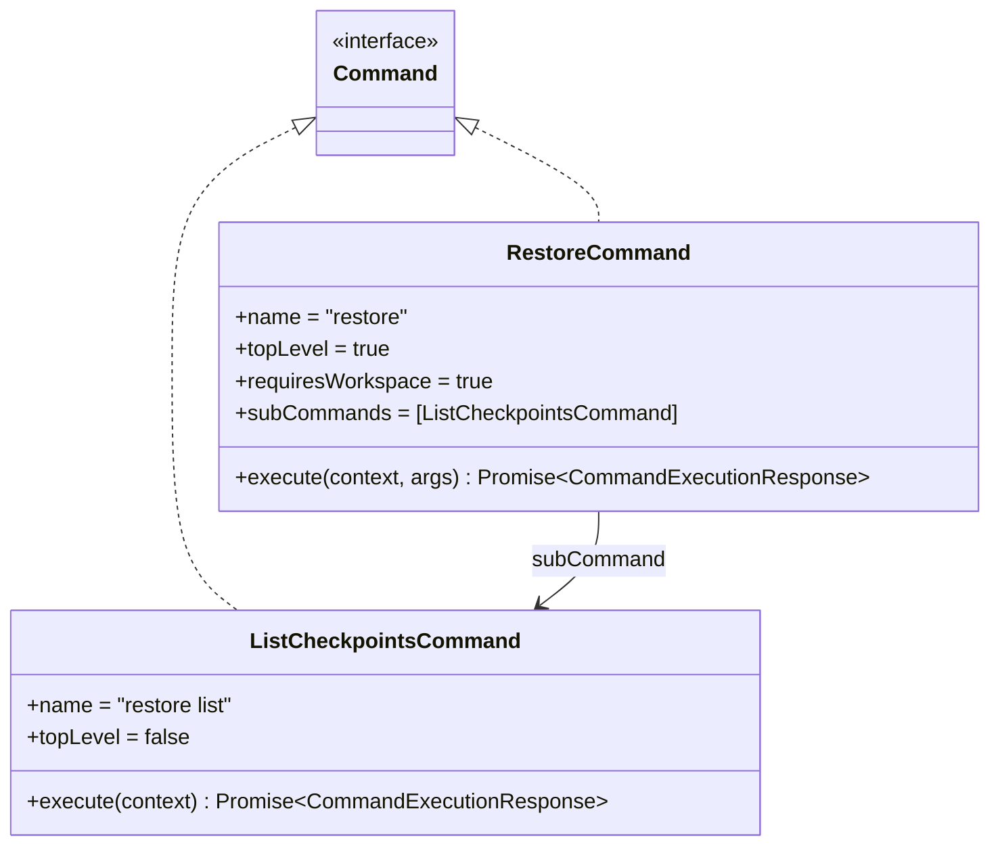

# restore.ts

> 实现检查点恢复命令，支持列出可用检查点和恢复到指定检查点状态。

## 概述

`restore.ts` 实现了 `restore` 命令及其子命令 `restore list`，用于管理 Git 检查点的恢复功能。检查点机制允许用户在 AI 代理执行操作后回退到之前的文件和对话状态。

`RestoreCommand` 接收检查点名称作为参数，从检查点目录中读取对应的 JSON 文件，经过 Zod schema 校验后，调用核心库的 `performRestore` 函数执行恢复操作。`ListCheckpointsCommand` 则遍历检查点目录，解析所有检查点文件并返回信息列表。

## 架构图

```mermaid
flowchart TD
    subgraph "RestoreCommand.execute"
        A["接收 args"] --> B{argsStr 为空?}
        B -->|是| C["返回错误: 请提供检查点名称"]
        B -->|否| D["补全 .json 后缀"]
        D --> E["拼接文件路径"]
        E --> F["readFile(filePath)"]
        F --> G{文件存在?}
        G -->|否 ENOENT| H["返回: File not found"]
        G -->|是| I["JSON.parse(data)"]
        I --> J["ToolCallDataSchema.safeParse"]
        J --> K{校验通过?}
        K -->|否| L["返回: 文件无效或损坏"]
        K -->|是| M["performRestore(data, gitService)"]
        M --> N["收集异步生成器结果"]
        N --> O["返回恢复结果数组"]
    end

    subgraph "ListCheckpointsCommand.execute"
        P["getProjectTempCheckpointsDir"] --> Q["mkdir recursive"]
        Q --> R["readdir"]
        R --> S["过滤 .json 文件"]
        S --> T["逐个读取文件内容"]
        T --> U["getCheckpointInfoList"]
        U --> V["返回检查点信息列表"]
    end
```

## 主要导出

### `class RestoreCommand implements Command`

检查点恢复命令。

| 属性 | 值 | 说明 |
|------|-----|------|
| `name` | `"restore"` | 命令名称 |
| `description` | 见下方 | 恢复到之前的检查点，重置对话和文件历史 |
| `topLevel` | `true` | 顶层命令 |
| `requiresWorkspace` | `true` | 需要工作空间 |
| `subCommands` | `[ListCheckpointsCommand]` | 包含 list 子命令 |

> description: "Restore to a previous checkpoint, or list available checkpoints to restore. This will reset the conversation and file history to the state it was in when the checkpoint was created"

#### `execute(context: CommandContext, args: string[]): Promise<CommandExecutionResponse>`

执行检查点恢复操作。参数 `args` 应包含检查点名称。

**返回值的 `data` 类型**：
- 成功：恢复操作结果数组
- 失败：`{ type: 'message', messageType: 'error', content: string }`

---

### `class ListCheckpointsCommand implements Command`

列出所有可用检查点。

| 属性 | 值 | 说明 |
|------|-----|------|
| `name` | `"restore list"` | 命令名称 |
| `description` | `"Lists all available checkpoints."` | 命令描述 |
| `topLevel` | `false` | 非顶层命令 |

#### `execute(context: CommandContext): Promise<CommandExecutionResponse>`

读取检查点目录中所有 JSON 文件并返回检查点信息列表。

## 核心逻辑

### RestoreCommand 恢复流程

1. **参数校验**：将 `args` 数组合并为字符串。如果为空，返回错误提示要求提供检查点名称。

2. **文件名处理**：如果参数不以 `.json` 结尾，自动补全后缀。

3. **文件路径构建**：通过 `config.storage.getProjectTempCheckpointsDir()` 获取检查点目录，拼接完整文件路径。

4. **文件读取**：使用 `fs.readFile` 异步读取文件内容。如果文件不存在（`ENOENT` 错误），返回 "File not found" 错误。使用 `isNodeError` 工具函数进行类型安全的错误码检查。

5. **数据校验**：
   - 使用 `JSON.parse` 解析文件内容
   - 通过 `getToolCallDataSchema()` 获取 Zod schema
   - 使用 `safeParse` 进行校验，失败时返回 "文件无效或损坏" 错误

6. **执行恢复**：
   - 调用 `performRestore(parseResult.data, gitService)` 返回异步生成器
   - 通过 `for await...of` 循环收集所有恢复操作的结果
   - 返回结果数组

7. **全局异常处理**：整个流程包裹在 `try-catch` 中，捕获未预期的错误并返回通用错误信息。

### ListCheckpointsCommand 列出流程

1. 获取检查点目录路径并确保目录存在（`mkdir recursive`）
2. 读取目录内容，过滤出 `.json` 文件
3. 逐个读取每个 JSON 文件的内容，存入 `Map<filename, content>`
4. 调用 `getCheckpointInfoList(checkpointFiles)` 解析并返回检查点元信息列表
5. 将结果序列化为 JSON 字符串返回

### 检查点存储结构

检查点文件存储在项目临时目录的 checkpoints 子目录中，每个检查点为一个 JSON 文件，包含工具调用数据（`ToolCallData`），记录了 Git 提交信息和文件变更等恢复所需的信息。

## 内部依赖

| 模块 | 导入内容 | 用途 |
|------|---------|------|
| `./types.js` | `Command`, `CommandContext`, `CommandExecutionResponse` | 命令接口和类型定义 |

## 外部依赖

| 包 | 导入内容 | 用途 |
|----|---------|------|
| `@google/gemini-cli-core` | `getCheckpointInfoList` | 从检查点文件 Map 中提取检查点信息列表 |
| `@google/gemini-cli-core` | `getToolCallDataSchema` | 获取检查点数据的 Zod 校验 schema |
| `@google/gemini-cli-core` | `isNodeError` | 类型安全的 Node.js 错误检查工具 |
| `@google/gemini-cli-core` | `performRestore` | 执行检查点恢复操作的核心函数（返回异步生成器） |
| `node:fs/promises` | `fs` | 异步文件系统操作（读取文件、创建目录、读取目录） |
| `node:path` | `path` | 路径拼接 |
