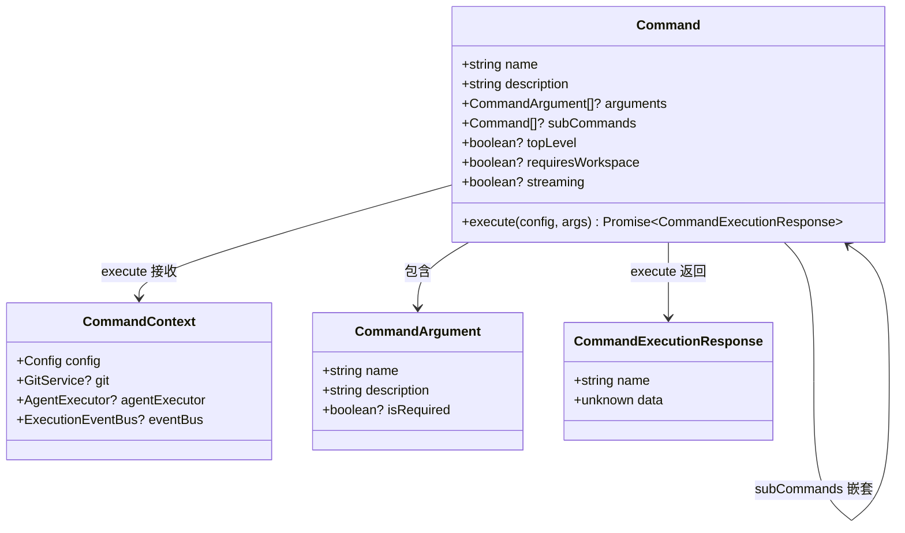

# types.ts

> 定义命令系统的核心类型接口，包括命令上下文、命令定义和命令执行响应。

## 概述

`types.ts` 是 `commands` 模块的类型基础文件，为整个命令系统提供统一的类型约束。文件定义了三个核心接口：`CommandContext`（命令执行上下文）、`Command`（命令定义契约）和 `CommandExecutionResponse`（命令执行结果），以及辅助接口 `CommandArgument`（命令参数描述）。

本文件是命令模块中所有具体命令实现（`extensions.ts`、`init.ts`、`memory.ts`、`restore.ts`）的类型依赖基础，也是 `command-registry.ts` 用于注册和管理命令的接口契约来源。其设计遵循面向接口编程原则，通过 `Command` 接口约定了命令的元数据属性和 `execute` 方法签名，使得不同命令的实现可以被统一注册、查找和调用。

## 架构图

## 主要导出

### `interface CommandContext`

命令执行时的上下文环境，承载了命令运行所需的所有外部依赖。

| 属性 | 类型 | 必需 | 说明 |
|------|------|------|------|
| `config` | `Config` | 是 | 来自 `@google/gemini-cli-core` 的全局配置对象 |
| `git` | `GitService` | 否 | Git 服务实例，用于需要版本控制操作的命令 |
| `agentExecutor` | `AgentExecutor` | 否 | A2A 代理执行器，用于需要代理交互的命令（如 `init`） |
| `eventBus` | `ExecutionEventBus` | 否 | 事件总线，用于流式命令发布执行事件 |

### `interface CommandArgument`

命令参数的元数据描述，用于命令帮助信息和参数校验。

| 属性 | 类型 | 必需 | 说明 |
|------|------|------|------|
| `name` | `string` | 是 | 参数名称 |
| `description` | `string` | 是 | 参数说明 |
| `isRequired` | `boolean` | 否 | 是否为必填参数 |

### `interface Command`

命令定义的核心契约，所有具体命令类均需实现此接口。

| 属性/方法 | 类型 | 必需 | 说明 |
|-----------|------|------|------|
| `name` | `string` | 是 | 命令名称，作为注册和查找的唯一标识 |
| `description` | `string` | 是 | 命令功能描述 |
| `arguments` | `CommandArgument[]` | 否 | 命令接受的参数列表 |
| `subCommands` | `Command[]` | 否 | 子命令列表，支持命令层级嵌套 |
| `topLevel` | `boolean` | 否 | 是否为顶层命令 |
| `requiresWorkspace` | `boolean` | 否 | 是否要求工作空间环境 |
| `streaming` | `boolean` | 否 | 是否为流式命令（通过 eventBus 发布事件） |
| `execute(config, args)` | 方法 | 是 | 执行命令的核心方法，返回 `Promise<CommandExecutionResponse>` |

### `interface CommandExecutionResponse`

命令执行后的统一返回结构。

| 属性 | 类型 | 说明 |
|------|------|------|
| `name` | `string` | 执行的命令名称 |
| `data` | `unknown` | 命令执行结果数据，具体类型由各命令自行定义 |

## 核心逻辑

本文件为纯类型定义文件，不包含运行时逻辑。其设计要点：

1. **命令模式（Command Pattern）**：通过 `Command` 接口抽象命令行为，将命令的声明与执行解耦。所有命令实现同一接口，可被 `CommandRegistry` 统一管理。

2. **子命令支持**：`Command.subCommands` 属性支持命令的层级嵌套（如 `memory show`、`memory list`），子命令本身也是 `Command`，形成递归结构。

3. **可选上下文成员**：`CommandContext` 中的 `git`、`agentExecutor`、`eventBus` 均为可选，不同命令根据自身需求使用不同的上下文能力，例如 `RestoreCommand` 需要 `git`，`InitCommand` 需要 `agentExecutor` 和 `eventBus`。

4. **弱类型响应数据**：`CommandExecutionResponse.data` 使用 `unknown` 类型，为不同命令提供灵活的返回数据格式。

## 内部依赖

无（本文件是类型基础，不依赖同包其他模块）。

## 外部依赖

| 包 | 导入内容 | 用途 |
|----|---------|------|
| `@a2a-js/sdk/server` | `ExecutionEventBus`, `AgentExecutor` | A2A 协议的事件总线和代理执行器类型 |
| `@google/gemini-cli-core` | `Config`, `GitService` | Gemini CLI 核心配置和 Git 服务类型 |
