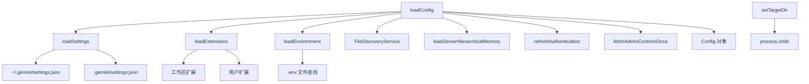

# a2a-server/src/config 架构

> 配置管理模块，负责加载用户设置、工作区设置、环境变量和扩展，构建 Config 对象。

## 概述

`config` 目录负责 A2A 服务器的配置加载和初始化。`config.ts` 是核心文件，组合设置、扩展、认证等多个配置源，创建最终的 `Config` 对象。`settings.ts` 处理用户级和工作区级 settings.json 的加载与合并，支持环境变量替换。`extension.ts` 从 `.gemini/extensions/` 目录加载 Gemini CLI 扩展及其 MCP 服务器配置。

## 架构图

## 关键文件

| 文件 | 功能 |
|------|------|
| `config.ts` | 核心配置加载：`loadConfig()` 构建完整 Config 对象（含模型、认证、MCP、遥测等）；`setTargetDir()` 设置工作目录；`loadEnvironment()` 加载 .env 文件；`refreshAuthentication()` 处理 CCPA/API Key 认证 |
| `settings.ts` | Settings 类型定义和 `loadSettings()` 函数：从用户目录和工作区目录加载 settings.json，工作区设置覆盖用户设置，支持 `$VAR` 和 `${VAR}` 环境变量替换 |
| `extension.ts` | 扩展加载：`loadExtensions()` 从工作区和用户 home 的 `.gemini/extensions/` 目录加载扩展，解析 `gemini-extension.json` 配置文件，去重后返回 |

## 内部依赖

- `../types.ts` - AgentSettings、CoderAgentEvent
- `../utils/logger.ts` - 日志

## 外部依赖

| 包名 | 用途 |
|------|------|
| `@google/gemini-cli-core` | Config、AuthType、ApprovalMode、FileDiscoveryService、GEMINI_DIR 等核心类型和常量 |
| `dotenv` | .env 文件加载 |
| `strip-json-comments` | 移除 JSON 注释后解析 settings.json |
