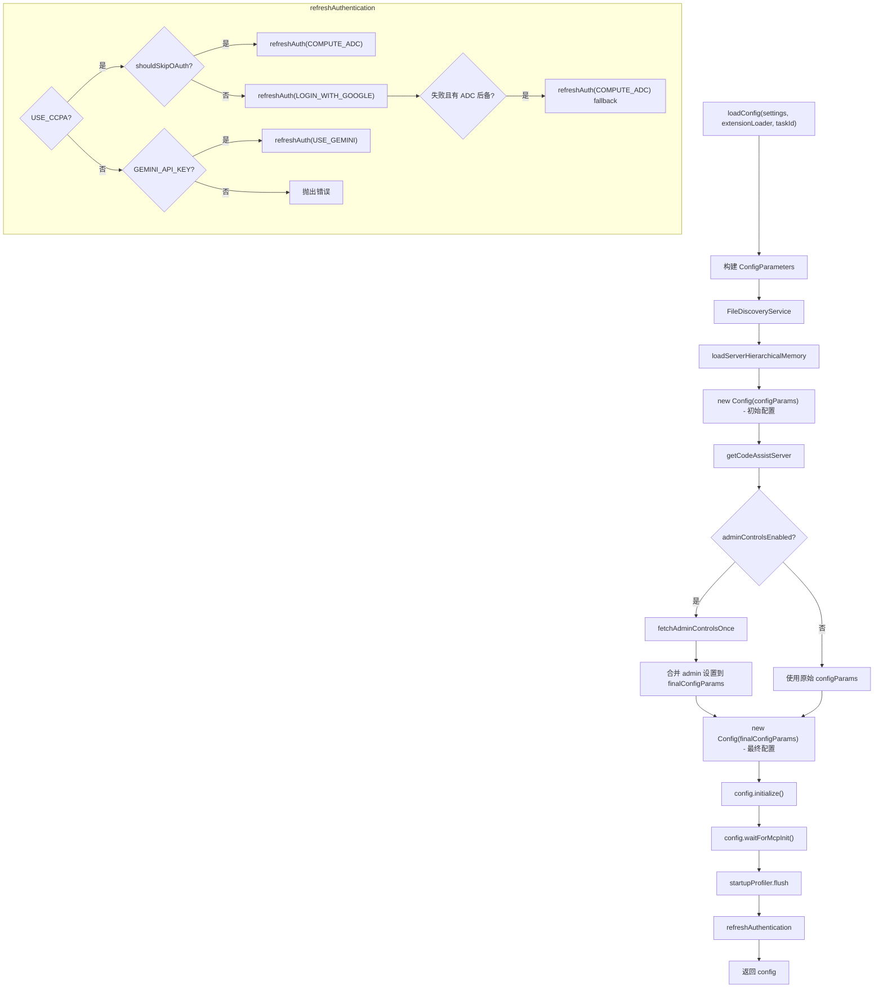
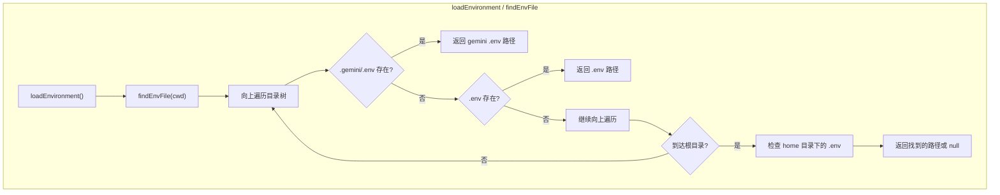

# config.ts

> 加载和初始化 A2A 服务器的核心配置，包括认证、环境变量和工作目录管理。

## 概述

`config.ts` 是 A2A 服务器配置模块的核心文件，负责从设置（Settings）构建完整的 `Config` 对象。该文件承担三个主要职责：

1. **配置加载**（`loadConfig`）：将用户/工作区设置转换为 `Config` 实例，包括模型选择、工具配置、遥测设置、文件过滤、MCP 服务器、管理员控制等全部参数的组装和初始化。
2. **环境管理**（`loadEnvironment` / `setTargetDir`）：加载 `.env` 文件和管理工作目录切换。
3. **认证刷新**（`refreshAuthentication`）：支持 CCPA OAuth、Compute ADC 和 Gemini API Key 三种认证方式，带有完整的降级策略。

## 架构图





## 主要导出

### `async function loadConfig(settings: Settings, extensionLoader: ExtensionLoader, taskId: string): Promise<Config>`

核心配置加载函数，接收合并后的设置、扩展加载器和任务 ID，返回完整初始化的 `Config` 实例。

**参数**：
- `settings` - 合并后的用户/工作区设置
- `extensionLoader` - 扩展加载器，用于加载 GEMINI.md 等扩展上下文
- `taskId` - 用作会话 ID

**关键配置参数组装逻辑**：
- `clientName`：固定为 `"a2a-server"`
- `model`：使用 `PREVIEW_GEMINI_MODEL`
- `embeddingModel`：使用 `DEFAULT_GEMINI_EMBEDDING_MODEL`
- `approvalMode`：环境变量 `GEMINI_YOLO_MODE=true` 时为 `YOLO` 模式，否则为 `DEFAULT`
- `coreTools` / `excludeTools` / `allowedTools`：支持 V1 平铺格式和 V2 嵌套格式（`settings.tools.core` 等）
- `checkpointing`：支持环境变量 `CHECKPOINTING` 和设置文件两种来源，且会校验 Git 可用性
- `folderTrust`：支持设置文件和环境变量 `GEMINI_FOLDER_TRUST`
- `fileFiltering.customIgnoreFilePaths`：合并设置文件和环境变量 `CUSTOM_IGNORE_FILE_PATHS`（以路径分隔符分割）

---

### `function setTargetDir(agentSettings: AgentSettings | undefined): string`

设置工作目录，返回最终的目标目录路径。

**目录来源优先级**：
1. 环境变量 `CODER_AGENT_WORKSPACE_PATH`
2. `AgentSettings.workspacePath`（当 `kind === StateAgentSettingsEvent` 时）
3. 当前工作目录 `process.cwd()`

如果提供了目标目录，会调用 `process.chdir` 切换到该目录。路径解析失败时回退到原始工作目录。

---

### `function loadEnvironment(): void`

加载 `.env` 环境变量文件。

使用 `findEnvFile` 从当前工作目录开始向上查找 `.env` 文件，找到后通过 `dotenv.config` 加载，设置 `override: true` 覆盖已有环境变量。

## 核心逻辑

### 配置加载两阶段流程

1. **初始配置阶段**：使用原始参数创建临时 `Config` 实例（`initialConfig`），用于获取 Code Assist 服务器和检查实验标志。

2. **管理员控制阶段**：如果实验标志 `ENABLE_ADMIN_CONTROLS` 启用，通过 `fetchAdminControlsOnce` 获取管理员设置，并将 `disableYoloMode`、`mcpEnabled`、`extensionsEnabled` 合并到最终配置参数中。

3. **最终初始化**：使用最终参数创建正式 `Config` 实例，依次执行 `initialize()`（初始化工具注册表和 Git checkpointing）、`waitForMcpInit()`（等待 MCP 服务器连接）、`startupProfiler.flush()`（输出启动性能数据）。

### .env 文件查找策略 (findEnvFile)

从起始目录开始向上逐级查找，优先查找 `.gemini/.env`（Gemini 专用环境配置），其次查找 `.env`。到达文件系统根目录后，回退检查用户 home 目录下的 `.gemini/.env` 和 `.env`。

**查找顺序**（以 `/a/b/c` 为例）：
1. `/a/b/c/.gemini/.env`
2. `/a/b/c/.env`
3. `/a/b/.gemini/.env`
4. `/a/b/.env`
5. ...（继续向上）
6. `~/.gemini/.env`（home 目录回退）
7. `~/.env`

### 认证策略 (refreshAuthentication)

```
优先级判断：
1. USE_CCPA 环境变量 → CCPA 认证流程
   a. headless 模式或 USE_COMPUTE_ADC → 直接使用 COMPUTE_ADC
   b. CloudShell 环境 → 直接使用 COMPUTE_ADC
   c. 其他 → 尝试 LOGIN_WITH_GOOGLE
      - 失败且为 CloudShell/COMPUTE_ADC 环境 → 降级到 COMPUTE_ADC
      - 其他失败 → 抛出异常
2. GEMINI_API_KEY 环境变量 → USE_GEMINI 认证
3. 都不存在 → 抛出错误
```

### Checkpointing 校验

检查点功能同时受设置文件和 `CHECKPOINTING` 环境变量控制。即使启用了检查点功能，如果系统中未安装 Git（通过 `GitService.verifyGitAvailability()` 检测），也会自动禁用并输出警告日志。

## 内部依赖

| 模块 | 导入内容 | 用途 |
|------|---------|------|
| `../utils/logger.js` | `logger` | 日志记录 |
| `./settings.js` | `Settings`（类型） | 设置接口类型 |
| `../types.js` | `AgentSettings`, `CoderAgentEvent` | 代理设置类型和事件枚举 |

## 外部依赖

| 包 | 导入内容 | 用途 |
|----|---------|------|
| `node:fs` | `fs` | 同步文件系统操作（检查 .env 文件存在性） |
| `node:path` | `path` | 路径操作 |
| `dotenv` | `dotenv` | 加载 .env 环境变量文件 |
| `@google/gemini-cli-core` | `AuthType` | 认证类型枚举 |
| `@google/gemini-cli-core` | `Config` | 核心配置类 |
| `@google/gemini-cli-core` | `FileDiscoveryService` | 文件发现服务 |
| `@google/gemini-cli-core` | `ApprovalMode` | 审批模式枚举 |
| `@google/gemini-cli-core` | `loadServerHierarchicalMemory` | 加载服务端层级记忆 |
| `@google/gemini-cli-core` | `GEMINI_DIR` | Gemini 配置目录名常量 |
| `@google/gemini-cli-core` | `DEFAULT_GEMINI_EMBEDDING_MODEL` | 默认嵌入模型名称 |
| `@google/gemini-cli-core` | `startupProfiler` | 启动性能分析器 |
| `@google/gemini-cli-core` | `PREVIEW_GEMINI_MODEL` | 预览版 Gemini 模型名称 |
| `@google/gemini-cli-core` | `homedir` | 获取用户 home 目录 |
| `@google/gemini-cli-core` | `GitService` | Git 服务（校验 Git 可用性） |
| `@google/gemini-cli-core` | `fetchAdminControlsOnce` | 获取管理员控制设置 |
| `@google/gemini-cli-core` | `getCodeAssistServer` | 获取 Code Assist 服务器实例 |
| `@google/gemini-cli-core` | `ExperimentFlags` | 实验标志枚举 |
| `@google/gemini-cli-core` | `isHeadlessMode` | 检测是否为无头模式 |
| `@google/gemini-cli-core` | `FatalAuthenticationError` | 致命认证错误类 |
| `@google/gemini-cli-core` | `isCloudShell` | 检测是否为 Cloud Shell 环境 |
| `@google/gemini-cli-core` | `TelemetryTarget`（类型） | 遥测目标类型 |
| `@google/gemini-cli-core` | `ConfigParameters`（类型） | 配置参数类型 |
| `@google/gemini-cli-core` | `ExtensionLoader`（类型） | 扩展加载器类型 |
