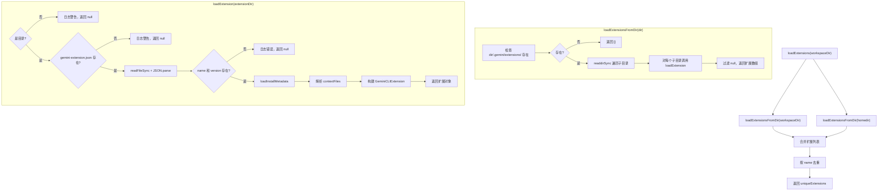
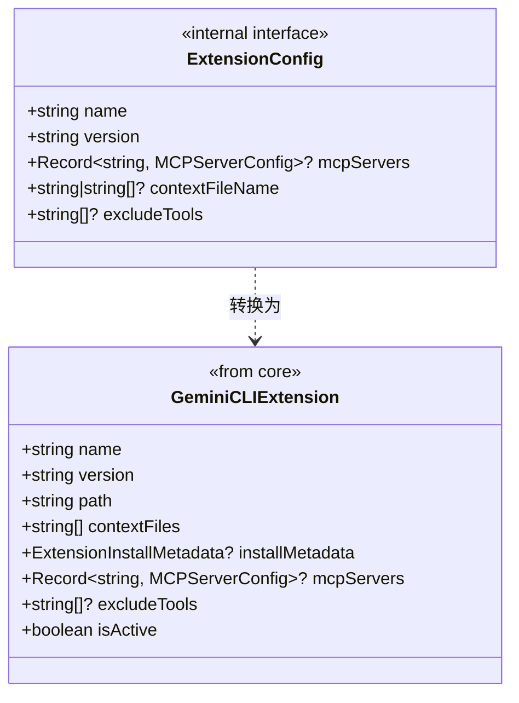

# extension.ts

> 加载和管理 Gemini CLI 扩展，从工作区和用户目录发现并解析扩展配置。

## 概述

`extension.ts` 实现了 Gemini CLI 扩展的加载机制，负责从工作区目录和用户 home 目录中发现、解析和加载扩展。每个扩展是一个包含 `gemini-extension.json` 配置文件的目录，位于 `.gemini/extensions/` 下。

本文件从 `packages/cli/src/config/extension.ts` 完整复制（最后同步 PR #1026），保持与 CLI 包一致的扩展加载逻辑。扩展系统支持 MCP 服务器配置、上下文文件（GEMINI.md）、工具排除列表和安装元数据。工作区扩展优先于用户扩展，同名扩展去重时保留先发现的版本。

## 架构图





## 主要导出

### 常量

#### `EXTENSIONS_DIRECTORY_NAME: string`

扩展目录名称，值为 `path.join(GEMINI_DIR, 'extensions')`，即 `.gemini/extensions`。

#### `EXTENSIONS_CONFIG_FILENAME: string`

扩展配置文件名，值为 `"gemini-extension.json"`。

#### `INSTALL_METADATA_FILENAME: string`

安装元数据文件名，值为 `".gemini-extension-install.json"`。

### `function loadExtensions(workspaceDir: string): GeminiCLIExtension[]`

加载所有可用扩展的入口函数。

**参数**：
- `workspaceDir` - 工作区目录路径

**返回值**：去重后的扩展对象数组。

**执行流程**：
1. 依次从工作区目录和用户 home 目录加载扩展
2. 合并两个来源的扩展列表（工作区扩展在前）
3. 按扩展名称去重，保留先出现的版本（即工作区扩展优先）
4. 对每个保留的扩展输出日志

### `function loadInstallMetadata(extensionDir: string): ExtensionInstallMetadata | undefined`

加载扩展的安装元数据。

**参数**：
- `extensionDir` - 扩展目录路径

**返回值**：解析后的 `ExtensionInstallMetadata` 对象，或在文件不存在/解析失败时返回 `undefined`。

从扩展目录中读取 `.gemini-extension-install.json` 文件并解析。该文件记录了扩展的安装来源、时间等元信息。

## 核心逻辑

### 扩展发现流程

扩展存放在 `.gemini/extensions/` 目录下，每个扩展是一个独立的子目录。系统从两个位置查找扩展：

1. **工作区扩展**：`<workspaceDir>/.gemini/extensions/<extension-name>/`
2. **用户扩展**：`~/.gemini/extensions/<extension-name>/`

工作区扩展的加载顺序先于用户扩展，因此在去重时工作区扩展具有更高优先级。

### 单个扩展加载 (loadExtension)

1. **目录校验**：确认路径是目录（非文件）
2. **配置文件检查**：确认 `gemini-extension.json` 存在
3. **配置解析**：读取并 JSON 解析配置文件
4. **字段校验**：验证 `name` 和 `version` 字段存在
5. **安装元数据**：尝试加载 `.gemini-extension-install.json`
6. **上下文文件解析**：通过 `getContextFileNames` 获取上下文文件名列表，然后映射为完整路径并过滤掉不存在的文件
7. **构建扩展对象**：组装 `GeminiCLIExtension` 对象，`isActive` 默认为 `true`

### 上下文文件名解析 (getContextFileNames)

- `contextFileName` 未设置：默认返回 `['GEMINI.md']`
- `contextFileName` 为字符串：包装为单元素数组
- `contextFileName` 为数组：直接返回

### 错误处理策略

扩展加载采用宽容策略：
- 扩展目录不存在：返回空数组，不报错
- 单个扩展加载失败（目录结构异常、配置无效、JSON 解析错误）：记录警告/错误日志，跳过该扩展，继续加载其他扩展
- 安装元数据加载失败：记录警告日志，返回 `undefined`，不影响扩展本身的加载

### ExtensionConfig 内部接口

```typescript
interface ExtensionConfig {
  name: string;          // 扩展名称
  version: string;       // 扩展版本
  mcpServers?: Record<string, MCPServerConfig>;  // MCP 服务器配置
  contextFileName?: string | string[];           // 上下文文件名
  excludeTools?: string[];                       // 排除的工具列表
}
```

此接口仅用于磁盘文件的读取和解析，不应在加载逻辑之外引用。对外暴露的扩展信息统一使用核心包的 `GeminiCLIExtension` 类型。

## 内部依赖

| 模块 | 导入内容 | 用途 |
|------|---------|------|
| `../utils/logger.js` | `logger` | 日志记录 |

## 外部依赖

| 包 | 导入内容 | 用途 |
|----|---------|------|
| `@google/gemini-cli-core` | `GEMINI_DIR` | Gemini 配置目录名常量（`.gemini`） |
| `@google/gemini-cli-core` | `MCPServerConfig`（类型） | MCP 服务器配置类型 |
| `@google/gemini-cli-core` | `ExtensionInstallMetadata`（类型） | 扩展安装元数据类型 |
| `@google/gemini-cli-core` | `GeminiCLIExtension`（类型） | 扩展对象类型 |
| `@google/gemini-cli-core` | `homedir` | 获取用户 home 目录 |
| `node:fs` | `fs` | 同步文件系统操作（existsSync、statSync、readdirSync、readFileSync） |
| `node:path` | `path` | 路径拼接 |
