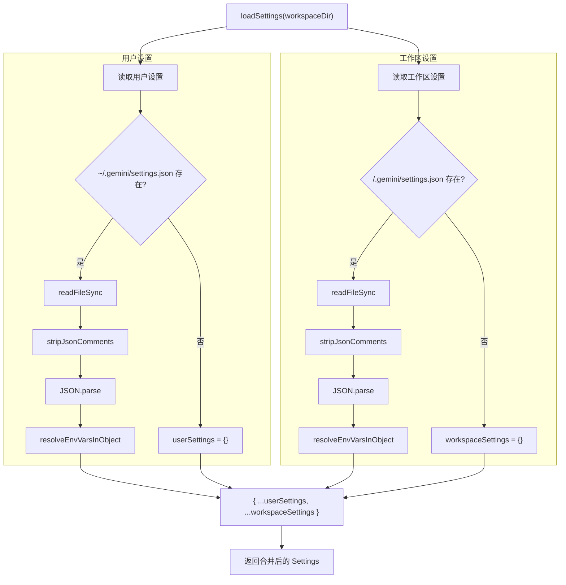
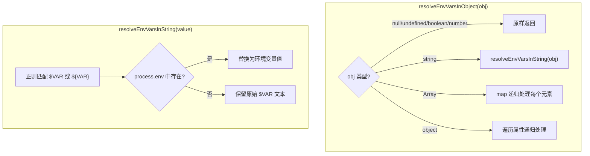

# settings.ts

> 加载和合并用户级与工作区级的 settings.json 配置文件，支持环境变量替换。

## 概述

`settings.ts` 负责 A2A 服务器的设置文件管理，定义了 `Settings` 接口及其加载逻辑。设置系统采用两级覆盖机制：用户级设置（`~/.gemini/settings.json`）和工作区级设置（`<workspace>/.gemini/settings.json`），工作区设置优先级更高。

文件还实现了设置值中环境变量的动态替换功能，支持 `$VAR_NAME` 和 `${VAR_NAME}` 两种语法，递归地处理所有字符串值。

与 CLI 包的 `settings.ts` 不同，本文件直接返回合并后的 `Settings` 对象而非 `LoadedSettings`，因为 A2A 服务器不需要修改用户的 settings.json 文件。

## 架构图

## 主要导出

### 常量

#### `USER_SETTINGS_DIR: string`

用户设置目录路径，值为 `path.join(homedir(), GEMINI_DIR)`，即 `~/.gemini/`。

#### `USER_SETTINGS_PATH: string`

用户设置文件路径，值为 `path.join(USER_SETTINGS_DIR, 'settings.json')`，即 `~/.gemini/settings.json`。

### `interface Settings`

设置文件的类型定义。

| 属性 | 类型 | 说明 |
|------|------|------|
| `mcpServers` | `Record<string, MCPServerConfig>` | MCP 服务器配置映射 |
| `coreTools` | `string[]` | 核心工具列表（V1 平铺格式） |
| `excludeTools` | `string[]` | 排除的工具列表（V1 平铺格式） |
| `allowedTools` | `string[]` | 允许的工具列表（V1 平铺格式） |
| `tools` | `{ allowed?, exclude?, core? }` | 工具配置（V2 嵌套格式） |
| `telemetry` | `TelemetrySettings` | 遥测设置 |
| `showMemoryUsage` | `boolean` | 是否显示内存使用量 |
| `checkpointing` | `CheckpointingSettings` | 检查点设置 |
| `folderTrust` | `boolean` | 是否信任当前文件夹 |
| `general` | `{ previewFeatures? }` | 通用设置 |
| `fileFiltering` | `{ respectGitIgnore?, respectGeminiIgnore?, enableRecursiveFileSearch?, customIgnoreFilePaths? }` | 文件过滤设置 |

### `interface SettingsError`

设置加载错误信息。

| 属性 | 类型 | 说明 |
|------|------|------|
| `message` | `string` | 错误消息 |
| `path` | `string` | 出错的设置文件路径 |

### `interface CheckpointingSettings`

检查点功能设置。

| 属性 | 类型 | 说明 |
|------|------|------|
| `enabled` | `boolean` | 是否启用检查点功能 |

### `function loadSettings(workspaceDir: string): Settings`

加载并合并设置。

**参数**：
- `workspaceDir` - 工作区目录路径

**返回值**：合并后的 `Settings` 对象，工作区设置覆盖用户设置。

## 核心逻辑

### 设置加载与合并

1. **用户设置加载**：从 `~/.gemini/settings.json` 读取。文件不存在时使用空对象。
2. **工作区设置加载**：从 `<workspaceDir>/.gemini/settings.json` 读取。文件不存在时使用空对象。
3. **JSON 注释处理**：使用 `stripJsonComments` 移除 JSON 中的注释（支持 `//` 和 `/* */` 注释），方便用户在配置文件中添加注释。
4. **环境变量替换**：解析后的对象经过 `resolveEnvVarsInObject` 处理，将字符串值中的环境变量引用替换为实际值。
5. **浅合并**：使用展开运算符 `{ ...userSettings, ...workspaceSettings }` 进行合并，工作区设置的同名顶层属性覆盖用户设置。注意这是浅合并，嵌套对象会被整体替换而非递归合并。

### 错误处理

设置加载的错误不会中断流程。错误被收集到 `settingsErrors` 数组中，加载完成后统一通过 `debugLogger.error` 输出。这确保了即使某个设置文件损坏，另一个仍能正常加载。

### 环境变量替换

`resolveEnvVarsInObject` 函数递归遍历对象的所有属性：
- **基本类型**（null、undefined、boolean、number）：原样返回
- **字符串**：通过正则 `/\$(?:(\w+)|{([^}]+)})/g` 匹配 `$VAR` 或 `${VAR}` 语法，替换为 `process.env` 中对应的值。如果环境变量不存在，保留原始文本不变。
- **数组**：递归处理每个元素
- **对象**：浅拷贝后递归处理每个属性值

## 内部依赖

无（本文件不依赖同包其他模块）。

## 外部依赖

| 包 | 导入内容 | 用途 |
|----|---------|------|
| `node:fs` | `fs` | 同步文件系统操作（检查存在性、读取文件） |
| `node:path` | `path` | 路径拼接 |
| `@google/gemini-cli-core` | `MCPServerConfig`（类型） | MCP 服务器配置类型 |
| `@google/gemini-cli-core` | `debugLogger` | 调试日志记录器 |
| `@google/gemini-cli-core` | `GEMINI_DIR` | Gemini 配置目录名常量（`.gemini`） |
| `@google/gemini-cli-core` | `getErrorMessage` | 从 unknown 错误中提取错误消息 |
| `@google/gemini-cli-core` | `TelemetrySettings`（类型） | 遥测设置类型 |
| `@google/gemini-cli-core` | `homedir` | 获取用户 home 目录 |
| `strip-json-comments` | `stripJsonComments` | 移除 JSON 字符串中的注释 |
