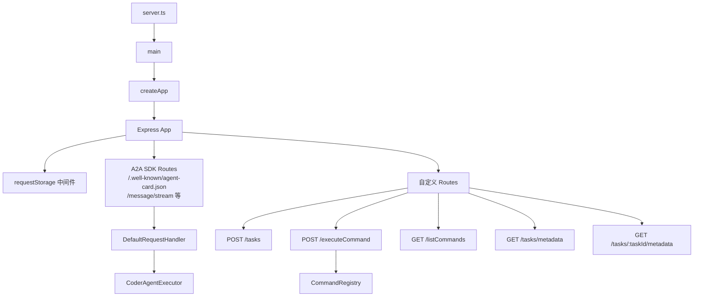

# a2a-server/src/http 架构

> HTTP 服务层，提供 Express 应用、A2A 协议路由和自定义 API 端点。

## 概述

`http` 目录实现了 A2A 服务器的 HTTP 层。`app.ts` 是核心文件，创建 Express 应用并配置所有路由。它同时挂载 A2A SDK 的标准路由（用于 `message/stream` 等 JSON-RPC 方法）和自定义 REST 端点（用于任务管理和命令执行）。`server.ts` 是可执行入口点，负责启动服务器进程。`requestStorage.ts` 使用 AsyncLocalStorage 在请求生命周期内传递请求上下文。

## 架构图

## 关键文件

| 文件 | 功能 |
|------|------|
| `app.ts` | 核心应用文件：`createApp()` 初始化配置、创建 TaskStore（GCS 或 InMemory）、实例化 CoderAgentExecutor、配置 A2A 路由和自定义端点；`main()` 启动监听；定义 AgentCard（Agent 名称、能力、安全方案）；支持 Bearer/Basic 认证 |
| `server.ts` | 进程入口：检测是否为主模块后调用 `main()`，注册未捕获异常处理 |
| `requestStorage.ts` | 导出 AsyncLocalStorage 实例，在请求中间件中注入 `req` 对象，供 Agent 执行时获取 socket 连接实现断开检测 |

## 内部依赖

- `../agent/executor.ts` - CoderAgentExecutor
- `../commands/command-registry.ts` - commandRegistry
- `../config/config.ts` - loadConfig、loadEnvironment、setTargetDir
- `../config/settings.ts` - loadSettings
- `../config/extension.ts` - loadExtensions
- `../persistence/gcs.ts` - GCSTaskStore、NoOpTaskStore
- `../utils/logger.ts` - logger

## 外部依赖

| 包名 | 用途 |
|------|------|
| `express` | HTTP 服务框架 |
| `@a2a-js/sdk` | AgentCard、Message 类型 |
| `@a2a-js/sdk/server` | DefaultRequestHandler、InMemoryTaskStore、DefaultExecutionEventBus |
| `@a2a-js/sdk/server/express` | A2AExpressApp 路由挂载 |
| `uuid` | UUID 生成 |
