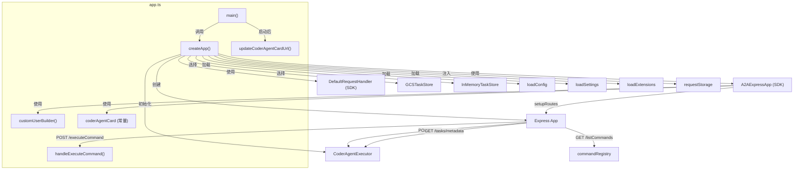

# app.ts

> A2A 服务器的 Express 应用核心，负责创建并配置所有 HTTP 路由、Agent 卡片、任务存储和命令执行端点。

## 概述

`app.ts` 是 `a2a-server` 包的核心入口文件，承担以下职责：

1. **Agent 卡片定义** -- 声明符合 A2A 协议的 `AgentCard`，描述 Gemini SDLC Agent 的能力、安全方案和技能。
2. **Express 应用工厂** -- `createApp()` 函数完成所有一次性初始化：加载配置/环境/扩展、创建任务存储（GCS 或内存）、注册 A2A SDK 路由以及自定义业务路由。
3. **自定义路由** -- 提供 `/tasks`、`/tasks/metadata`、`/tasks/:taskId/metadata`、`/executeCommand`、`/listCommands` 等 REST 端点。
4. **服务器启动** -- `main()` 函数监听端口并打印启动信息。

该文件在整个模块中扮演"应用组装者"的角色：将配置、持久化、Agent 执行器、命令注册表等子系统粘合为一个可运行的 Express 应用。

## 架构图



## 主要导出

### `updateCoderAgentCardUrl(port: number): void`

更新模块级 `coderAgentCard` 常量的 `url` 字段，使其反映实际监听端口。在服务器启动拿到真实端口后调用。

### `createApp(): Promise<express.Express>`

异步工厂函数，创建并返回完整配置的 Express 应用实例。执行以下步骤：

1. 调用 `setTargetDir` / `loadEnvironment` / `loadSettings` / `loadExtensions` / `loadConfig` 完成配置加载。
2. 如果启用了 checkpointing，初始化 `GitService`。
3. 根据环境变量 `GCS_BUCKET_NAME` 决定使用 `GCSTaskStore`（带 `NoOpTaskStore` 包装）或 `InMemoryTaskStore`。
4. 创建 `CoderAgentExecutor` 和 `DefaultRequestHandler`。
5. 通过 `A2AExpressApp.setupRoutes()` 注册 A2A 协议路由。
6. 注册自定义业务路由（见下文"核心逻辑"）。

### `main(): Promise<void>`

服务器启动入口。调用 `createApp()` 获取 Express 应用，监听 `CODER_AGENT_PORT` 环境变量指定的端口（默认随机端口），启动后更新 AgentCard URL 并打印日志。

## 核心逻辑

### 任务存储策略选择

```
if GCS_BUCKET_NAME 环境变量存在:
    executor 使用 GCSTaskStore
    handler 使用 NoOpTaskStore(GCSTaskStore)  // save 时不重复写 GCS
else:
    executor 和 handler 共享同一个 InMemoryTaskStore
```

`NoOpTaskStore` 的设计意图：A2A SDK 的 `DefaultRequestHandler` 会自动调用 `TaskStore.save()`，而 `CoderAgentExecutor` 也会保存任务。为避免双重写入 GCS，handler 侧使用 `NoOpTaskStore`（save 为空操作，load 委托给真实 store）。

### 用户认证 (`customUserBuilder`)

支持两种认证方式：
- **Bearer Token** -- `Authorization: Bearer valid-token` 返回 `bearer-user`。
- **Basic Auth** -- `Authorization: Basic <base64(admin:password)>` 返回 `basic-user`。
- 其他情况返回 `UnauthenticatedUser`。

### 命令执行端点 (`handleExecuteCommand`)

`POST /executeCommand` 接收 `{ command, args }` 请求体：

1. 验证参数类型。
2. 从 `commandRegistry` 查找命令；若命令需要工作区但 `CODER_AGENT_WORKSPACE_PATH` 未设置，返回 400。
3. **流式命令** (`command.streaming === true`) -- 设置 `Content-Type: text/event-stream`，通过 `DefaultExecutionEventBus` 监听事件并以 SSE 格式写出。
4. **非流式命令** -- 直接返回 JSON 结果。

### 命令列表端点 (`GET /listCommands`)

递归遍历 `commandRegistry` 中所有顶级命令及其子命令，使用 `visited` 数组检测并跳过循环引用，返回扁平化的命令描述树。

### 任务管理端点

| 端点 | 方法 | 说明 |
|---|---|---|
| `/tasks` | POST | 创建新任务，返回任务 ID |
| `/tasks/metadata` | GET | 获取所有任务元数据（仅 InMemoryTaskStore 支持） |
| `/tasks/:taskId/metadata` | GET | 获取指定任务元数据，先查内存再查持久化 |

## 内部依赖

| 模块 | 用途 |
|---|---|
| `../utils/logger.js` | 日志记录 |
| `../persistence/gcs.js` | `GCSTaskStore`、`NoOpTaskStore` |
| `../agent/executor.js` | `CoderAgentExecutor` |
| `./requestStorage.js` | 请求级 `AsyncLocalStorage` |
| `../config/config.js` | `loadConfig`、`loadEnvironment`、`setTargetDir` |
| `../config/settings.js` | `loadSettings` |
| `../config/extension.js` | `loadExtensions` |
| `../commands/command-registry.js` | `commandRegistry` |
| `../commands/types.js` | `Command`、`CommandArgument` 类型 |
| `../types.js` | `AgentSettings` 类型 |

## 外部依赖

| npm 包 | 用途 |
|---|---|
| `express` | Web 框架，HTTP 路由和中间件 |
| `@a2a-js/sdk` | A2A 协议类型 (`AgentCard`、`Message`) |
| `@a2a-js/sdk/server` | `TaskStore`、`DefaultRequestHandler`、`InMemoryTaskStore`、`DefaultExecutionEventBus`、`UnauthenticatedUser` 等服务端组件 |
| `@a2a-js/sdk/server/express` | `A2AExpressApp`、`UserBuilder` -- Express 集成 |
| `uuid` (v4) | 生成任务 ID 和上下文 ID |
| `@google/gemini-cli-core` | `debugLogger`、`SimpleExtensionLoader`、`GitService` |
