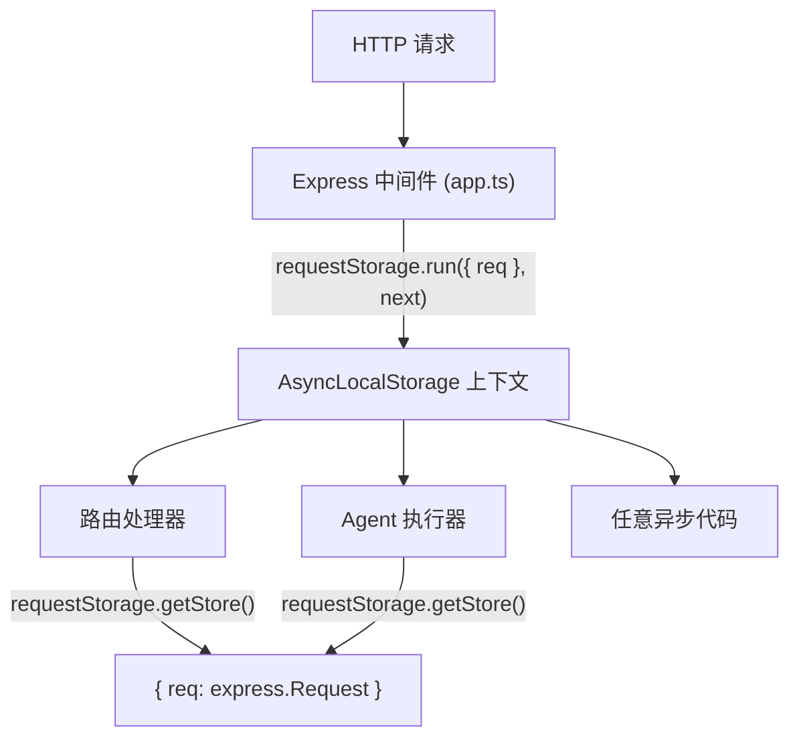

# requestStorage.ts

> 基于 `AsyncLocalStorage` 的请求上下文存储，使同一请求链路中的任意代码都能访问当前 Express 请求对象。

## 概述

`requestStorage.ts` 导出一个全局的 `AsyncLocalStorage` 实例，用于在 Express 请求处理的整个异步调用链中传播请求上下文。在 `app.ts` 中，每个传入请求都会通过中间件调用 `requestStorage.run({ req }, next)` 来建立上下文，下游的任何异步代码都可以通过 `requestStorage.getStore()` 获取当前请求对象，而无需显式传参。

这是一种经典的"隐式上下文传播"模式，常用于日志注入请求 ID、获取认证信息等场景。

## 架构图



## 主要导出

### `requestStorage: AsyncLocalStorage<{ req: express.Request }>`

类型为 `AsyncLocalStorage<{ req: express.Request }>` 的全局单例。

- **写入上下文**：在 Express 中间件中调用 `requestStorage.run({ req }, next)`。
- **读取上下文**：在任意异步代码中调用 `requestStorage.getStore()?.req` 获取当前请求。

存储的值是一个包含 `req` 属性的对象，其中 `req` 是 Express 的 `Request` 类型。

## 核心逻辑

该文件仅包含一行核心代码：

```typescript
export const requestStorage = new AsyncLocalStorage<{ req: express.Request }>();
```

创建一个类型化的 `AsyncLocalStorage` 实例。`AsyncLocalStorage` 是 Node.js `async_hooks` 模块提供的 API，能够在异步操作链（Promise、setTimeout、EventEmitter 回调等）中自动传播存储的值，无需手动传递。

### 使用方式（在 app.ts 中）

```typescript
expressApp.use((req, res, next) => {
  requestStorage.run({ req }, next);
});
```

每个请求进入时创建一个新的存储上下文，确保并发请求之间互不干扰。

## 内部依赖

无。

## 外部依赖

| npm 包 | 用途 |
|---|---|
| `express` | `express.Request` 类型定义（仅类型导入） |
| `node:async_hooks` | `AsyncLocalStorage` -- Node.js 内置异步上下文传播 API |
