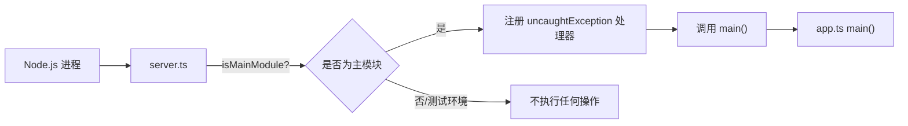

# server.ts

> A2A 服务器的进程入口脚本，负责检测主模块身份并启动服务。

## 概述

`server.ts` 是 `a2a-server` 包的可执行入口文件（通过 shebang `#!/usr/bin/env -S node --no-warnings=DEP0040` 可直接运行）。它的唯一职责是判断自身是否为主模块，如果是则注册全局异常处理器并调用 `app.ts` 中的 `main()` 函数启动服务器。

该文件在模块中扮演"启动器"角色，将进程生命周期管理（异常捕获、退出码）与应用逻辑（`app.ts`）分离。

## 架构图



## 主要导出

该文件没有任何导出。它是一个纯副作用模块，仅在作为主脚本运行时执行逻辑。

## 核心逻辑

### 主模块检测

```typescript
const isMainModule =
  path.basename(process.argv[1]) ===
  path.basename(url.fileURLToPath(import.meta.url));
```

通过比较 `process.argv[1]`（当前执行脚本路径）与 `import.meta.url`（当前模块 URL）的文件名来判断是否为主模块。

### 启动条件

同时满足以下三个条件才会执行启动逻辑：

1. `import.meta.url` 以 `file:` 开头（排除非本地文件系统场景）。
2. `isMainModule` 为 `true`（当前文件是入口脚本）。
3. `process.env['NODE_ENV'] !== 'test'`（非测试环境）。

### 异常处理

- **`uncaughtException`** -- 全局未捕获异常处理器，记录错误日志后以退出码 1 终止进程。
- **`main().catch()`** -- 捕获 `main()` 函数中的未处理 Promise 拒绝，同样记录日志并退出。

## 内部依赖

| 模块 | 用途 |
|---|---|
| `../utils/logger.js` | 错误日志记录 |
| `./app.js` | `main()` 函数 -- 实际的服务器启动逻辑 |

## 外部依赖

| npm 包 | 用途 |
|---|---|
| `node:url` | `url.fileURLToPath` -- 将 `import.meta.url` 转换为文件路径 |
| `node:path` | `path.basename` -- 提取文件名进行主模块比较 |
