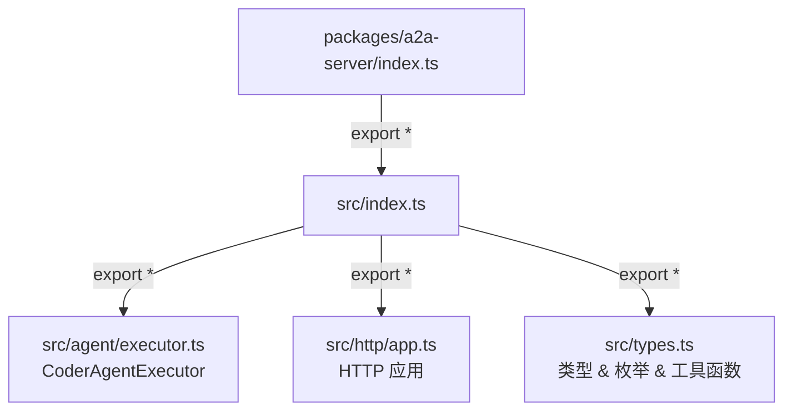

# src/index.ts

> 包的次级入口文件，聚合并重导出 agent executor、HTTP 应用和类型定义三大模块。

## 概述

`src/index.ts` 是 `a2a-server` 包的内部聚合入口，负责将包内三个核心子模块的公共 API 统一导出。它充当 `src/` 目录的桶文件（barrel file），由根 `index.ts` 进一步转发给外部消费者。

该文件定义了包对外暴露的 API 表面（API surface）：
1. **Agent Executor** -- 代理执行器，负责任务的创建、调度和生命周期管理。
2. **HTTP App** -- HTTP 应用层，提供 A2A 协议的 HTTP 服务接口。
3. **Types** -- 类型定义，包含协议事件枚举、接口和持久化元数据工具函数。

## 架构图

## 主要导出

| 导出语句 | 来源模块 | 说明 |
|---------|---------|------|
| `export * from './agent/executor.js'` | `agent/executor.ts` | 导出 `CoderAgentExecutor` 类及其相关类型 |
| `export * from './http/app.js'` | `http/app.ts` | 导出 HTTP 服务器应用相关的构建函数和中间件 |
| `export * from './types.js'` | `types.ts` | 导出 `CoderAgentEvent` 枚举、所有接口定义、持久化元数据工具函数等 |

## 核心逻辑

该文件仅包含三行重导出语句，不含业务逻辑。它的设计目的是提供一个统一的导入入口，避免外部消费者需要记忆包的内部目录结构。

## 内部依赖

| 模块 | 说明 |
|------|------|
| `./agent/executor.js` | 代理执行器模块 |
| `./http/app.js` | HTTP 应用模块 |
| `./types.js` | 类型定义模块 |

## 外部依赖

无。
