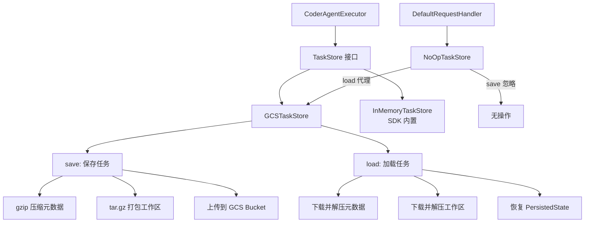

# a2a-server/src/persistence 架构

> 持久化层，提供基于 Google Cloud Storage 的任务状态和工作区存储。

## 概述

`persistence` 目录实现了 A2A 服务器的任务持久化机制。`GCSTaskStore` 将任务的元数据和工作区文件持久化到 Google Cloud Storage，支持跨进程重启后恢复任务状态。元数据以 gzip 压缩的 JSON 形式存储，工作区文件则打包为 tar.gz 归档。`NoOpTaskStore` 是一个代理包装器，在使用 GCS 时跳过 SDK 内部的冗余保存操作。当未配置 GCS 时，系统回退到 A2A SDK 自带的 `InMemoryTaskStore`。

## 架构图

## 关键文件

| 文件 | 功能 |
|------|------|
| `gcs.ts` | `GCSTaskStore`：实现 TaskStore 接口；`save()` 将元数据 gzip 压缩后上传、将工作区目录打包为 tar.gz 并流式上传到 GCS；`load()` 下载并解压元数据和工作区，重建 SDKTask 对象。`NoOpTaskStore`：包装 GCSTaskStore，save 为空操作、load 代理到真实 store，用于避免 SDK RequestHandler 层的重复保存 |

## 内部依赖

- `../config/config.ts` - setTargetDir
- `../types.ts` - getPersistedState、PersistedTaskMetadata
- `../utils/logger.ts` - logger

## 外部依赖

| 包名 | 用途 |
|------|------|
| `@google-cloud/storage` | GCS 客户端 |
| `@a2a-js/sdk` | SDKTask 类型 |
| `@a2a-js/sdk/server` | TaskStore 接口 |
| `tar` | tar 归档创建和解压 |
| `fs-extra` | 文件系统操作（pathExists、ensureDir、remove） |
| `uuid` | 临时文件名生成 |
| `@google/gemini-cli-core` | tmpdir 函数 |
