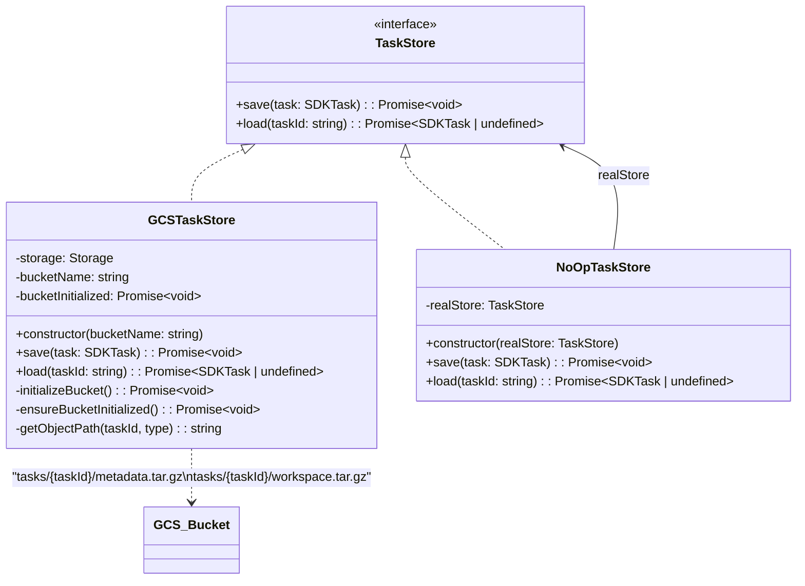
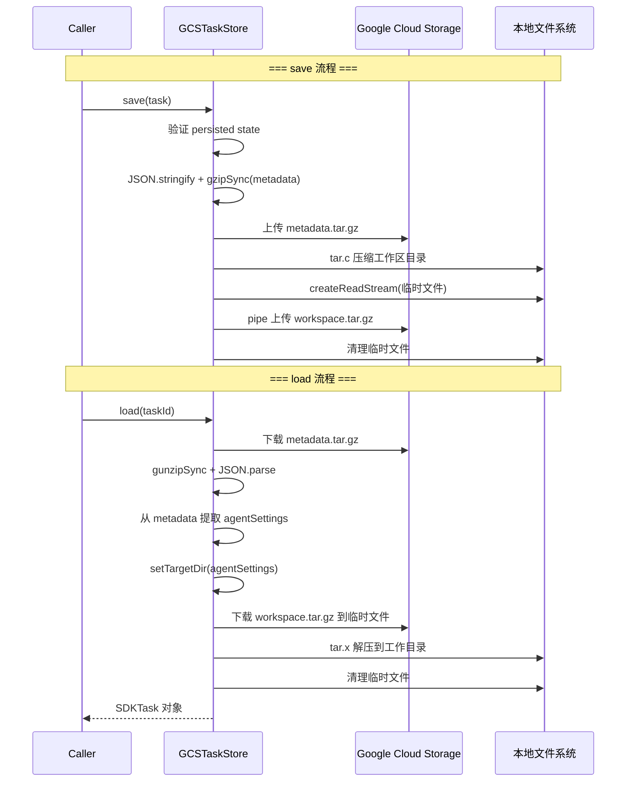

# gcs.ts

> 基于 Google Cloud Storage 的任务持久化实现，支持任务元数据和工作区文件的压缩存储与恢复。

## 概述

`gcs.ts` 提供了 `TaskStore` 接口的两个实现：

1. **`GCSTaskStore`** -- 将任务元数据（JSON gzip 压缩）和工作区目录（tar.gz 归档）持久化到 GCS 存储桶。支持保存和加载完整的任务状态，包括文件系统工作区的快照恢复。
2. **`NoOpTaskStore`** -- 一个装饰器/代理，save 操作为空（忽略），load 操作委托给真实的 `TaskStore`。用于避免 A2A SDK 的 `DefaultRequestHandler` 与 `CoderAgentExecutor` 双重保存的问题。

该文件在持久化层中是核心模块，使 Agent 的任务状态能够跨进程重启存活。

## 架构图





## 主要导出

### `class GCSTaskStore implements TaskStore`

基于 Google Cloud Storage 的任务存储实现。

#### `constructor(bucketName: string)`

- 接收 GCS 存储桶名称，若为空则抛出错误。
- 创建 `Storage` 客户端实例。
- 异步初始化存储桶（若不存在则创建），结果保存在 `bucketInitialized` Promise 中。

#### `async save(task: SDKTask): Promise<void>`

保存任务到 GCS，包含两部分：

1. **元数据** -- 将 `task.metadata` 序列化为 JSON，gzip 压缩后上传到 `tasks/{taskId}/metadata.tar.gz`。
2. **工作区** -- 将当前工作目录 (`process.cwd()`) 打包为 tar.gz，通过流式上传到 `tasks/{taskId}/workspace.tar.gz`。上传完成后清理临时文件。

#### `async load(taskId: string): Promise<SDKTask | undefined>`

从 GCS 加载任务：

1. 下载并解压元数据，解析 JSON。
2. 从元数据中提取 `agentSettings`，调用 `setTargetDir` 设置工作目录。
3. 下载工作区归档并解压到工作目录。
4. 返回重建的 `SDKTask` 对象。

---

### `class NoOpTaskStore implements TaskStore`

空操作任务存储装饰器。

#### `constructor(realStore: TaskStore)`

接收一个真实的 `TaskStore` 实例，用于 `load` 操作的委托。

#### `async save(task: SDKTask): Promise<void>`

记录日志后立即返回，不执行实际保存。

#### `async load(taskId: string): Promise<SDKTask | undefined>`

委托给构造时传入的 `realStore.load()`。

## 核心逻辑

### GCS 对象路径规范

```
tasks/{taskId}/metadata.tar.gz   -- 任务元数据（gzip JSON）
tasks/{taskId}/workspace.tar.gz  -- 工作区文件归档
```

### 任务 ID 安全校验

```typescript
const isTaskIdValid = (taskId: string): boolean => {
  const validTaskIdRegex = /^[a-zA-Z0-9_-]+$/;
  return validTaskIdRegex.test(taskId);
};
```

在 `getObjectPath` 中调用，仅允许字母数字、破折号和下划线，防止路径穿越攻击。

### 存储桶延迟初始化

构造函数中触发 `initializeBucket()` 返回的 Promise 被保存在 `bucketInitialized` 字段中。每次 `save` / `load` 操作前调用 `ensureBucketInitialized()` 等待其完成。这样：
- 构造函数不阻塞（不是 async）。
- 初始化仅执行一次。
- 后续操作自动等待初始化完成。

### 工作区保存流程

1. 使用 `tar.c` 将 `process.cwd()` 下所有文件打包为 tar.gz 临时文件。
2. 通过 `createReadStream` + `pipe` 流式上传到 GCS（支持 resumable upload）。
3. `finally` 块中清理临时文件，即使上传失败也不留残留。

### 工作区恢复流程

1. 从 metadata 中提取 `_agentSettings`，调用 `setTargetDir` 确定工作目录。
2. 使用 `fse.ensureDir` 确保目录存在。
3. 下载 workspace 归档到临时文件，使用 `tar.x` 解压到工作目录。
4. `finally` 块中清理临时文件。

### 临时文件命名

```typescript
const getTmpArchiveFilename = (taskId: string): string =>
  `task-${taskId}-workspace-${uuidv4()}.tar.gz`;
```

使用 UUID 后缀确保并发操作不会产生文件名冲突。

## 内部依赖

| 模块 | 用途 |
|---|---|
| `../utils/logger.js` | 日志记录 |
| `../config/config.js` | `setTargetDir` -- 根据 agentSettings 设置工作目录 |
| `../types.js` | `getPersistedState`、`PersistedTaskMetadata` -- 任务元数据类型和提取工具 |

## 外部依赖

| npm 包 | 用途 |
|---|---|
| `@google-cloud/storage` | `Storage` -- GCS 客户端 |
| `node:zlib` | `gzipSync`、`gunzipSync` -- 元数据压缩/解压 |
| `tar` | tar 归档创建 (`tar.c`) 和解压 (`tar.x`) |
| `fs-extra` | `fse.pathExists`、`fse.ensureDir`、`fse.remove` -- 文件系统增强操作 |
| `node:fs` | `fsPromises.readdir`、`createReadStream` -- 文件读取 |
| `node:path` | `join` -- 路径拼接 |
| `@google/gemini-cli-core` | `tmpdir` -- 获取临时目录路径 |
| `@a2a-js/sdk` | `Task` (SDKTask) 类型定义 |
| `@a2a-js/sdk/server` | `TaskStore` 接口定义 |
| `uuid` (v4) | 生成临时文件名中的唯一后缀 |
