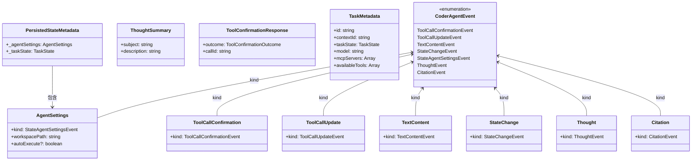
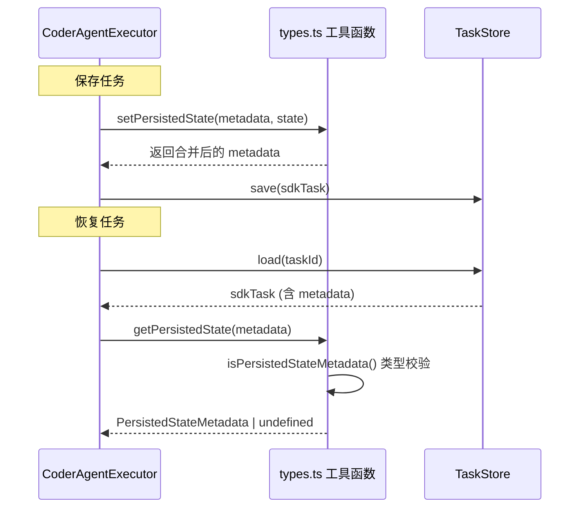

# src/types.ts

> 定义 CoderAgent 协议的所有事件枚举、消息接口、任务元数据类型以及持久化状态的读写工具函数。

## 概述

`types.ts` 是 `a2a-server` 包的类型基础设施文件，它为整个 CoderAgent 协议提供了统一的类型契约。文件中包含：

- **CoderAgentEvent 枚举**：定义了代理和客户端之间通信的所有事件类型。
- **消息接口族**：每种事件对应一个具有 `kind` 标识字段的接口，形成可辨识联合类型（Discriminated Union）。
- **任务元数据接口**：描述任务运行时的元数据结构，如模型信息、MCP 服务器状态、可用工具列表等。
- **持久化工具函数**：提供对任务元数据中持久化状态的安全读写能力，支持任务的断点恢复。

该文件在模块中扮演 "类型中枢" 的角色，被 `executor.ts`、`task.ts` 以及 HTTP 层等多个模块广泛引用。

## 架构图



## 主要导出

### 枚举

#### `CoderAgentEvent`
```typescript
export enum CoderAgentEvent {
  ToolCallConfirmationEvent = 'tool-call-confirmation',
  ToolCallUpdateEvent = 'tool-call-update',
  TextContentEvent = 'text-content',
  StateChangeEvent = 'state-change',
  StateAgentSettingsEvent = 'agent-settings',
  ThoughtEvent = 'thought',
  CitationEvent = 'citation',
}
```
定义代理与客户端之间所有通信事件的类型标识。每个事件对应一个字符串值，用作 `kind` 字段的辨识标签。

### 接口

| 接口名 | `kind` 值 | 说明 |
|--------|-----------|------|
| `AgentSettings` | `'agent-settings'` | 用户发起的代理初始化设置，包含 `workspacePath` 和可选的 `autoExecute` |
| `ToolCallConfirmation` | `'tool-call-confirmation'` | 请求一个或多个工具调用确认的事件 |
| `ToolCallUpdate` | `'tool-call-update'` | 工具调用状态更新事件 |
| `TextContent` | `'text-content'` | 任务的文本内容更新事件 |
| `StateChange` | `'state-change'` | 任务执行状态变更事件 |
| `Thought` | `'thought'` | 代理思维过程事件 |
| `Citation` | `'citation'` | 代理引用事件 |

### 类型别名

#### `ThoughtSummary`
```typescript
export type ThoughtSummary = {
  subject: string;
  description: string;
};
```
代理思维摘要，包含主题和描述。

#### `ToolConfirmationResponse`
```typescript
export interface ToolConfirmationResponse {
  outcome: ToolConfirmationOutcome;
  callId: string;
}
```
工具确认响应，包含确认结果（来自 `@google/gemini-cli-core`）和调用 ID。

#### `CoderAgentMessage`
```typescript
export type CoderAgentMessage =
  | AgentSettings
  | ToolCallConfirmation
  | ToolCallUpdate
  | TextContent
  | StateChange
  | Thought
  | Citation;
```
所有 CoderAgent 消息接口的联合类型（Discriminated Union），通过 `kind` 字段进行类型区分。

#### `TaskMetadata`
```typescript
export interface TaskMetadata {
  id: string;
  contextId: string;
  taskState: TaskState;
  model: string;
  mcpServers: Array<{ name, status, tools }>;
  availableTools: Array<{ name, description, parameterSchema }>;
}
```
描述任务运行时的完整元数据，包含任务 ID、上下文 ID、当前状态、使用的模型、MCP 服务器列表（含连接状态和工具列表）以及所有可用工具。

#### `PersistedStateMetadata`
```typescript
export interface PersistedStateMetadata {
  _agentSettings: AgentSettings;
  _taskState: TaskState;
}
```
持久化状态元数据，存储代理设置和任务状态，用于任务的断点恢复（reconstruct）。

#### `PersistedTaskMetadata`
```typescript
export type PersistedTaskMetadata = { [k: string]: unknown };
```
任务元数据的通用字典类型，键为字符串、值为任意类型。

### 常量

#### `METADATA_KEY`
```typescript
export const METADATA_KEY = '__persistedState';
```
持久化状态在任务元数据字典中的键名。

### 函数

#### `getPersistedState(metadata: PersistedTaskMetadata): PersistedStateMetadata | undefined`
从任务元数据字典中安全提取持久化状态。内部使用 `isPersistedStateMetadata` 类型守卫验证数据结构完整性。

#### `getContextIdFromMetadata(metadata: PersistedTaskMetadata | undefined): string | undefined`
从任务元数据中提取 `_contextId` 字段，若不存在或类型不匹配则返回 `undefined`。

#### `getAgentSettingsFromMetadata(metadata: PersistedTaskMetadata | undefined): AgentSettings | undefined`
从任务元数据中提取 `coderAgent` 字段并验证其是否为合法的 `AgentSettings` 对象。

#### `setPersistedState(metadata: PersistedTaskMetadata, state: PersistedStateMetadata): PersistedTaskMetadata`
将持久化状态写入任务元数据字典，使用展开运算符合并原有元数据，在 `METADATA_KEY` 键下存储新状态。

## 核心逻辑

### 类型守卫模式

文件中有两个私有类型守卫函数（未导出），用于在运行时安全地校验 `unknown` 类型的数据结构：

1. **`isAgentSettings(value: unknown): value is AgentSettings`**
   - 检查 `value` 是否是非空对象
   - 检查 `kind` 字段是否等于 `CoderAgentEvent.StateAgentSettingsEvent`
   - 检查 `workspacePath` 字段是否为字符串类型

2. **`isPersistedStateMetadata(value: unknown): value is PersistedStateMetadata`**
   - 检查 `value` 是否是非空对象
   - 检查是否同时包含 `_agentSettings` 和 `_taskState` 字段
   - 对 `_agentSettings` 调用 `isAgentSettings` 进行递归验证

这种模式确保从持久化存储中恢复数据时，即使数据损坏或格式变化也不会产生运行时类型错误。

### 持久化状态的读写流程



## 内部依赖

无（该文件是纯类型定义模块，不导入包内其他文件）。

## 外部依赖

| 包名 | 导入内容 | 说明 |
|------|---------|------|
| `@google/gemini-cli-core` | `MCPServerStatus`, `ToolConfirmationOutcome` | MCP 服务器状态枚举和工具确认结果枚举（均为 type-only 导入） |
| `@a2a-js/sdk` | `TaskState` | A2A SDK 中的任务状态类型（type-only 导入） |
