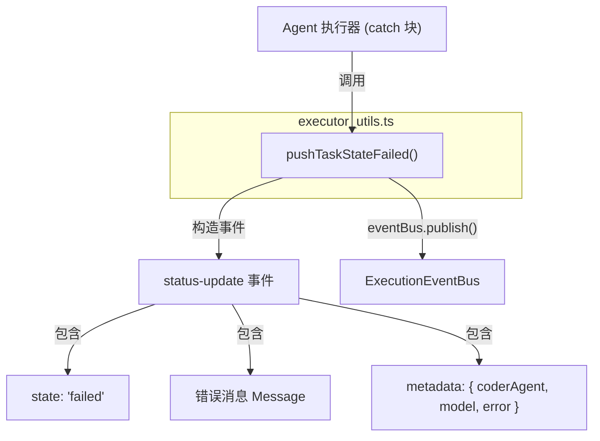

# executor_utils.ts

> 任务执行失败时的标准化错误事件发布工具函数。

## 概述

`executor_utils.ts` 提供一个辅助函数 `pushTaskStateFailed`，用于在 Agent 任务执行发生错误时，向事件总线发布一个标准化的"失败"状态更新事件。该函数封装了构造 A2A 协议 `status-update` 事件的样板代码，确保所有失败路径使用一致的事件格式。

该文件在模块中扮演"执行器辅助工具"角色，被 Agent 执行器在 catch 块中调用。

## 架构图



## 主要导出

### `pushTaskStateFailed(error: unknown, eventBus: ExecutionEventBus, taskId: string, contextId: string): Promise<void>`

向事件总线发布一个任务失败的状态更新事件。

**参数：**

| 参数 | 类型 | 说明 |
|---|---|---|
| `error` | `unknown` | 捕获的错误对象 |
| `eventBus` | `ExecutionEventBus` | A2A SDK 执行事件总线 |
| `taskId` | `string` | 任务 ID |
| `contextId` | `string` | 上下文 ID |

**行为：**

1. 从 `error` 中提取错误消息（若为 `Error` 实例取 `message`，否则使用默认文本）。
2. 构造一个 `StateChange` 类型的 `coderAgent` 元数据。
3. 通过 `eventBus.publish()` 发布包含以下内容的事件：
   - `kind: 'status-update'`
   - `status.state: 'failed'`
   - `status.message` -- 包含错误文本的 Agent 消息
   - `final: true` -- 标记为终态事件
   - `metadata` -- 包含 `coderAgent` 状态变更、模型（`'unknown'`）和错误消息

## 核心逻辑

### 事件结构

发布的事件完整结构如下：

```typescript
{
  kind: 'status-update',
  taskId,
  contextId,
  status: {
    state: 'failed',
    message: {
      kind: 'message',
      role: 'agent',
      parts: [{ kind: 'text', text: errorMessage }],
      messageId: uuidv4(),  // 自动生成
      taskId,
      contextId,
    }
  },
  final: true,
  metadata: {
    coderAgent: { kind: 'state-change' },
    model: 'unknown',
    error: errorMessage,
  }
}
```

`final: true` 表示这是该任务的最终事件，客户端收到后不应再期待后续事件。

## 内部依赖

| 模块 | 用途 |
|---|---|
| `../types.js` | `CoderAgentEvent`（事件类型枚举）、`StateChange`（状态变更类型） |

## 外部依赖

| npm 包 | 用途 |
|---|---|
| `@a2a-js/sdk` | `Message` 类型定义 |
| `@a2a-js/sdk/server` | `ExecutionEventBus` 类型定义 |
| `uuid` (v4) | 生成消息 ID |
